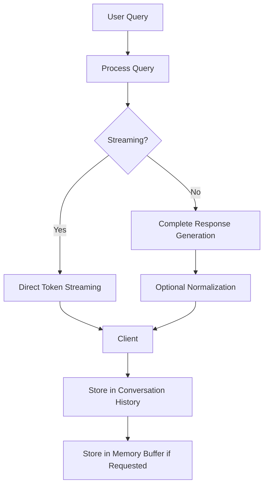

# Metis RAG Response Format Simplified Implementation Plan

This plan outlines a simplified approach to response formatting in the Metis RAG system, designed to integrate with the memory implementation plan we've already created.

## Goals

1. Simplify the streaming response implementation
2. Consolidate text processing to a single point
3. Standardize response formats
4. Optimize buffer management
5. Integrate with the memory implementation plan

## Implementation Approach

### 1. Simplified Response Structure



### 2. Streaming Implementation Simplification

1. **Direct Token Streaming**: Stream tokens directly from the LLM to the client without intermediate buffering
2. **Minimal Processing**: Apply only essential processing to each token
3. **Final Token Handling**: Ensure proper handling of the final token

### 3. Text Processing Consolidation

1. **Single Normalization Point**: Apply normalization only once, after complete response generation
2. **Configurable Normalization**: Make normalization optional and configurable
3. **Consistent Formatting**: Ensure consistent formatting between streaming and non-streaming responses

### 4. Memory Integration

1. **Memory Command Detection**: Detect memory commands in the user query before processing
2. **Memory Buffer Storage**: Store explicit memories in the memory buffer
3. **Memory Confirmation**: Provide confirmation when information is stored
4. **Memory Retrieval**: Retrieve stored information when requested

## Technical Implementation Details

### 1. Simplified Streaming Response Method

```python
async def generate_streaming_response(
    self,
    prompt: str,
    model: str,
    system_prompt: str,
    model_parameters: Dict[str, Any]
) -> AsyncGenerator[str, None]:
    """
    Generate a streaming response with minimal processing
    
    Args:
        prompt: Full prompt
        model: Model to use
        system_prompt: System prompt
        model_parameters: Model parameters
        
    Returns:
        Async generator of response tokens
    """
    # Get the raw stream from the LLM
    stream = await self.ollama_client.generate(
        prompt=prompt,
        model=model,
        system_prompt=system_prompt,
        stream=True,
        parameters=model_parameters or {}
    )
    
    # Stream tokens directly with minimal processing
    async for chunk in stream:
        # Handle string chunks
        if isinstance(chunk, str):
            yield chunk
        # Handle dictionary chunks (for backward compatibility)
        elif isinstance(chunk, dict) and "response" in chunk:
            yield chunk["response"]
```

### 2. Consolidated Text Processing

```python
def process_complete_response(self, response_text: str, apply_normalization: bool = True) -> str:
    """
    Process a complete response with optional normalization
    
    Args:
        response_text: The complete response text
        apply_normalization: Whether to apply text normalization
        
    Returns:
        Processed response text
    """
    if not apply_normalization:
        return response_text
    
    # Apply text normalization
    normalized_text = normalize_text(response_text)
    
    # Format code blocks
    formatted_text = format_code_blocks(normalized_text)
    
    return formatted_text
```

### 3. Memory Command Processing Integration

```python
async def process_query(
    self,
    query: str,
    user_id: str,
    conversation_id: UUID
) -> Tuple[str, Optional[str], Optional[str]]:
    """
    Process a query for memory commands before sending to RAG
    
    Args:
        query: User query
        user_id: User ID
        conversation_id: Conversation ID
        
    Returns:
        Tuple of (processed_query, memory_response, memory_operation)
    """
    # Check for memory commands
    memory_match = re.search(r"remember\s+this(?:\s+(?:phrase|name|information))?\s*:\s*(.+)", query, re.IGNORECASE)
    if memory_match:
        content = memory_match.group(1).strip()
        
        # Store in memory buffer
        await add_to_memory_buffer(
            conversation_id=conversation_id,
            content=content,
            label="explicit_memory"
        )
        
        # Create confirmation response
        memory_response = f"I've stored this in my memory: '{content}'"
        
        # Remove the command from the query
        processed_query = query.replace(memory_match.group(0), "").strip()
        if not processed_query:
            processed_query = "Thank you for providing that information."
        
        return processed_query, memory_response, "store"
    
    # Check for recall command
    recall_match = re.search(r"recall(?:\s+(?:the|my))?\s*(?:(.+))?", query, re.IGNORECASE)
    if recall_match:
        search_term = recall_match.group(1).strip() if recall_match.group(1) else None
        
        # Retrieve from memory buffer
        memories = await get_memory_buffer(
            conversation_id=conversation_id,
            search_term=search_term
        )
        
        if memories:
            memory_items = [f"{i+1}. {memory['content']}" for i, memory in enumerate(memories)]
            memory_response = "Here's what I remember:\n" + "\n".join(memory_items)
        else:
            memory_response = "I don't have any memories stored about that."
        
        # Remove the command from the query
        processed_query = query.replace(recall_match.group(0), "").strip()
        if not processed_query:
            processed_query = "Please provide the information you'd like me to recall."
        
        return processed_query, memory_response, "recall"
    
    # No memory command found
    return query, None, None
```

### 4. Updated RAG Engine Query Method

```python
async def query(
    self,
    query: str,
    model: str = None,
    use_rag: bool = True,
    stream: bool = False,
    system_prompt: str = None,
    model_parameters: Dict[str, Any] = None,
    conversation_history: Optional[List[Message]] = None,
    metadata_filters: Optional[Dict[str, Any]] = None,
    user_id: Optional[str] = None
) -> Dict[str, Any]:
    """
    Query the RAG engine with simplified response handling
    
    Args:
        query: User query
        model: Model to use
        use_rag: Whether to use RAG
        stream: Whether to stream the response
        system_prompt: System prompt
        model_parameters: Model parameters
        conversation_history: Conversation history
        metadata_filters: Metadata filters
        user_id: User ID
        
    Returns:
        Response dictionary
    """
    try:
        start_time = time.time()
        
        # Process memory commands if user_id is provided
        processed_query = query
        memory_response = None
        memory_operation = None
        
        if user_id:
            # Extract conversation_id from conversation_history if available
            conversation_id = None
            if conversation_history and len(conversation_history) > 0:
                # Assuming the first message has the conversation_id
                conversation_id = conversation_history[0].conversation_id
            
            if conversation_id:
                processed_query, memory_response, memory_operation = await self.process_query(
                    query=query,
                    user_id=user_id,
                    conversation_id=conversation_id
                )
        
        # If it's a recall operation with a response, return immediately
        if memory_operation == "recall" and memory_response:
            return {
                "query": query,
                "answer": memory_response,
                "sources": []
            }
        
        # Use the processed query for RAG
        query = processed_query
        
        # Get model name
        model = model or self.default_model
        
        # Get full conversation context
        conversation_context = await get_conversation_context(
            conversation_history=conversation_history,
            max_tokens=self.max_context_tokens
        )
        
        # Get context from vector store if RAG is enabled
        context = ""
        sources = []
        document_ids = []
        
        if use_rag:
            # Retrieve context using the appropriate method
            context, sources, document_ids = await self._retrieve_context(
                query=query,
                conversation_context=conversation_context,
                metadata_filters=metadata_filters
            )
        
        # Create full prompt
        full_prompt = await self._create_prompt(
            query=query,
            context=context,
            conversation_context=conversation_context,
            retrieval_state="success" if context else "no_documents"
        )
        
        # Generate response
        if stream:
            # For streaming, return the stream generator directly
            stream_response = await self.generate_streaming_response(
                prompt=full_prompt,
                model=model,
                system_prompt=system_prompt or self.system_prompt,
                model_parameters=model_parameters or {}
            )
            
            # If we have a memory confirmation, prepend it to the first chunk
            if memory_response:
                # Create a wrapper generator that prepends the memory response
                async def wrapped_stream():
                    yield memory_response + "\n\n"
                    async for chunk in stream_response:
                        yield chunk
                
                stream_response = wrapped_stream()
            
            return {
                "query": query,
                "stream": stream_response,
                "sources": sources
            }
        else:
            # For non-streaming, generate the complete response
            response = await self.generate_complete_response(
                prompt=full_prompt,
                model=model,
                system_prompt=system_prompt or self.system_prompt,
                model_parameters=model_parameters or {}
            )
            
            # Process the response text
            response_text = self.process_complete_response(
                response_text=response.get("response", ""),
                apply_normalization=True
            )
            
            # If we have a memory confirmation, prepend it to the response
            if memory_response:
                response_text = f"{memory_response}\n\n{response_text}"
            
            return {
                "query": query,
                "answer": response_text,
                "sources": sources
            }
    except Exception as e:
        logger.error(f"Error in RAG engine query: {str(e)}")
        return {
            "query": query,
            "answer": f"Error: {str(e)}",
            "sources": []
        }
```

### 5. Conversation Context Retrieval

```python
async def get_conversation_context(
    conversation_history: Optional[List[Message]] = None,
    max_tokens: int = 4000
) -> str:
    """
    Get the full conversation context up to the specified token limit
    
    Args:
        conversation_history: List of conversation messages
        max_tokens: Maximum number of tokens to include
        
    Returns:
        Formatted conversation context string
    """
    if not conversation_history:
        return ""
    
    # Calculate tokens for each message
    message_tokens = []
    for msg in conversation_history:
        # Estimate token count if not already calculated
        token_count = msg.token_count or estimate_token_count(msg.content)
        message_tokens.append({
            "role": msg.role,
            "content": msg.content,
            "tokens": token_count
        })
    
    # Apply smart context window management
    formatted_messages = []
    total_tokens = 0
    
    # First, include messages with memory operations
    memory_messages = [m for m in message_tokens if contains_memory_operation(m["content"])]
    for msg in memory_messages:
        if total_tokens + msg["tokens"] <= max_tokens:
            formatted_messages.append(msg)
            total_tokens += msg["tokens"]
    
    # Then include the most recent messages
    recent_messages = [m for m in reversed(message_tokens) if m not in formatted_messages]
    for msg in recent_messages:
        if total_tokens + msg["tokens"] <= max_tokens:
            formatted_messages.insert(0, msg)  # Insert at beginning to maintain order
            total_tokens += msg["tokens"]
        else:
            break
    
    # Sort messages by original order
    formatted_messages.sort(key=lambda m: message_tokens.index(m))
    
    # Format the conversation history
    history_pieces = []
    for msg in formatted_messages:
        role_prefix = "User" if msg["role"] == "user" else "Assistant"
        history_pieces.append(f"{role_prefix}: {msg['content']}")
    
    return "\n".join(history_pieces)
```

## Integration with Memory Implementation Plan

This simplified response format implementation integrates with our memory implementation plan in the following ways:

1. **Memory Command Processing**: The `process_query` method detects and processes memory commands before sending the query to the RAG engine.

2. **Memory Buffer Integration**: The implementation uses the memory buffer methods (`add_to_memory_buffer` and `get_memory_buffer`) from our memory implementation plan.

3. **Conversation Context Prioritization**: The `get_conversation_context` method prioritizes messages with memory operations when managing the context window.

4. **Memory Response Integration**: Memory responses (confirmations and recall results) are integrated into the response flow, either by prepending to the first chunk in streaming mode or to the complete response in non-streaming mode.

## Implementation Phases

### Phase 1: Response Format Simplification

1. Implement the simplified streaming response method
2. Implement the consolidated text processing method
3. Update the RAG engine query method
4. Test with various response types and formats

### Phase 2: Memory Integration

1. Implement the memory command processing method
2. Integrate with the memory buffer methods
3. Update the conversation context retrieval method
4. Test with memory commands and conversation history

### Phase 3: Testing and Optimization

1. Test with various conversation lengths and memory operations
2. Optimize token usage and response formatting
3. Ensure consistent behavior between streaming and non-streaming modes
4. Verify memory command processing and response integration

## Implementation Checklist

### Phase 1: Response Format Simplification
- [ ] **Core Implementation**
  - [ ] Implement `generate_streaming_response` method
  - [ ] Implement `process_complete_response` method
  - [ ] Update RAG engine query method
  - [ ] Update API handlers to use the simplified methods
  
- [ ] **Testing**
  - [ ] Test streaming response performance
  - [ ] Test non-streaming response formatting
  - [ ] Verify consistent behavior between modes
  - [ ] Measure impact on response time

### Phase 2: Memory Integration
- [ ] **Core Implementation**
  - [ ] Implement `process_query` method for memory commands
  - [ ] Implement `get_conversation_context` method
  - [ ] Integrate with memory buffer methods
  - [ ] Update response handling for memory operations
  
- [ ] **Testing**
  - [ ] Test memory command detection
  - [ ] Test memory storage and retrieval
  - [ ] Test conversation context prioritization
  - [ ] Verify memory response integration

### Phase 3: Testing and Optimization
- [ ] **Performance Testing**
  - [ ] Measure token usage efficiency
  - [ ] Test with large conversation histories
  - [ ] Verify memory buffer performance
  - [ ] Optimize context window management
  
- [ ] **Integration Testing**
  - [ ] Test end-to-end conversation flows
  - [ ] Test with various memory operations
  - [ ] Verify error handling and recovery
  - [ ] Ensure consistent user experience

By implementing this simplified approach to response formatting and integrating it with our memory implementation plan, we can create a more efficient, maintainable, and user-friendly Metis RAG system.