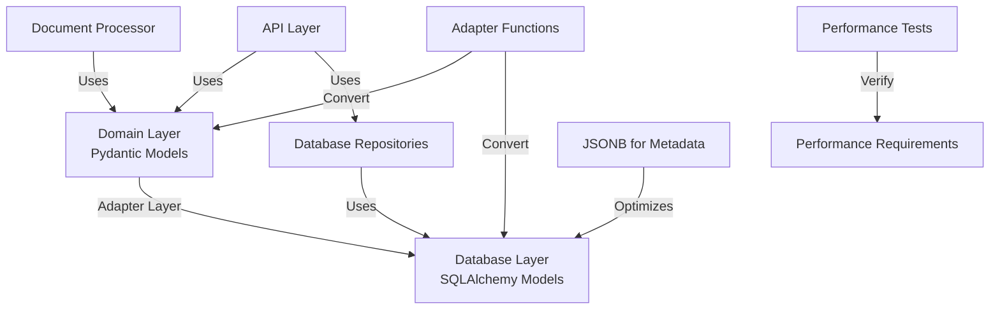

# Metis_RAG Database Integration Plan

## Overview

This plan addresses the model compatibility issues between Pydantic and SQLAlchemy models, focusing on fixing the architecture first to ensure a robust foundation for the system. The implementation will prioritize PostgreSQL compatibility, performance optimization, and comprehensive testing.



## Current Issues

### 1. Model Compatibility Issues

- **Attribute Name Mismatch**: SQLAlchemy models use renamed attributes (`doc_metadata`, `chunk_metadata`, etc.) to avoid conflicts with SQLAlchemy's reserved keywords, while Pydantic models use `metadata`.
- **Type Conversion**: UUID objects need proper string conversion between PostgreSQL and SQLite.
- **Model Type Mismatch**: Document processor creates Pydantic `Chunk` objects, but database repositories expect SQLAlchemy `Chunk` objects.

### 2. Testing Framework Issues

- Performance tests fail when trying to use real components with incompatible models
- No clear separation between domain logic and database persistence
- Missing adapter functions to convert between model types

## Implementation Plan

### Phase 1: Create Standalone Adapter Layer

#### 1. Create Model Adapter Module

Create a new file `app/db/adapters.py` with standalone conversion functions:

```python
"""
Adapter functions to convert between Pydantic and SQLAlchemy models
"""
import uuid
from typing import List, Optional, Union, Dict, Any
from uuid import UUID

from app.models import document as pydantic_models
from app.db import models as db_models
from app.core.config import DATABASE_TYPE

def to_str_id(id_value: Union[str, UUID, None]) -> Optional[str]:
    """Convert ID to string format"""
    if id_value is None:
        return None
    return str(id_value)

def to_uuid_or_str(id_value: Union[str, UUID, None]) -> Optional[Union[str, UUID]]:
    """
    Convert ID to appropriate type based on database
    For PostgreSQL: UUID
    For SQLite: string
    """
    if id_value is None:
        return None
        
    if DATABASE_TYPE == 'postgresql':
        if isinstance(id_value, UUID):
            return id_value
        return UUID(id_value)
    else:
        return to_str_id(id_value)

def pydantic_document_to_sqlalchemy(doc: pydantic_models.Document) -> db_models.Document:
    """Convert Pydantic Document to SQLAlchemy Document"""
    # Handle UUID conversion based on database type
    doc_id = to_uuid_or_str(doc.id)
    
    sqlalchemy_doc = db_models.Document(
        id=doc_id,
        filename=doc.filename,
        content=doc.content,
        doc_metadata=doc.metadata,  # Note the attribute name change
        folder=doc.folder,
        uploaded=doc.uploaded,
        processing_status=doc.metadata.get("processing_status", "pending"),
        processing_strategy=doc.metadata.get("processing_strategy", None),
        file_size=doc.metadata.get("file_size", None),
        file_type=doc.metadata.get("file_type", None),
        last_accessed=doc.metadata.get("last_accessed", doc.uploaded)
    )
    
    # Convert chunks if available
    if hasattr(doc, 'chunks') and doc.chunks:
        sqlalchemy_doc.chunks = [
            pydantic_chunk_to_sqlalchemy(chunk, doc_id) 
            for chunk in doc.chunks
        ]
    
    return sqlalchemy_doc

def sqlalchemy_document_to_pydantic(doc: db_models.Document) -> pydantic_models.Document:
    """Convert SQLAlchemy Document to Pydantic Document"""
    pydantic_doc = pydantic_models.Document(
        id=to_str_id(doc.id),
        filename=doc.filename,
        content=doc.content,
        metadata=doc.doc_metadata,  # Note the attribute name change
        folder=doc.folder,
        uploaded=doc.uploaded
    )
    
    # Convert chunks if available
    if hasattr(doc, 'chunks') and doc.chunks:
        pydantic_doc.chunks = [
            sqlalchemy_chunk_to_pydantic(chunk) 
            for chunk in doc.chunks
        ]
    
    # Convert tags if available
    if hasattr(doc, 'tags') and doc.tags:
        pydantic_doc.tags = [tag.name for tag in doc.tags]
    
    return pydantic_doc

def pydantic_chunk_to_sqlalchemy(chunk: pydantic_models.Chunk, document_id: Union[str, UUID]) -> db_models.Chunk:
    """Convert Pydantic Chunk to SQLAlchemy Chunk"""
    # Handle UUID conversion based on database type
    chunk_id = to_uuid_or_str(chunk.id)
    doc_id = to_uuid_or_str(document_id)
    
    # Extract index from metadata or default to 0
    index = chunk.metadata.get('index', 0) if chunk.metadata else 0
    
    sqlalchemy_chunk = db_models.Chunk(
        id=chunk_id,
        document_id=doc_id,
        content=chunk.content,
        chunk_metadata=chunk.metadata,  # Note the attribute name change
        index=index,
        embedding_quality=chunk.metadata.get('embedding_quality', None) if chunk.metadata else None
    )
    return sqlalchemy_chunk

def sqlalchemy_chunk_to_pydantic(chunk: db_models.Chunk) -> pydantic_models.Chunk:
    """Convert SQLAlchemy Chunk to Pydantic Chunk"""
    pydantic_chunk = pydantic_models.Chunk(
        id=to_str_id(chunk.id),
        content=chunk.content,
        metadata=chunk.chunk_metadata  # Note the attribute name change
    )
    
    # Add embedding if available
    if hasattr(chunk, 'embedding') and chunk.embedding:
        pydantic_chunk.embedding = chunk.embedding
    
    return pydantic_chunk

def is_sqlalchemy_model(obj: Any) -> bool:
    """Check if an object is a SQLAlchemy model"""
    return hasattr(obj, '_sa_instance_state')

def is_pydantic_model(obj: Any) -> bool:
    """Check if an object is a Pydantic model"""
    return hasattr(obj, '__fields__')
```

### Phase 2: Update Database Models to Use JSONB

Update `app/db/models.py` to use JSONB for metadata fields:

```python
from sqlalchemy import (
    Column, Integer, String, Text, Float, Boolean, 
    DateTime, ForeignKey, Table, Index, UniqueConstraint
)
from sqlalchemy.dialects.postgresql import UUID as PostgresUUID, JSONB
from sqlalchemy.orm import relationship, backref

from app.db.session import Base
from app.core.config import DATABASE_TYPE

# Use appropriate types based on database type
if DATABASE_TYPE == 'postgresql':
    UUID = PostgresUUID
    JSONType = JSONB  # Use JSONB for PostgreSQL
else:
    # For SQLite and other databases
    UUID = String
    JSONType = JSON

# Update Document model
class Document(Base):
    """Document model for database"""
    __tablename__ = "documents"

    id = Column(UUID(as_uuid=True) if DATABASE_TYPE == 'postgresql' else UUID, primary_key=True, default=uuid.uuid4)
    filename = Column(String, nullable=False)
    content = Column(Text, nullable=True)
    doc_metadata = Column('metadata', JSONType, default={})  # Use JSONType
    folder = Column(String, ForeignKey('folders.path'), default="/")
    uploaded = Column(DateTime, default=datetime.utcnow)
    processing_status = Column(String, default="pending")
    processing_strategy = Column(String, nullable=True)
    file_size = Column(Integer, nullable=True)
    file_type = Column(String, nullable=True)
    last_accessed = Column(DateTime, default=datetime.utcnow)

    # Relationships
    chunks = relationship("Chunk", back_populates="document", cascade="all, delete-orphan")
    tags = relationship("Tag", secondary=document_tags, back_populates="documents")
    folder_rel = relationship("Folder", back_populates="documents")
    citations = relationship("Citation", back_populates="document")

# Update Chunk model
class Chunk(Base):
    """Chunk model for database"""
    __tablename__ = "chunks"

    id = Column(UUID(as_uuid=True) if DATABASE_TYPE == 'postgresql' else UUID, primary_key=True, default=uuid.uuid4)
    document_id = Column(UUID(as_uuid=True) if DATABASE_TYPE == 'postgresql' else UUID, ForeignKey('documents.id'), nullable=False)
    content = Column(Text, nullable=False)
    chunk_metadata = Column('metadata', JSONType, default={})  # Use JSONType
    index = Column(Integer, nullable=False)
    embedding_quality = Column(Float, nullable=True)
    created_at = Column(DateTime, default=datetime.utcnow)

    # Relationships
    document = relationship("Document", back_populates="chunks")
    citations = relationship("Citation", back_populates="chunk")
```

### Phase 3: Create Alembic Migration for JSONB

Create a new migration to update the metadata columns to use JSONB:

```python
"""Update metadata columns to use JSONB

Revision ID: xxxx
Revises: yyyy
Create Date: 2025-03-20

"""
from alembic import op
import sqlalchemy as sa
from sqlalchemy.dialects.postgresql import JSONB

# revision identifiers, used by Alembic.
revision = 'xxxx'
down_revision = 'yyyy'
branch_labels = None
depends_on = None

def upgrade():
    # For PostgreSQL, convert JSON to JSONB
    if op.get_bind().dialect.name == 'postgresql':
        # Update documents table
        op.alter_column('documents', 'metadata', 
                        type_=JSONB, 
                        postgresql_using='metadata::jsonb')
        
        # Update chunks table
        op.alter_column('chunks', 'metadata', 
                        type_=JSONB, 
                        postgresql_using='metadata::jsonb')
        
        # Update other tables with metadata columns
        op.alter_column('conversations', 'metadata', 
                        type_=JSONB, 
                        postgresql_using='metadata::jsonb')
        
        op.alter_column('processing_jobs', 'metadata', 
                        type_=JSONB, 
                        postgresql_using='metadata::jsonb')
        
        op.alter_column('background_tasks', 'metadata', 
                        type_=JSONB, 
                        postgresql_using='metadata::jsonb')

def downgrade():
    # For PostgreSQL, convert JSONB back to JSON
    if op.get_bind().dialect.name == 'postgresql':
        # Update documents table
        op.alter_column('documents', 'metadata', 
                        type_=sa.JSON, 
                        postgresql_using='metadata::json')
        
        # Update chunks table
        op.alter_column('chunks', 'metadata', 
                        type_=sa.JSON, 
                        postgresql_using='metadata::json')
        
        # Update other tables with metadata columns
        op.alter_column('conversations', 'metadata', 
                        type_=sa.JSON, 
                        postgresql_using='metadata::json')
        
        op.alter_column('processing_jobs', 'metadata', 
                        type_=sa.JSON, 
                        postgresql_using='metadata::json')
        
        op.alter_column('background_tasks', 'metadata', 
                        type_=sa.JSON, 
                        postgresql_using='metadata::json')
```

### Phase 4: Update Document Repository

Enhance `app/db/repositories/document_repository.py` to handle both model types:

```python
from typing import List, Optional, Dict, Any, Union
from uuid import UUID
from datetime import datetime
from sqlalchemy.orm import Session
from sqlalchemy import func, or_, and_
import logging

from app.db.models import Document as DBDocument, Chunk as DBChunk, Tag, Folder, document_tags
from app.models.document import Document as PydanticDocument, Chunk as PydanticChunk
from app.db.repositories.base import BaseRepository
from app.db.adapters import (
    pydantic_document_to_sqlalchemy,
    sqlalchemy_document_to_pydantic,
    pydantic_chunk_to_sqlalchemy,
    to_uuid_or_str,
    is_sqlalchemy_model
)
from app.core.config import DATABASE_TYPE

logger = logging.getLogger("app.db.repositories.document_repository")

class DocumentRepository(BaseRepository[DBDocument]):
    """
    Repository for Document model
    """
    
    def __init__(self, session: Session):
        super().__init__(session, DBDocument)
    
    def create_document(self, 
                       filename: str, 
                       content: Optional[str] = None, 
                       metadata: Optional[Dict[str, Any]] = None, 
                       tags: Optional[List[str]] = None, 
                       folder: str = "/") -> PydanticDocument:
        """
        Create a new document
        
        Args:
            filename: Document filename
            content: Document content
            metadata: Document metadata
            tags: List of tag names
            folder: Document folder path
            
        Returns:
            Created document (Pydantic model)
        """
        try:
            # Ensure folder exists
            self._ensure_folder_exists(folder)
            
            # Create document
            document = DBDocument(
                filename=filename,
                content=content,
                doc_metadata=metadata or {},  # Changed to doc_metadata
                folder=folder,
                uploaded=datetime.utcnow(),
                processing_status="pending"
            )
            
            self.session.add(document)
            self.session.flush()  # Flush to get the document ID
            
            # Add tags if provided
            if tags:
                self._add_tags_to_document(document, tags)
            
            # Update folder document count
            folder_obj = self.session.query(Folder).filter(Folder.path == folder).first()
            if folder_obj:
                folder_obj.document_count += 1
            
            self.session.commit()
            self.session.refresh(document)
            
            # Convert to Pydantic model
            return sqlalchemy_document_to_pydantic(document)
        except Exception as e:
            self.session.rollback()
            logger.error(f"Error creating document: {str(e)}")
            raise
    
    def save_document_with_chunks(self, document: Union[PydanticDocument, DBDocument]) -> PydanticDocument:
        """
        Save a document with its chunks
        
        Args:
            document: Document to save (Pydantic or SQLAlchemy)
            
        Returns:
            Saved document (Pydantic)
        """
        try:
            # Convert to SQLAlchemy model if needed
            if not is_sqlalchemy_model(document):
                db_document = pydantic_document_to_sqlalchemy(document)
            else:
                db_document = document
            
            # Check if document exists
            existing = self.session.query(DBDocument).filter(
                DBDocument.id == db_document.id
            ).first()
            
            if existing:
                # Update existing document
                existing.filename = db_document.filename
                existing.content = db_document.content
                existing.doc_metadata = db_document.doc_metadata
                existing.folder = db_document.folder
                existing.last_accessed = datetime.utcnow()
                existing.processing_status = db_document.processing_status
                existing.processing_strategy = db_document.processing_strategy
                
                # Delete existing chunks
                self.session.query(DBChunk).filter(
                    DBChunk.document_id == existing.id
                ).delete()
                
                # Add new chunks
                if hasattr(db_document, 'chunks') and db_document.chunks:
                    for chunk in db_document.chunks:
                        chunk.document_id = existing.id
                        self.session.add(chunk)
                        
                target_document = existing
            else:
                # Add new document
                self.session.add(db_document)
                
                # Add chunks
                if hasattr(db_document, 'chunks') and db_document.chunks:
                    for chunk in db_document.chunks:
                        chunk.document_id = db_document.id
                        self.session.add(chunk)
                        
                target_document = db_document
            
            # Commit changes
            self.session.commit()
            
            # Refresh and convert back to Pydantic
            self.session.refresh(target_document)
            return sqlalchemy_document_to_pydantic(target_document)
        except Exception as e:
            self.session.rollback()
            logger.error(f"Error saving document: {str(e)}")
            raise
    
    def get_document_for_processing(self, document_id: Union[UUID, str]) -> Optional[PydanticDocument]:
        """
        Get a document for processing
        
        Args:
            document_id: Document ID
            
        Returns:
            Document if found, None otherwise
        """
        try:
            # Convert UUID to string for SQLite
            doc_id = to_uuid_or_str(document_id)
            
            document = self.session.query(DBDocument).filter(
                DBDocument.id == doc_id
            ).first()
            
            if not document:
                return None
            
            # Update processing status
            document.processing_status = "processing"
            document.last_accessed = datetime.utcnow()
            self.session.commit()
            
            # Convert to Pydantic model
            return sqlalchemy_document_to_pydantic(document)
        except Exception as e:
            self.session.rollback()
            logger.error(f"Error getting document for processing: {str(e)}")
            raise
    
    def update_document_processing_status(
        self, 
        document_id: Union[UUID, str], 
        status: str, 
        chunks: Optional[List[PydanticChunk]] = None
    ) -> Optional[PydanticDocument]:
        """
        Update document processing status and add chunks
        
        Args:
            document_id: Document ID
            status: New processing status
            chunks: Document chunks
            
        Returns:
            Updated document if found, None otherwise
        """
        try:
            # Convert UUID to string for SQLite
            doc_id = to_uuid_or_str(document_id)
            
            document = self.session.query(DBDocument).filter(
                DBDocument.id == doc_id
            ).first()
            
            if not document:
                return None
            
            # Update status
            document.processing_status = status
            document.last_accessed = datetime.utcnow()
            
            # Add chunks if provided
            if chunks:
                # Delete existing chunks
                self.session.query(DBChunk).filter(
                    DBChunk.document_id == doc_id
                ).delete()
                
                # Add new chunks
                for i, chunk in enumerate(chunks):
                    db_chunk = pydantic_chunk_to_sqlalchemy(chunk, doc_id)
                    db_chunk.index = i
                    self.session.add(db_chunk)
            
            self.session.commit()
            self.session.refresh(document)
            
            # Convert to Pydantic model
            return sqlalchemy_document_to_pydantic(document)
        except Exception as e:
            self.session.rollback()
            logger.error(f"Error updating document processing status: {str(e)}")
            raise
```

### Phase 5: Create Performance Tests

Create a new file `tests/performance/test_document_processing.py` to verify performance requirements:

```python
import pytest
import os
import time
import asyncio
import tempfile
import shutil
import uuid
from app.rag.document_processor import DocumentProcessor
from app.models.document import Document
from app.core.config import UPLOAD_DIR
from app.db.repositories.document_repository import DocumentRepository
from app.db.session import SessionLocal

# Helper function to create a test file of a given size
def create_test_file(file_path, size_mb, content_type="text"):
    """Create a test file of the specified size and type"""
    os.makedirs(os.path.dirname(file_path), exist_ok=True)
    
    with open(file_path, "wb") as f:
        if content_type == "text":
            # Generate text content
            paragraph = "This is a test paragraph for document processing performance testing. " * 100
            paragraphs_needed = (size_mb * 1024 * 1024) // len(paragraph.encode('utf-8'))
            content = "\n\n".join([paragraph for _ in range(paragraphs_needed)])
            f.write(content.encode('utf-8'))
        elif content_type == "pdf":
            # For a real test, you'd generate an actual PDF
            # This is a simplified version that creates a binary file
            f.write(b"%PDF-1.7\n")  # PDF header
            # Generate random content to fill the file
            remaining_size = size_mb * 1024 * 1024 - 8  # Subtract header size
            f.write(os.urandom(remaining_size))

@pytest.fixture
def temp_upload_dir():
    """Create a temporary directory for uploads"""
    temp_dir = tempfile.mkdtemp()
    original_upload_dir = UPLOAD_DIR
    
    # Temporarily override the upload directory
    import app.core.config
    app.core.config.UPLOAD_DIR = temp_dir
    
    yield temp_dir
    
    # Restore the original upload directory and clean up
    app.core.config.UPLOAD_DIR = original_upload_dir
    shutil.rmtree(temp_dir)

@pytest.fixture
def document_repository():
    """Create a document repository for testing"""
    session = SessionLocal()
    try:
        yield DocumentRepository(session)
    finally:
        session.close()

@pytest.mark.asyncio
async def test_text_file_processing_performance(temp_upload_dir, document_repository):
    """Test processing performance for a 1MB text file"""
    # Create a 1MB text file
    document_id = str(uuid.uuid4())
    document_dir = os.path.join(temp_upload_dir, document_id)
    os.makedirs(document_dir, exist_ok=True)
    
    file_name = "test_1mb.txt"
    file_path = os.path.join(document_dir, file_name)
    create_test_file(file_path, 1, "text")
    
    # Create a Document object
    document = Document(
        id=document_id,
        filename=file_name,
        content="",  # Content will be read during processing
        metadata={"file_type": "txt"},
        folder="/test"
    )
    
    # Create a DocumentProcessor
    processor = DocumentProcessor()
    
    # Measure processing time
    start_time = time.time()
    processed_doc = await processor.process_document(document)
    end_time = time.time()
    processing_time = end_time - start_time
    
    print(f"Text file (1MB) processing time: {processing_time:.2f} seconds")
    print(f"Number of chunks: {len(processed_doc.chunks)}")
    
    # Assert performance
    assert processing_time < 5, f"Text file processing took too long: {processing_time:.2f}s > 5s"
    assert len(processed_doc.chunks) > 0, "No chunks were created"

@pytest.mark.asyncio
async def test_pdf_file_processing_performance(temp_upload_dir, document_repository):
    """Test processing performance for a 10MB PDF file"""
    # Create a 10MB PDF file
    document_id = str(uuid.uuid4())
    document_dir = os.path.join(temp_upload_dir, document_id)
    os.makedirs(document_dir, exist_ok=True)
    
    file_name = "test_10mb.pdf"
    file_path = os.path.join(document_dir, file_name)
    create_test_file(file_path, 10, "pdf")
    
    # Create a Document object
    document = Document(
        id=document_id,
        filename=file_name,
        content="",  # Content will be read during processing
        metadata={"file_type": "pdf"},
        folder="/test"
    )
    
    # Create a DocumentProcessor
    processor = DocumentProcessor()
    
    # Measure processing time
    start_time = time.time()
    processed_doc = await processor.process_document(document)
    end_time = time.time()
    processing_time = end_time - start_time
    
    print(f"PDF file (10MB) processing time: {processing_time:.2f} seconds")
    print(f"Number of chunks: {len(processed_doc.chunks)}")
    
    # Assert performance
    assert processing_time < 30, f"PDF processing took too long: {processing_time:.2f}s > 30s"
    assert len(processed_doc.chunks) > 0, "No chunks were created"

@pytest.mark.asyncio
async def test_concurrent_processing_performance(temp_upload_dir, document_repository):
    """Test concurrent processing of multiple documents"""
    # Create 5 documents of different sizes
    document_ids = []
    documents = []
    
    for i, size in enumerate([0.5, 1, 2, 3, 4]):  # Sizes in MB
        document_id = str(uuid.uuid4())
        document_ids.append(document_id)
        
        document_dir = os.path.join(temp_upload_dir, document_id)
        os.makedirs(document_dir, exist_ok=True)
        
        file_name = f"test_concurrent_{i}.txt"
        file_path = os.path.join(document_dir, file_name)
        create_test_file(file_path, size, "text")
        
        document = Document(
            id=document_id,
            filename=file_name,
            content="",
            metadata={"file_type": "txt"},
            folder="/test"
        )
        documents.append(document)
    
    # Create a DocumentProcessor
    processor = DocumentProcessor()
    
    # Process documents concurrently
    start_time = time.time()
    tasks = [processor.process_document(doc) for doc in documents]
    processed_docs = await asyncio.gather(*tasks)
    end_time = time.time()
    total_processing_time = end_time - start_time
    
    print(f"Concurrent processing time for 5 documents: {total_processing_time:.2f} seconds")
    print(f"Average time per document: {total_processing_time / 5:.2f} seconds")
    
    # Assert performance
    assert total_processing_time < 15, f"Concurrent processing took too long: {total_processing_time:.2f}s > 15s"
    assert all(len(doc.chunks) > 0 for doc in processed_docs), "Some documents have no chunks"
```

### Phase 6: Update Document Processor

Modify `app/rag/document_processor.py` to handle metadata field differences:

```python
async def process_document(self, document: Document) -> Document:
    """
    Process a document by splitting it into chunks
    """
    try:
        logger.info(f"Processing document: {document.filename}")
        
        # Convert document ID to string if it's a UUID
        document_id_str = to_str_id(document.id)
        
        # Get the document path
        file_path = os.path.join(UPLOAD_DIR, document_id_str, document.filename)
        
        # Get file extension for specialized handling
        _, ext = os.path.splitext(file_path.lower())
        
        # Use Chunking Judge if enabled
        if USE_CHUNKING_JUDGE:
            logger.info(f"Using Chunking Judge to analyze document: {document.filename}")
            chunking_judge = ChunkingJudge()
            try:
                analysis_result = await chunking_judge.analyze_document(document)
                
                # Update chunking strategy and parameters
                self.chunking_strategy = analysis_result["strategy"]
                if "parameters" in analysis_result and "chunk_size" in analysis_result["parameters"]:
                    self.chunk_size = analysis_result["parameters"]["chunk_size"]
                if "parameters" in analysis_result and "chunk_overlap" in analysis_result["parameters"]:
                    self.chunk_overlap = analysis_result["parameters"]["chunk_overlap"]
                
                # Store the chunking analysis in document metadata
                # Access metadata attribute directly - works for both Pydantic and SQLAlchemy models
                document.metadata["chunking_analysis"] = analysis_result
                
                logger.info(f"Chunking Judge recommendation: strategy={self.chunking_strategy}, " +
                           f"chunk_size={self.chunk_size}, chunk_overlap={self.chunk_overlap}")
            except Exception as e:
                logger.error(f"Error using Chunking Judge: {str(e)}")
                # Fall back to DocumentAnalysisService
                logger.info(f"Falling back to DocumentAnalysisService for document: {document.filename}")
                analysis_result = await self.document_analysis_service.analyze_document(document)
                
                # Update chunking strategy and parameters
                self.chunking_strategy = analysis_result["strategy"]
                if "parameters" in analysis_result and "chunk_size" in analysis_result["parameters"]:
                    self.chunk_size = analysis_result["parameters"]["chunk_size"]
                if "parameters" in analysis_result and "chunk_overlap" in analysis_result["parameters"]:
                    self.chunk_overlap = analysis_result["parameters"]["chunk_overlap"]
                
                # Store the document analysis in document metadata
                document.metadata["document_analysis"] = analysis_result
        else:
            # Use DocumentAnalysisService if Chunking Judge is disabled
            logger.info(f"Chunking Judge disabled, using DocumentAnalysisService for document: {document.filename}")
            analysis_result = await self.document_analysis_service.analyze_document(document)
            
            # Update chunking strategy and parameters
            self.chunking_strategy = analysis_result["strategy"]
            if "parameters" in analysis_result and "chunk_size" in analysis_result["parameters"]:
                self.chunk_size = analysis_result["parameters"]["chunk_size"]
            if "parameters" in analysis_result and "chunk_overlap" in analysis_result["parameters"]:
                self.chunk_overlap = analysis_result["parameters"]["chunk_overlap"]
            
            # Store the document analysis in document metadata
            document.metadata["document_analysis"] = analysis_result
            
            logger.info(f"Document analysis recommendation: strategy={self.chunking_strategy}, " +
                       f"chunk_size={self.chunk_size}, chunk_overlap={self.chunk_overlap}")
        
        # Get appropriate text splitter for this file type
        self.text_splitter = self._get_text_splitter(ext)
        
        # Extract text from the document based on file type
        docs = await self._load_document(file_path)
        
        # Split the document into chunks
        chunks = self._split_document(docs)
        
        # Update the document with chunks
        document.chunks = []
        for i, chunk in enumerate(chunks):
            # Start with the chunk's existing metadata
            metadata = dict(chunk.metadata) if chunk.metadata else {}
            
            # Add document metadata
            metadata.update({
                "document_id": document_id_str,
                "index": i,
                "folder": document.folder
            })
            
            # Handle tags specially - store as string for ChromaDB compatibility
            if hasattr(document, 'tags') and document.tags:
                metadata["tags_list"] = document.tags
                metadata["tags"] = ",".join(document.tags)
            else:
                metadata["tags"] = ""
                metadata["tags_list"] = []
            
            # Create the chunk with processed metadata
            document.chunks.append(
                Chunk(
                    id=str(uuid.uuid4()),  # Generate a new UUID for each chunk
                    content=chunk.page_content,
                    metadata=metadata
                )
            )
        
        logger.info(f"Document processed into {len(document.chunks)} chunks")
        
        return document
    except FileNotFoundError as e:
        logger.error(f"File not found: {str(e)}")
        raise
    except IOError as e:
        logger.error(f"IO error processing document {document.filename}: {str(e)}")
        raise
    except Exception as e:
        logger.error(f"Error processing document {document.filename}: {str(e)}")
        raise
```

## Implementation Timeline and Milestones

### Week 1: Core Architecture Updates
- Create adapter functions in `app/db/adapters.py`
- Update database models to use JSONB for PostgreSQL
- Create Alembic migration for JSONB conversion
- Update document repository to handle both model types
- Add comprehensive error handling and logging

### Week 2: Document Processing Updates
- Update document processor to handle metadata field differences
- Update document analysis service to handle metadata field differences
- Implement proper error handling and logging
- Add performance optimizations

### Week 3: Testing and Performance Optimization
- Create performance tests for 1MB text and 10MB PDF files
- Create tests for concurrent document processing
- Optimize document processing for performance
- Add comprehensive documentation

### Week 4: Integration and Deployment
- Integrate all components and ensure they work together
- Deploy to PostgreSQL database
- Verify performance in production environment
- Add monitoring and telemetry

## Performance Requirements

- Process a 1MB text file in under 5 seconds
- Process a 10MB PDF in under 30 seconds
- Handle concurrent processing of at least 10 documents without significant performance degradation

## Conclusion

This implementation plan addresses the model compatibility issues between Pydantic and SQLAlchemy models, focusing on fixing the architecture first to ensure a robust foundation for the system. The use of standalone adapter functions, JSONB for metadata, and comprehensive performance testing will ensure that the system meets the requirements and is maintainable in the long term.