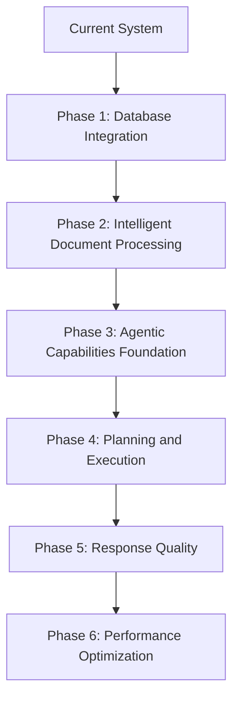
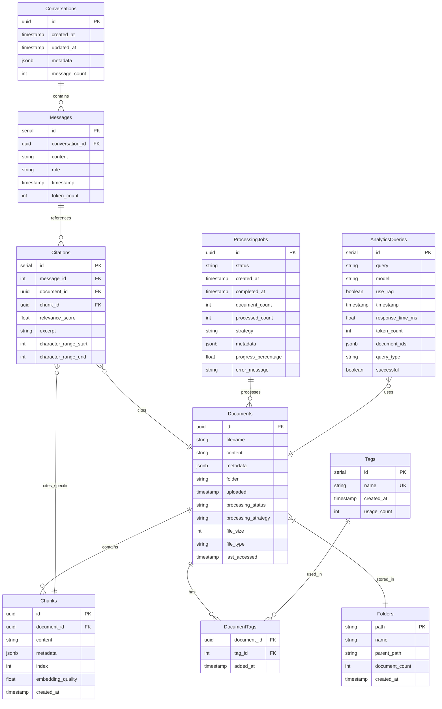

# Metis_RAG Implementation Plan

## Overview

This document outlines a comprehensive implementation plan for enhancing the Metis_RAG system with database integration, intelligent document processing, agentic capabilities, and performance optimizations.

## Key Decisions and Priorities

Based on project requirements, the following key decisions have been made:

1. **Database**: PostgreSQL for both development and production environments to ensure consistency
2. **Mem0 Integration**: Local Mem0 instance implementation
3. **Testing**: Comprehensive testing throughout development with pytest ecosystem
4. **Deployment**: Primary focus on containerized deployment with Docker, with support for bare metal installations
5. **Performance Targets**: 
   - Simple queries: 6 seconds maximum response time
   - Complex agentic tasks: Few minutes maximum completion time
   - Support for large document collections

## Phase 1: Database Integration (Weeks 1-2)

### Week 1: Database Setup and Schema Design

#### Database Configuration
- **Primary Database**: PostgreSQL for both development and production
- **Configuration**: Environment variable-based configuration for connection parameters
- **Migration Tool**: Alembic for schema migrations and version control

#### Schema Design

#### Implementation Tasks
1. Create database connection module with connection pooling and transaction management
2. Implement SQLAlchemy models with proper relationships and indexes
3. Create Alembic migration scripts for schema versioning
4. Add database initialization and connection management to application startup

### Week 2: Repository Implementation and API Updates

#### Repository Classes
1. Implement DocumentRepository with CRUD operations and efficient querying
2. Implement ConversationRepository with message management and citation tracking
3. Implement AnalyticsRepository with query logging and performance metrics
4. Add mem0 integration to repositories for memory-enhanced operations

#### API Updates
1. Update document API endpoints to use database repositories
2. Update chat API endpoints to store conversations in database
3. Update analytics API endpoints to store and retrieve analytics data
4. Add pagination, filtering, and sorting to all list endpoints