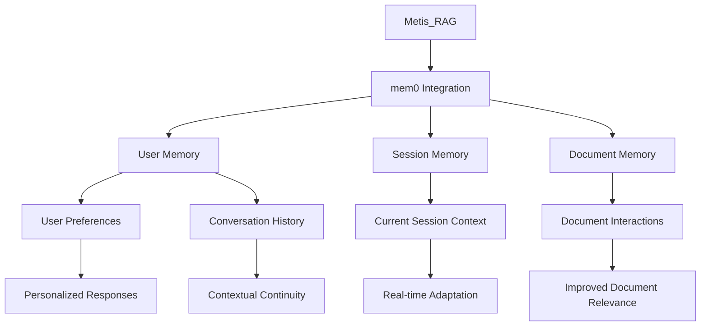

# Mem0 Integration Plan for Metis_RAG

## Overview
This document outlines the plan for integrating mem0, a memory layer for AI applications, into the Metis_RAG system. The integration will enhance Metis_RAG with persistent memory capabilities, enabling more personalized and context-aware responses.

## Architecture Diagram

## Integration Steps

### 1. Memory Layer Addition
- Add mem0 as a memory layer between the RAG system and the user interface
- Implement three memory types:
  * User Memory: Store long-term user preferences and conversation history
  * Session Memory: Maintain context for the current conversation
  * Document Memory: Track user interactions with specific documents

### 2. API Integration
- Add mem0 API calls in the FastAPI backend
- Modify the chat endpoint to:
  * Retrieve relevant memories before generating responses
  * Store new memories after each interaction

### 3. Document Processing Enhancement
- Integrate mem0 with LangChain document processing
- Store document-specific memories (e.g., frequently referenced sections)

### 4. User Interface Updates
- Add memory management controls
- Show memory-related information in the chat interface

### 5. Testing and Validation
- Add tests for memory integration
- Verify memory persistence across sessions
- Ensure proper memory retrieval and usage

## Implementation Timeline
1. Week 1: Memory layer setup and API integration
2. Week 2: Document processing enhancement
3. Week 3: User interface updates
4. Week 4: Testing and validation

## Dependencies
- mem0 Python package
- Additional memory storage capacity
- Testing infrastructure for memory-related features

## Risks and Mitigation
- **Risk**: Increased latency due to memory operations
  - **Mitigation**: Implement caching and optimize memory queries
- **Risk**: Memory storage growth
  - **Mitigation**: Implement memory pruning and archiving strategies