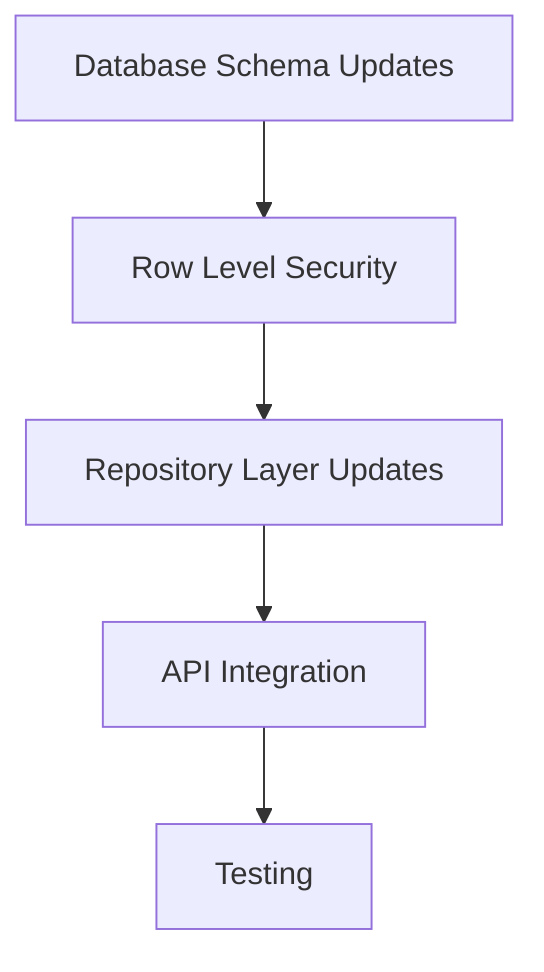

# Metis RAG Database Security Implementation Plan

## Overview

This document outlines the high-level implementation plan for Phase 2 (Database Level Security) of the Metis RAG Authentication Implementation. This phase focuses on implementing database-level security mechanisms to ensure proper access control for documents and conversations.

## Current State Analysis

Based on the code analysis:
- The `users` table is properly implemented with all necessary fields
- The `documents` and `conversations` tables already have `user_id` foreign key columns
- JWT authentication (Phase 1) has been successfully implemented

## Implementation Strategy

### 1. Database Schema Updates

- Create a `document_permissions` table for document sharing
  - Fields: document_id, user_id, permission_level, created_at
  - Indexes for efficient querying
  - Unique constraint on document_id + user_id

- Add `is_public` flag to documents table
  - Boolean field to indicate publicly accessible documents

### 2. Row Level Security (RLS) Implementation

- Enable RLS on document tables
  - Apply to `documents` and `chunks` tables

- Create ownership RLS policies
  - SELECT policy: Users can view their own documents or public documents
  - UPDATE/DELETE policies: Users can only modify their own documents

- Create document sharing RLS policies
  - SELECT policy: Users can view documents shared with them
  - UPDATE policy: Users with write permission can update shared documents

### 3. Repository Layer Updates

- Update document repository
  - Add user context to CRUD operations
  - Implement permission checking methods
  - Add methods for document sharing

- Update conversation repository
  - Add user context to conversation operations
  - Implement access control for conversations

### 4. API Integration

- Create middleware for setting user context
  - Set current user ID for RLS policies

- Update document endpoints
  - Add user context to document creation
  - Implement document sharing endpoints
  - Filter document lists by user access

- Update conversation endpoints
  - Add user context to conversation creation
  - Filter conversation lists by user access

### 5. Testing Strategy

- Unit tests for permission models
  - Test document ownership verification
  - Test document sharing between users

- Integration tests for RLS
  - Test access control across different users
  - Test public document access

- Performance testing
  - Measure impact of RLS on query performance

## Security Considerations

- Ensure proper indexing for RLS policies to maintain performance
- Implement comprehensive error handling for permission-related failures
- Add audit logging for security-related operations
- Consider the trade-offs between pre-filtering and post-filtering for vector database operations

## Next Steps

After completing Phase 2, proceed to Phase 3 (Vector Database Security) to extend the security model to the vector database components of the RAG system.
