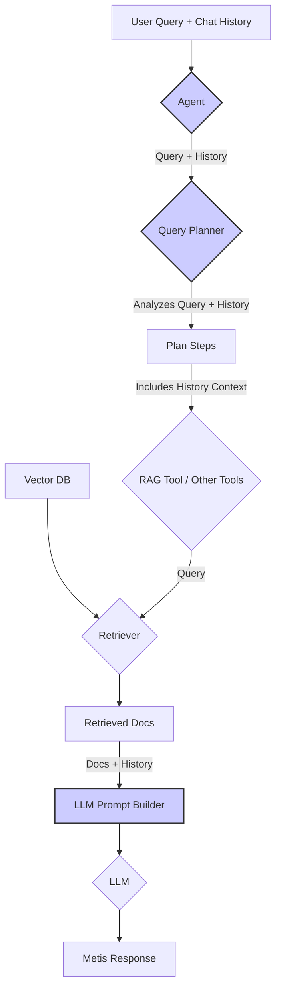

# Chat Memory Augmentation Plan for Metis RAG

## Problem Statement

The Metis RAG system currently lacks persistent memory of conversation history between turns. This results in the system appearing to "forget" previous parts of the conversation, as observed in the following behaviors:

1. When asked to reformat a previous response, Metis provides a new response instead of reformatting the original one.
2. When asked follow-up questions that reference previous turns, Metis loses context.
3. Metis explicitly states it "does not have a persistent memory of our entire conversation" in response to a direct question.

## Current System Analysis

After examining the codebase, we've identified that the lack of conversational memory stems from the following architectural limitations:

1. **Agent Layer (`enhanced_langgraph_rag_agent.py`)**: 
   - Only passes the current query to the QueryPlanner, without any conversation history.
   - Line 331: `plan = await self.query_planner.create_plan(query_id=query_id, query=query)`

2. **Query Planner (`query_planner.py`)**: 
   - `create_plan` method only accepts `query_id` and `query` parameters.
   - No mechanism to store or utilize conversation history.

3. **Query Analyzer (`query_analyzer.py`)**: 
   - `analyze` method only considers the current query in isolation.
   - LLM prompt doesn't include any conversation context.

4. **RAG Tool (`rag_tool.py`)**: 
   - Retrieval is based solely on the current query.
   - No consideration of conversation history during retrieval or response generation.

## Solution: Context Augmentation Approach

We will implement the **Context Augmentation** approach, where:

1. The conversation history will be passed through the system.
2. Retrieval will still be based primarily on the current query (for efficiency and focus).
3. The final LLM prompt will include both the retrieved documents AND the conversation history.
4. This allows the LLM to generate responses that maintain conversational context while still grounding answers in retrieved information.



## Implementation Plan

### 1. Modify QueryPlan Class (`query_planner.py`)

Add support for storing conversation history in the QueryPlan:

```python
class QueryPlan:
    def __init__(self, query_id: str, query: str, steps: List[Dict[str, Any]], 
                 chat_history: Optional[List[Tuple[str, str]]] = None):
        self.query_id = query_id
        self.query = query
        self.steps = steps
        self.current_step = 0
        self.results = []
        self.completed = False
        self.chat_history = chat_history  # Add this line
    
    def to_dict(self) -> Dict[str, Any]:
        return {
            "query_id": self.query_id,
            "query": self.query,
            "steps": self.steps,
            "current_step": self.current_step,
            "results": self.results,
            "completed": self.completed,
            "chat_history": self.chat_history  # Add this line
        }
    
    @classmethod
    def from_dict(cls, data: Dict[str, Any]) -> 'QueryPlan':
        plan = cls(
            query_id=data["query_id"],
            query=data["query"],
            steps=data["steps"],
            chat_history=data.get("chat_history")  # Add this line
        )
        plan.current_step = data.get("current_step", 0)
        plan.results = data.get("results", [])
        plan.completed = data.get("completed", False)
        return plan
```

### 2. Modify QueryPlanner Class (`query_planner.py`)

Update the `create_plan` method to accept and utilize chat history:

```python
async def create_plan(self, query_id: str, query: str, 
                     chat_history: Optional[List[Tuple[str, str]]] = None) -> QueryPlan:
    """
    Create a plan for executing a query
    
    Args:
        query_id: Unique query ID
        query: Query string
        chat_history: Optional list of (user_message, ai_message) tuples
        
    Returns:
        QueryPlan instance
    """
    self.logger.info(f"Creating plan for query: {query}")
    
    # Analyze the query with chat history context
    analysis = await self.query_analyzer.analyze(query, chat_history)
    
    # Determine if the query is simple or complex
    complexity = analysis.get("complexity", "simple")
    required_tools = analysis.get("requires_tools", [])
    sub_queries = analysis.get("sub_queries", [])
    
    # Create plan steps
    steps = []
    
    if complexity == "simple":
        # Simple query - just use RAG
        steps.append({
            "type": "tool",
            "tool": "rag",
            "input": {
                "query": query,
                "top_k": 5
            },
            "description": "Retrieve information using RAG"
        })
    else:
        # Complex query - may require multiple steps
        # ... existing code for complex queries ...
    
    # Add a final step to synthesize the results with chat history
    steps.append({
        "type": "synthesize",
        "description": "Synthesize results from previous steps with conversation history",
        "with_history": True  # Flag to indicate this step should use history
    })
    
    # Create the plan with chat history
    plan = QueryPlan(
        query_id=query_id,
        query=query,
        steps=steps,
        chat_history=chat_history  # Pass chat history to the plan
    )
    
    self.logger.info(f"Created plan with {len(steps)} steps for query: {query}")
    return plan
```

### 3. Modify QueryAnalyzer Class (`query_analyzer.py`)

Update the `analyze` method and prompt creation to consider chat history:

```python
async def analyze(self, query: str, 
                 chat_history: Optional[List[Tuple[str, str]]] = None) -> Dict[str, Any]:
    """
    Analyze a query to determine its complexity and requirements
    
    Args:
        query: Query string
        chat_history: Optional list of (user_message, ai_message) tuples
        
    Returns:
        Dict with analysis results
    """
    start_time = time.time()
    self.logger.info(f"Analyzing query: {query}")
    
    prompt = self._create_analysis_prompt(query, chat_history)
    response = await self.llm_provider.generate(prompt=prompt)
    analysis = self._parse_analysis(response.get("response", ""))
    
    elapsed_time = time.time() - start_time
    self.logger.info(f"Query analysis completed in {elapsed_time:.2f}s. Complexity: {analysis.get('complexity')}")
    
    return analysis

def _create_analysis_prompt(self, query: str, 
                           chat_history: Optional[List[Tuple[str, str]]] = None) -> str:
    """
    Create a prompt for query analysis
    
    Args:
        query: Query string
        chat_history: Optional list of (user_message, ai_message) tuples
        
    Returns:
        Prompt string
    """
    # Format chat history if available
    history_str = ""
    if chat_history:
        history_lines = []
        for i, (user_msg, ai_msg) in enumerate(chat_history):
            history_lines.append(f"Turn {i+1}:")
            history_lines.append(f"User: {user_msg}")
            history_lines.append(f"AI: {ai_msg}")
        history_str = "\n".join(history_lines)

    return f"""
You are an expert query analyzer for a RAG (Retrieval-Augmented Generation) system. Your task is to analyze the following query, considering the preceding conversation history, and determine its complexity, required tools, and potential sub-queries.

Conversation History:
{history_str if history_str else "None"}

Current Query: "{query}"

Available tools:
1. rag - Retrieves information from documents using RAG
2. calculator - Performs mathematical calculations
3. database - Queries structured data from databases

Please analyze the query and provide your assessment in the following JSON format:
{{
  "complexity": "simple" or "complex",
  "requires_tools": ["tool1", "tool2", ...],
  "sub_queries": ["sub-query1", "sub-query2", ...],
  "reasoning": "Detailed explanation of your analysis, considering the history"
}}

Where:
- "complexity" indicates whether the query is simple (can be answered with a single RAG lookup) or complex (requires multiple steps or tools)
- "requires_tools" lists the tools needed to answer the query
- "sub_queries" lists potential sub-queries if the main query needs to be broken down
- "reasoning" explains your analysis in detail

Analyze the query carefully, considering:
1. Does it require factual information retrieval? (use rag tool)
2. Does it involve calculations? (use calculator tool)
3. Does it need structured data lookup? (use database tool)
4. Does it require multiple steps or a combination of tools?
5. Would breaking it into sub-queries improve the response quality?
6. How does the conversation history affect the interpretation of the current query? Does the query refer back to previous turns (e.g., "like you mentioned before", "tell me more about that")?

Provide your analysis in valid JSON format.
"""
```

### 4. Modify Agent Implementation (`enhanced_langgraph_rag_agent.py`)

The agent needs to:
1. Maintain chat history in its state
2. Pass chat history to the QueryPlanner
3. Ensure the final response generation uses both retrieved information and chat history

```python
# Pseudocode for the agent implementation changes
async def process_query(self, query_id: str, query: str, session_id: str):
    # Retrieve chat history for this session
    chat_history = await self.get_chat_history(session_id)
    
    # Create a plan using the query planner with chat history
    plan = await self.query_planner.create_plan(
        query_id=query_id, 
        query=query,
        chat_history=chat_history
    )
    
    # Execute the plan steps
    while not plan.is_completed():
        step = plan.get_next_step()
        
        if step["type"] == "tool":
            # Execute tool (e.g., RAG)
            result = await self.execute_tool(step)
        elif step["type"] == "synthesize":
            # Generate final response using both retrieved info and chat history
            result = await self.synthesize_response(plan, step)
        
        plan.record_step_result(result)
    
    # Extract the final response
    response = self.extract_response(plan)
    
    # Update chat history with this turn
    await self.update_chat_history(session_id, query, response)
    
    return response

async def synthesize_response(self, plan: QueryPlan, step: Dict[str, Any]) -> Dict[str, Any]:
    """
    Generate a final response using retrieved information and chat history
    """
    # Get results from previous steps (e.g., RAG tool output)
    retrieved_chunks = []
    for result in plan.results:
        if "chunks" in result:
            retrieved_chunks.extend(result["chunks"])
    
    # Format retrieved chunks as context
    context = "\n\n".join([chunk["content"] for chunk in retrieved_chunks])
    
    # Format chat history
    history_str = ""
    if plan.chat_history:
        history_lines = []
        for i, (user_msg, ai_msg) in enumerate(plan.chat_history):
            history_lines.append(f"User: {user_msg}")
            history_lines.append(f"AI: {ai_msg}")
        history_str = "\n".join(history_lines)
    
    # Create prompt for response generation
    prompt = f"""
You are Metis, a helpful AI assistant with RAG capabilities. Generate a response to the user's query using the retrieved information and conversation history.

Conversation History:
{history_str if history_str else "None"}

Current Query: "{plan.query}"

Retrieved Information:
{context}

Generate a comprehensive, accurate response that:
1. Directly addresses the user's query
2. Maintains continuity with the conversation history
3. Is grounded in the retrieved information
4. Cites sources when appropriate using [1], [2], etc.

Your response:
"""
    
    # Generate response using LLM
    llm_response = await self.llm_provider.generate(prompt=prompt)
    
    return {
        "response": llm_response.get("response", ""),
        "sources": [chunk["metadata"].get("document_id") for chunk in retrieved_chunks if "metadata" in chunk]
    }
```

## Testing Plan

1. **Unit Tests**:
   - Update existing tests for QueryPlanner, QueryAnalyzer, and Agent to handle chat history
   - Add new tests specifically for conversation memory scenarios

2. **Integration Tests**:
   - Test the full conversation flow with multi-turn dialogues
   - Verify that references to previous turns are handled correctly

3. **Test Cases**:
   - Simple follow-up questions ("Tell me more about that")
   - Requests to reformulate previous responses ("Give me that as a list")
   - Questions that reference entities from previous turns
   - Explicit questions about conversation memory

## Implementation Phases

1. **Phase 1**: Modify data structures (QueryPlan) to store chat history
2. **Phase 2**: Update QueryPlanner and QueryAnalyzer to accept and use chat history
3. **Phase 3**: Implement the synthesize_response method in the Agent
4. **Phase 4**: Add chat history persistence (if needed)
5. **Phase 5**: Testing and refinement

## Conclusion

This implementation will add conversational memory to the Metis RAG system using the Context Augmentation approach. By passing chat history through the system and incorporating it in the final response generation, Metis will be able to maintain context across conversation turns while still grounding its responses in retrieved information.