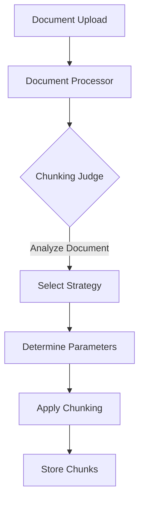
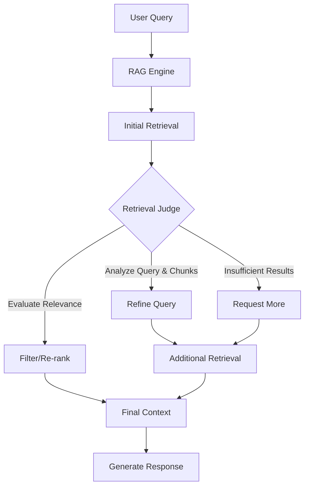

# LLM-Enhanced RAG System Implementation Plan

## Overview

This document outlines a comprehensive plan for implementing an enhanced Retrieval Augmented Generation (RAG) system using LLM-based "judges" to improve two critical aspects of the RAG pipeline:

1. **Dynamic Chunking Strategy Selection**: An LLM agent ("Chunking Judge") that analyzes documents and selects the most appropriate chunking strategy and parameters.

2. **Query Refinement and Retrieval Enhancement**: An LLM agent ("Retrieval Judge") that analyzes queries and retrieved chunks to improve retrieval quality through query refinement, relevance evaluation, and potential re-retrieval.

## Current System Analysis

The current RAG implementation has several strengths:

- Multiple chunking strategies (recursive, token-based, markdown) with file type-specific handling
- Relevance filtering with a threshold of 0.4 to filter out less relevant chunks
- Robust vector store using ChromaDB with caching for performance
- Well-structured document model with chunks, metadata, tags, and folder organization
- Resilient Ollama client with retry logic and error handling

However, the system currently uses static rules for chunking strategy selection and fixed parameters, which limits adaptability to diverse document types. The retrieval process is also relatively simple, without query refinement or iterative retrieval.

## Implementation Approach

We will take a phased approach to implementation, starting with the Chunking Judge and then moving on to the Retrieval Judge. Both judges will use the gemma3:12b model for its multimodal capabilities, with the system designed to allow changing the model in the future.

## Phase 1: Chunking Judge Implementation

### 1.1 Create Agent Architecture



### 1.2 Create the Chunking Judge Class

```python
# app/rag/agents/chunking_judge.py
import logging
import json
import re
from typing import Dict, Any, List, Optional
from app.models.document import Document
from app.rag.ollama_client import OllamaClient
from app.core.config import CHUNKING_JUDGE_MODEL

logger = logging.getLogger("app.rag.agents.chunking_judge")

class ChunkingJudge:
    """
    LLM-based agent that analyzes documents and recommends optimal chunking strategies
    """
    def __init__(self, ollama_client: Optional[OllamaClient] = None, model: str = CHUNKING_JUDGE_MODEL):
        self.ollama_client = ollama_client or OllamaClient()
        self.model = model
    
    async def analyze_document(self, document: Document) -> Dict[str, Any]:
        """
        Analyze a document and recommend the best chunking strategy and parameters
        
        Returns:
            Dict with keys:
            - strategy: The recommended chunking strategy
            - parameters: Dict of parameters for the chosen strategy
            - justification: Explanation of the recommendation
        """
        # Extract a sample of the document content (to avoid exceeding context window)
        content_sample = self._extract_representative_sample(document.content)
        
        # Create prompt for the LLM
        prompt = self._create_analysis_prompt(document.filename, content_sample)
        
        # Get recommendation from LLM
        response = await self.ollama_client.generate(
            prompt=prompt,
            model=self.model,
            stream=False
        )
        
        # Parse the response
        recommendation = self._parse_recommendation(response.get("response", ""))
        
        logger.info(f"Chunking Judge recommended strategy '{recommendation['strategy']}' for document {document.filename}")
        
        return recommendation
    
    def _extract_representative_sample(self, content: str, max_length: int = 5000) -> str:
        """Extract a representative sample of the document content"""
        if len(content) <= max_length:
            return content
        
        # Take beginning, middle and end sections
        third = max_length // 3
        beginning = content[:third]
        middle_start = (len(content) - third) // 2
        middle = content[middle_start:middle_start + third]
        end = content[-third:]
        
        return f"{beginning}\n\n[...]\n\n{middle}\n\n[...]\n\n{end}"
    
    def _create_analysis_prompt(self, filename: str, content_sample: str) -> str:
        """Create a prompt for the LLM to analyze the document"""
        return f"""You are a document analysis expert. Your task is to analyze the following document and recommend the best chunking strategy for a RAG (Retrieval Augmented Generation) system.

Available Strategies:
- recursive: Splits text recursively by characters. Good for general text with natural separators.
- token: Splits text by tokens. Good for preserving semantic units in technical content.
- markdown: Splits markdown documents by headers. Good for structured documents with clear sections.

Document Filename: {filename}

Document Sample:
{content_sample}

Analyze the document structure, content type, and formatting. Consider:
1. Is this a structured document with clear sections or headers?
2. Does it contain code, tables, or other special formatting?
3. What's the typical paragraph and sentence length?
4. Are there natural breaks in the content?
5. Would semantic chunking be more appropriate than fixed-size chunking?

Output your recommendation in JSON format:
{{
    "strategy": "...",  // One of: recursive, token, markdown
    "parameters": {{
        "chunk_size": ...,  // Recommended chunk size (characters or tokens)
        "chunk_overlap": ...  // Recommended overlap size
    }},
    "justification": "..." // Explanation of your reasoning
}}
"""
    
    def _parse_recommendation(self, response_text: str) -> Dict[str, Any]:
        """Parse the LLM response to extract the recommendation"""
        try:
            # Extract JSON from the response
            json_match = re.search(r'({[\s\S]*})', response_text)
            if json_match:
                json_str = json_match.group(1)
                recommendation = json.loads(json_str)
                
                # Validate the recommendation
                if "strategy" not in recommendation:
                    raise ValueError("Missing 'strategy' in recommendation")
                
                # Set defaults if missing
                if "parameters" not in recommendation:
                    recommendation["parameters"] = {}
                if "chunk_size" not in recommendation["parameters"]:
                    recommendation["parameters"]["chunk_size"] = 500
                if "chunk_overlap" not in recommendation["parameters"]:
                    recommendation["parameters"]["chunk_overlap"] = 50
                
                return recommendation
            else:
                raise ValueError("Could not find JSON in response")
        except Exception as e:
            logger.error(f"Error parsing chunking recommendation: {str(e)}")
            # Return default recommendation
            return {
                "strategy": "recursive",
                "parameters": {
                    "chunk_size": 500,
                    "chunk_overlap": 50
                },
                "justification": "Failed to parse LLM recommendation, using default strategy."
            }
```

### 1.3 Update Configuration

```python
# app/core/config.py
# Add new configuration variables
CHUNKING_JUDGE_MODEL = os.getenv("CHUNKING_JUDGE_MODEL", DEFAULT_MODEL)
RETRIEVAL_JUDGE_MODEL = os.getenv("RETRIEVAL_JUDGE_MODEL", DEFAULT_MODEL)
USE_CHUNKING_JUDGE = os.getenv("USE_CHUNKING_JUDGE", "True").lower() == "true"
USE_RETRIEVAL_JUDGE = os.getenv("USE_RETRIEVAL_JUDGE", "True").lower() == "true"
```

### 1.4 Integrate with DocumentProcessor

```python
# app/rag/document_processor.py
# Update the process_document method

from app.rag.agents.chunking_judge import ChunkingJudge
from app.core.config import USE_CHUNKING_JUDGE

async def process_document(self, document: Document) -> Document:
    """
    Process a document by splitting it into chunks
    """
    try:
        logger.info(f"Processing document: {document.filename}")
        
        # Get the document path
        file_path = os.path.join(UPLOAD_DIR, document.id, document.filename)
        
        # Get file extension for specialized handling
        _, ext = os.path.splitext(file_path.lower())
        
        # Use Chunking Judge if enabled
        if USE_CHUNKING_JUDGE:
            chunking_judge = ChunkingJudge()
            analysis_result = await chunking_judge.analyze_document(document)
            
            # Update chunking strategy and parameters
            self.chunking_strategy = analysis_result["strategy"]
            if "chunk_size" in analysis_result["parameters"]:
                self.chunk_size = analysis_result["parameters"]["chunk_size"]
            if "chunk_overlap" in analysis_result["parameters"]:
                self.chunk_overlap = analysis_result["parameters"]["chunk_overlap"]
            
            # Store the chunking analysis in document metadata
            document.metadata["chunking_analysis"] = analysis_result
            
            logger.info(f"Using Chunking Judge recommendation: strategy={self.chunking_strategy}, " +
                       f"chunk_size={self.chunk_size}, chunk_overlap={self.chunk_overlap}")
        else:
            logger.info(f"Chunking Judge disabled, using default strategy: {self.chunking_strategy}")
        
        # Get appropriate text splitter for this file type and strategy
        self.text_splitter = self._get_text_splitter(ext)
        
        # Rest of the existing code...
```

### 1.5 Enhance Text Splitter Selection

```python
# app/rag/document_processor.py
# Update the _get_text_splitter method to support more advanced chunking strategies

def _get_text_splitter(self, file_ext=None):
    """Get the appropriate text splitter based on chunking strategy and file type"""
    logger.info(f"Using chunking strategy: {self.chunking_strategy} for file type: {file_ext}")
    
    # If we have a chunking analysis, log it
    if hasattr(self, 'document') and self.document and 'chunking_analysis' in self.document.metadata:
        logger.info(f"Chunking analysis: {self.document.metadata['chunking_analysis']['justification']}")
    
    # Text file handling - use paragraph-based splitting for more natural chunks
    if file_ext == ".txt":
        # Use a larger chunk size for text files to preserve more context
        larger_chunk_size = self.chunk_size * 3  # Increase from 500 to 1500
        logger.info(f"Using paragraph-based splitting for text file with increased chunk size {larger_chunk_size}")
        return RecursiveCharacterTextSplitter(
            chunk_size=larger_chunk_size,
            chunk_overlap=self.chunk_overlap * 2,  # Increase overlap as well
            separators=["\n\n", "\n", ".", " ", ""]
        )
    
    # PDF-specific handling
    if file_ext == ".pdf":
        logger.info(f"Using PDF-specific splitting with chunk size {self.chunk_size}")
        return RecursiveCharacterTextSplitter(
            chunk_size=self.chunk_size,
            chunk_overlap=self.chunk_overlap,
            separators=["\n\n", "\n", ".", " ", ""]
        )
    
    # Markdown-specific handling
    if file_ext == ".md" and self.chunking_strategy == "markdown":
        logger.info("Using header-based splitting for markdown")
        # First split by headers
        header_splitter = MarkdownHeaderTextSplitter(
            headers_to_split_on=[
                ("#", "header1"),
                ("##", "header2"),
                ("###", "header3"),
                ("####", "header4"),
            ]
        )
        # Then apply recursive splitting to each section
        return RecursiveCharacterTextSplitter(
            chunk_size=self.chunk_size,
            chunk_overlap=self.chunk_overlap
        )
    
    # CSV-specific handling
    if file_ext == ".csv":
        logger.info(f"Using larger chunks for CSV with chunk size {self.chunk_size}")
        return RecursiveCharacterTextSplitter(
            chunk_size=self.chunk_size * 2,  # Double chunk size for CSVs
            chunk_overlap=self.chunk_overlap
        )
    
    # Standard strategies
    if self.chunking_strategy == "recursive":
        return RecursiveCharacterTextSplitter(
            chunk_size=self.chunk_size,
            chunk_overlap=self.chunk_overlap,
            separators=["\n\n", "\n", ".", "!", "?", ",", " ", ""]
        )
    elif self.chunking_strategy == "token":
        return TokenTextSplitter(
            chunk_size=self.chunk_size // 4,  # Adjust for tokens vs characters
            chunk_overlap=self.chunk_overlap // 4
        )
    elif self.chunking_strategy == "markdown":
        return MarkdownHeaderTextSplitter(
            headers_to_split_on=[
                ("#", "header1"),
                ("##", "header2"),
                ("###", "header3"),
                ("####", "header4"),
            ]
        )
    else:
        logger.warning(f"Unknown chunking strategy: {self.chunking_strategy}, falling back to recursive")
        return RecursiveCharacterTextSplitter(
            chunk_size=self.chunk_size,
            chunk_overlap=self.chunk_overlap,
            separators=["\n\n", "\n", ".", " ", ""]
        )
```

## Phase 2: Retrieval Judge Implementation

### 2.1 Create Agent Architecture



### 2.2 Create the Retrieval Judge Class

```python
# app/rag/agents/retrieval_judge.py
import logging
import json
import re
from typing import Dict, Any, List, Optional
from app.rag.ollama_client import OllamaClient
from app.core.config import RETRIEVAL_JUDGE_MODEL

logger = logging.getLogger("app.rag.agents.retrieval_judge")

class RetrievalJudge:
    """
    LLM-based agent that analyzes queries and retrieved chunks to improve retrieval quality
    """
    def __init__(self, ollama_client: Optional[OllamaClient] = None, model: str = RETRIEVAL_JUDGE_MODEL):
        self.ollama_client = ollama_client or OllamaClient()
        self.model = model
    
    async def evaluate_retrieval(
        self, 
        query: str, 
        chunks: List[Dict[str, Any]],
        conversation_history: Optional[List[Dict[str, str]]] = None
    ) -> Dict[str, Any]:
        """
        Evaluate the retrieved chunks for a query and recommend improvements
        
        Returns:
            Dict with keys:
            - refined_query: Reformulated query (or original if no change)
            - relevant_chunks: List of relevant chunk IDs
            - re_rank_chunks: List of chunk IDs in re-ranked order
            - request_more: Boolean indicating if more retrieval is needed
            - justification: Explanation of the evaluation
        """
        # Create prompt for the LLM
        prompt = self._create_evaluation_prompt(query, chunks, conversation_history)
        
        # Get evaluation from LLM
        response = await self.ollama_client.generate(
            prompt=prompt,
            model=self.model,
            stream=False
        )
        
        # Parse the response
        evaluation = self._parse_evaluation(response.get("response", ""), chunks)
        
        logger.info(f"Retrieval Judge evaluated query: '{query}', refined to: '{evaluation['refined_query']}'")
        logger.info(f"Found {len(evaluation['relevant_chunks'])} relevant chunks out of {len(chunks)}")
        
        return evaluation
    
    def _create_evaluation_prompt(
        self, 
        query: str, 
        chunks: List[Dict[str, Any]],
        conversation_history: Optional[List[Dict[str, str]]] = None
    ) -> str:
        """Create a prompt for the LLM to evaluate the retrieval"""
        # Format chunks for the prompt
        chunks_text = ""
        for i, chunk in enumerate(chunks):
            # Extract a preview of the chunk content
            content = chunk.get("content", "")
            content_preview = content[:300] + "..." if len(content) > 300 else content
            
            # Format chunk with metadata
            metadata = chunk.get("metadata", {})
            filename = metadata.get("filename", "Unknown")
            
            chunks_text += f"Chunk {i+1} (ID: {chunk.get('chunk_id', 'unknown')}):\n"
            chunks_text += f"Source: {filename}\n"
            chunks_text += f"Content: {content_preview}\n\n"
        
        # Format conversation history if provided
        history_text = ""
        if conversation_history and len(conversation_history) > 0:
            history_text = "Previous conversation:\n"
            for msg in conversation_history:
                role = msg.get("role", "unknown")
                content = msg.get("content", "")
                history_text += f"{role.capitalize()}: {content}\n"
            history_text += "\n"
        
        return f"""You are a retrieval evaluation expert. Your task is to analyze a user query and a set of retrieved document chunks, and determine if the retrieval is sufficient and relevant.

User Query: {query}

{history_text}Retrieved Chunks:
{chunks_text}

Your task:
1. Evaluate the relevance of each chunk to the query
2. Determine if the retrieval is sufficient to answer the query
3. If needed, reformulate the query to improve retrieval
4. Identify which chunks are most relevant
5. Re-rank the chunks in order of relevance to the query

Output your evaluation in JSON format:
{{
    "refined_query": "...",  // Reformulated query (or original if no change needed)
    "relevant_chunks": [...],  // List of relevant chunk IDs (or indices)
    "re_rank_chunks": [...],  // List of chunk IDs in order of relevance (most to least)
    "request_more": true/false,  // Whether additional retrieval is needed
    "justification": "..."  // Explanation of your evaluation
}}
"""
    
    def _parse_evaluation(self, response_text: str, chunks: List[Dict[str, Any]]) -> Dict[str, Any]:
        """Parse the LLM response to extract the evaluation"""
        try:
            # Extract JSON from the response
            json_match = re.search(r'({[\s\S]*})', response_text)
            if json_match:
                json_str = json_match.group(1)
                evaluation = json.loads(json_str)
                
                # Set defaults if missing
                if "refined_query" not in evaluation:
                    evaluation["refined_query"] = ""
                if "relevant_chunks" not in evaluation:
                    evaluation["relevant_chunks"] = []
                if "re_rank_chunks" not in evaluation:
                    evaluation["re_rank_chunks"] = []
                if "request_more" not in evaluation:
                    evaluation["request_more"] = False
                
                return evaluation
            else:
                raise ValueError("Could not find JSON in response")
        except Exception as e:
            logger.error(f"Error parsing retrieval evaluation: {str(e)}")
            # Return default evaluation
            return {
                "refined_query": "",
                "relevant_chunks": [chunk.get("chunk_id") for chunk in chunks],
                "re_rank_chunks": [],
                "request_more": False,
                "justification": "Failed to parse LLM evaluation, using all chunks."
            }
```

### 2.3 Integrate with RAGEngine

```python
# app/rag/rag_engine.py
# Update the query method

from app.rag.agents.retrieval_judge import RetrievalJudge
from app.core.config import USE_RETRIEVAL_JUDGE

async def query(
    self,
    query: str,
    model: str = DEFAULT_MODEL,
    use_rag: bool = True,
    top_k: int = 10,
    system_prompt: Optional[str] = None,
    stream: bool = False,
    model_parameters: Dict[str, Any] = None,
    conversation_history: Optional[List[Message]] = None,
    metadata_filters: Optional[Dict[str, Any]] = None,
    max_retrieval_iterations: int = 2  # New parameter
) -> Dict[str, Any]:
    """
    Query the RAG engine with optional conversation history and metadata filtering
    """
    start_time = time.time()
    document_ids = []
    
    try:
        logger.info(f"RAG query: {query[:50]}...")
        
        # Get context from vector store if RAG is enabled
        context = ""
        sources = []
        
        # Format conversation history if provided
        conversation_context = ""
        formatted_history = []
        
        if conversation_history and len(conversation_history) > 1:
            # Format the conversation history (existing code)
            # ...
            
            # Also prepare a version for the retrieval judge
            for msg in conversation_history[:-1]:  # Exclude current query
                formatted_history.append({
                    "role": msg.role,
                    "content": msg.content
                })
        
        if use_rag:
            # Check if there are any documents in the vector store
            stats = self.vector_store.get_stats()
            if stats["count"] == 0:
                # Handle empty vector store (existing code)
                # ...
            else:
                # Iterative retrieval with Retrieval Judge if enabled
                search_query = query
                iteration = 0
                all_results = []
                
                while iteration < max_retrieval_iterations:
                    # Log the search query for this iteration
                    logger.info(f"Retrieval iteration {iteration+1}: searching with query: {search_query[:100]}...")
                    
                    # Perform search with current query
                    search_results = await self.vector_store.search(
                        query=search_query,
                        top_k=15,  # Get more results for the judge to evaluate
                        filter_criteria=metadata_filters
                    )
                    
                    if not search_results:
                        logger.warning(f"No results found for query in iteration {iteration+1}")
                        break
                    
                    # Add results to our collection
                    all_results.extend(search_results)
                    
                    # Use Retrieval Judge if enabled and not the last iteration
                    if USE_RETRIEVAL_JUDGE and iteration < max_retrieval_iterations - 1:
                        retrieval_judge = RetrievalJudge()
                        evaluation = await retrieval_judge.evaluate_retrieval(
                            query=query,  # Original query
                            chunks=search_results,
                            conversation_history=formatted_history
                        )
                        
                        # Log the evaluation
                        logger.info(f"Retrieval Judge evaluation: {evaluation['justification']}")
                        
                        # Check if we need more retrieval
                        if evaluation["request_more"] and evaluation["refined_query"]:
                            # Use the refined query for the next iteration
                            search_query = evaluation["refined_query"]
                            iteration += 1
                            logger.info(f"Retrieval Judge requested more retrieval with refined query: {search_query}")
                        else:
                            # No more retrieval needed
                            break
                    else:
                        # No retrieval judge or last iteration
                        break
                
                # After retrieval iterations, process all results
                if all_results:
                    logger.info(f"Retrieved {len(all_results)} total chunks from vector store")
                    
                    # If we used the retrieval judge, filter and re-rank results
                    if USE_RETRIEVAL_JUDGE and 'evaluation' in locals():
                        # Filter to relevant chunks if specified
                        if evaluation["relevant_chunks"]:
                            relevant_ids = set(evaluation["relevant_chunks"])
                            all_results = [r for r in all_results if r.get("chunk_id") in relevant_ids]
                            logger.info(f"Filtered to {len(all_results)} relevant chunks based on Retrieval Judge")
                        
                        # Re-rank chunks if specified
                        if evaluation["re_rank_chunks"]:
                            # Create a mapping of chunk_id to result
                            result_map = {r.get("chunk_id"): r for r in all_results}
                            
                            # Re-order results based on the re-ranking
                            reranked_results = []
                            for chunk_id in evaluation["re_rank_chunks"]:
                                if chunk_id in result_map:
                                    reranked_results.append(result_map[chunk_id])
                            
                            # Add any remaining results not in the re-ranking
                            remaining = [r for r in all_results if r.get("chunk_id") not in evaluation["re_rank_chunks"]]
                            all_results = reranked_results + remaining
                            logger.info(f"Re-ranked chunks based on Retrieval Judge")
                    
                    # Format context with source information (existing code, but using all_results)
                    # ...
                
                # Rest of the existing code for context formatting
                # ...
        
        # Rest of the existing code for prompt construction and response generation
        # ...
```

## Phase 3: Advanced Semantic Chunking

Building on the success of the Chunking Judge, we can implement more advanced semantic chunking strategies:

### 3.1 Implement Semantic Chunking

```python
# app/rag/semantic_chunker.py
import logging
from typing import List, Dict, Any
from langchain.text_splitter import TextSplitter
from app.rag.ollama_client import OllamaClient
from app.models.document import Document

logger = logging.getLogger("app.rag.semantic_chunker")

class SemanticChunker(TextSplitter):
    """
    LLM-based semantic chunker that splits text based on semantic boundaries
    """
    def __init__(
        self,
        ollama_client: OllamaClient = None,
        model: str = "gemma3:12b",
        chunk_size: int = 500,
        chunk_overlap: int = 50
    ):
        super().__init__()
        self.ollama_client = ollama_client or OllamaClient()
        self.model = model
        self.chunk_size = chunk_size
        self.chunk_overlap = chunk_overlap
    
    async def split_text(self, text: str) -> List[str]:
        """Split text into semantically meaningful chunks"""
        # For very short texts, just return as is
        if len(text) < self.chunk_size:
            return [text]
        
        # Create prompt for the LLM
        prompt = self._create_chunking_prompt(text)
        
        # Get chunking from LLM
        response = await self.ollama_client.generate(
            prompt=prompt,
            model=self.model,
            stream=False
        )
        
        # Parse the response to get chunks
        chunks = self._parse_chunks(response.get("response", ""), text)
        
        logger.info(f"Semantic chunker created {len(chunks)} chunks")
        
        return chunks
    
    def _create_chunking_prompt(self, text: str) -> str:
        """Create a prompt for the LLM to chunk the text"""
        # Use a sample if the text is too long
        if len(text) > 10000:
            text = text[:10000] + "...\n[Text truncated for prompt length]"
        
        return f"""You are a document chunking expert. Your task is to split the following text into semantically meaningful chunks.

Each chunk should:
1. Be a coherent, self-contained unit of information
2. Preserve the semantic meaning of the content
3. Be approximately {self.chunk_size} characters in length (but prioritize semantic coherence over exact size)
4. Not break in the middle of a sentence or logical unit

Text to chunk:
{text}

Output format:
CHUNK 1:
[Content of first chunk]
END CHUNK 1

CHUNK 2:
[Content of second chunk]
END CHUNK 2

... and so on.

Make sure each chunk is semantically meaningful and can stand on its own as much as possible.
"""
    
    def _parse_chunks(self, response_text: str, original_text: str) -> List[str]:
        """Parse the LLM response to extract chunks"""
        try:
            # Extract chunks using regex
            import re
            chunk_pattern = r"CHUNK \d+:\n(.*?)END CHUNK \d+"
            chunks = re.findall(chunk_pattern, response_text, re.DOTALL)
            
            # Clean up chunks
            chunks = [chunk.strip() for chunk in chunks]
            
            # If no chunks were found, fall back to a simple split
            if not chunks:
                logger.warning("No chunks found in LLM response, falling back to simple splitting")
                return self._fallback_split(original_text)
            
            return chunks
        except Exception as e:
            logger.error(f"Error parsing chunks: {str(e)}")
            return self._fallback_split(original_text)
    
    def _fallback_split(self, text: str) -> List[str]:
        """Fallback method to split text if LLM chunking fails"""
        from langchain.text_splitter import RecursiveCharacterTextSplitter
        
        splitter = RecursiveCharacterTextSplitter(
            chunk_size=self.chunk_size,
            chunk_overlap=self.chunk_overlap,
            separators=["\n\n", "\n", ".", " ", ""]
        )
        
        return splitter.split_text(text)
```

### 3.2 Integrate Semantic Chunking with DocumentProcessor

```python
# app/rag/document_processor.py
# Update the _get_text_splitter method to support semantic chunking

from app.rag.semantic_chunker import SemanticChunker

def _get_text_splitter(self, file_ext=None):
    """Get the appropriate text splitter based on chunking strategy and file type"""
    logger.info(f"Using chunking strategy: {self.chunking_strategy} for file type: {file_ext}")
    
    # Add semantic chunking strategy
    if self.chunking_strategy == "semantic":
        logger.info(f"Using semantic chunking with chunk size {self.chunk_size}")
        return SemanticChunker(
            chunk_size=self.chunk_size,
            chunk_overlap=self.chunk_overlap
        )
    
    # Rest of the existing code...
```

## Phase 4: LangGraph Integration for Agentic RAG

Building on the success of the individual judges, we can implement a more sophisticated agentic RAG system using LangGraph:

### 4.1 Install Dependencies

```bash
pip install langgraph
```

### 4.2 Create LangGraph RAG Agent

```python
# app/rag/agents/langgraph_rag_agent.py
import logging
from typing import Dict, Any, List, Optional, TypedDict, Annotated, Literal
from enum import Enum
import json

from langgraph.graph import StateGraph, END
from langgraph.prebuilt import ToolNode
from app.rag.ollama_client import OllamaClient
from app.rag.vector_store import VectorStore
from app.core.config import DEFAULT_MODEL

logger = logging.getLogger("app.rag.agents.langgraph_rag_agent")

# Define state types
class AgentState(TypedDict):
    query: str
    conversation_history: List[Dict[str, str]]
    retrieved_chunks: List[Dict[str, Any]]
    refined_query: Optional[str]
    relevant_chunks: List[Dict[str, Any]]
    final_context: str
    answer: Optional[str]
    sources: List[Dict[str, Any]]
    needs_more_retrieval: bool
    needs_query_refinement: bool

class RAGAgentAction(str, Enum):
    RETRIEVE = "retrieve"
    EVALUATE = "evaluate"
    REFINE_QUERY = "refine_query"
    GENERATE = "generate"
    END = "end"

class LangGraphRAGAgent:
    """
    Agentic RAG system using LangGraph
    """
    def __init__(
        self,
        ollama_client: Optional[OllamaClient] = None,
        vector_store: Optional[VectorStore] = None,
        model: str = DEFAULT_MODEL,
        top_k: int = 10
    ):
        self.ollama_client = ollama_client or OllamaClient()
        self.vector_store = vector_store or VectorStore()
        self.model = model
        self.top_k = top_k
        self.graph = self._build_graph()
    
    def _build_graph(self) -> StateGraph:
        """Build the LangGraph for the RAG agent"""
        # Create the graph
        graph = StateGraph(AgentState)
        
        # Add nodes
        graph.add_node("retrieve", self._retrieve)
        graph.add_node("evaluate", self._evaluate_retrieval)
        graph.add_node("refine_query", self._refine_query)
        graph.add_node("generate", self._generate_response)
        
        # Add edges
        graph.add_edge("retrieve", "evaluate")
        graph.add_conditional_edges(
            "evaluate",
            self._route_after_evaluation,
            {
                RAGAgentAction.REFINE_QUERY: "refine_query",
                RAGAgentAction.GENERATE: "generate",
            }
        )
        graph.add_edge("refine_query", "retrieve")
        graph.add_edge("generate", END)
        
        # Set entry point
        graph.set_entry_point("retrieve")
        
        return graph.compile()
    
    async def _retrieve(self, state: AgentState) -> AgentState:
        """Retrieve chunks from the vector store"""
        query = state.get("refined_query") or state.get("query")
        logger.info(f"Retrieving chunks for query: {query[:100]}...")
        
        search_results = await self.vector_store.search(
            query=query,
            top_k=self.top_k
        )
        
        logger.info(f"Retrieved {len(search_results)} chunks")
        
        return {
            **state,
            "retrieved_chunks": search_results
        }
    
    async def _evaluate_retrieval(self, state: AgentState) -> AgentState:
        """Evaluate the retrieved chunks"""
        query = state.get("query")
        chunks = state.get("retrieved_chunks", [])
        
        if not chunks:
            logger.warning("No chunks retrieved to evaluate")
            return {
                **state,
                "needs_more_retrieval": False,
                "needs_query_refinement": False,
                "relevant_chunks": [],
                "final_context": "No relevant information found."
            }
        
        # Create prompt for evaluation
        prompt = f"""You are a retrieval evaluation expert. Analyze these retrieved chunks for the query: "{query}"

Retrieved Chunks:
{self._format_chunks_for_prompt(chunks)}

Evaluate:
1. Are these chunks relevant to the query?
2. Do they contain sufficient information to answer the query?
3. Is query refinement needed to get better results?

Output your evaluation in JSON format:
{{
    "needs_query_refinement": true/false,
    "needs_more_retrieval": true/false,
    "relevant_chunk_ids": [...],
    "justification": "..."
}}
"""
        
        # Get evaluation from LLM
        response = await self.ollama_client.generate(
            prompt=prompt,
            model=self.model,
            stream=False
        )
        
        # Parse the response
        evaluation = self._parse_json_response(response.get("response", ""))
        
        # Get relevant chunks
        relevant_chunk_ids = evaluation.get("relevant_chunk_ids", [])
        relevant_chunks = [c for c in chunks if c.get("chunk_id") in relevant_chunk_ids]
        
        # If no relevant chunks specified, use all chunks
        if not relevant_chunks and chunks:
            relevant_chunks = chunks
        
        # Format final context
        final_context = self._format_context(relevant_chunks)
        
        return {
            **state,
            "needs_more_retrieval": evaluation.get("needs_more_retrieval", False),
            "needs_query_refinement": evaluation.get("needs_query_refinement", False),
            "relevant_chunks": relevant_chunks,
            "final_context": final_context
        }
    
    def _route_after_evaluation(self, state: AgentState) -> RAGAgentAction:
        """Determine next action based on evaluation"""
        if state.get("needs_query_refinement", False):
            return RAGAgentAction.REFINE_QUERY
        else:
            return RAGAgentAction.GENERATE
    
    async def _refine_query(self, state: AgentState) -> AgentState:
        """Refine the query based on evaluation"""
        original_query = state.get("query", "")
        chunks = state.get("retrieved_chunks", [])
        
        # Create prompt for query refinement
        prompt = f"""You are a query refinement expert. The original query was: "{original_query}"

The retrieved chunks were:
{self._format_chunks_for_prompt(chunks)}

These chunks were not sufficient to answer the query. Please refine the query to get better results.
The refined query should be more specific and help retrieve more relevant information.

Output your refined query in JSON format:
{{
    "refined_query": "..."
}}
"""
        
        # Get refinement from LLM
        response = await self.ollama_client.generate(
            prompt=prompt,
            model=self.model,
            stream=False
        )
        
        # Parse the response
        refinement = self._parse_json_response(response.get("response", ""))
        refined_query = refinement.get("refined_query", original_query)
        
        logger.info(f"Refined query: '{refined_query}'")
        
        return {
            **state,
            "refined_query": refined_query
        }
    
    async def _generate_response(self, state: AgentState) -> AgentState:
        """Generate a response based on the retrieved context"""
        query = state.get("query", "")
        context = state.get("final_context", "")
        
        # Create prompt for response generation
        prompt = f"""Answer the following question based on the provided context:

Context:
{context}

Question: {query}

Provide a comprehensive answer based only on the information in the context. If the context doesn't contain enough information to answer the question, say so clearly.
"""
        
        # Get response from LLM
        response = await self.ollama_client.generate(
            prompt=prompt,
            model=self.model,
            stream=False
        )
        
        # Extract sources for citations
        sources = []
        for chunk in state.get("relevant_chunks", []):
            metadata = chunk.get("metadata", {})
            sources.append({
                "document_id": metadata.get("document_id", ""),
                "chunk_id": chunk.get("chunk_id", ""),
                "filename": metadata.get("filename", "Unknown"),
                "excerpt": chunk.get("content", "")[:200] + "..." if len(chunk.get("content", "")) > 200 else chunk.get("content", "")
            })
        
        return {
            **state,
            "answer": response.get("response", ""),
            "sources": sources
        }
    
    def _format_chunks_for_prompt(self, chunks: List[Dict[str, Any]]) -> str:
        """Format chunks for inclusion in a prompt"""
        formatted_chunks = []
        for i, chunk in enumerate(chunks):
            content = chunk.get("content", "")
            content_preview = content[:300] + "..." if len(content) > 300 else content
            
            metadata = chunk.get("metadata", {})
            filename = metadata.get("filename", "Unknown")
            
            formatted_chunks.append(
                f"Chunk {i+1} (ID: {chunk.get('chunk_id', 'unknown')}):\n"
                f"Source: {filename}\n"
                f"Content: {content_preview}"
            )
        
        return "\n\n".join(formatted_chunks)
    
    def _format_context(self, chunks: List[Dict[str, Any]]) -> str:
        """Format chunks into a context for the LLM"""
        context_pieces = []
        for i, chunk in enumerate(chunks):
            content = chunk.get("content", "")
            metadata = chunk.get("metadata", {})
            filename = metadata.get("filename", "Unknown")
            
            context_pieces.append(
                f"[{i+1}] Source: {filename}\n\n{content}"
            )
        
        return "\n\n".join(context_pieces)
    
    def _parse_json_response(self, response_text: str) -> Dict[str, Any]:
        """Parse JSON from LLM response"""
        try:
            import re
            json_match = re.search(r'({[\s\S]*})', response_text)
            if json_match:
                json_str = json_match.group(1)
                return json.loads(json_str)
            else:
                logger.warning("Could not find JSON in response")
                return {}
        except Exception as e:
            logger.error(f"Error parsing JSON response: {str(e)}")
            return {}
    
    async def query(
        self,
        query: str,
        conversation_history: Optional[List[Dict[str, str]]] = None
    ) -> Dict[str, Any]:
        """
        Process a query through the agentic RAG system
        """
        # Initialize state
        initial_state = {
            "query": query,
            "conversation_history": conversation_history or [],
            "retrieved_chunks": [],
            "refined_query": None,
            "relevant_chunks": [],
            "final_context": "",
            "answer": None,
            "sources": [],
            "needs_more_retrieval": False,
            "needs_query_refinement": False
        }
        
        # Run the graph
        result = await self.graph.ainvoke(initial_state)
        
        # Return the result
        return {
            "query": query,
            "answer": result.get("answer", ""),
            "sources": result.get("sources", [])
        }
```

### 4.3 Integrate LangGraph Agent with API

```python
# app/api/chat.py
# Add a new endpoint for the LangGraph RAG agent

from app.rag.agents.langgraph_rag_agent import LangGraphRAGAgent

@router.post("/chat/langgraph_rag", response_model=ChatResponse)
async def langgraph_rag_chat(
    request: ChatRequest,
    background_tasks: BackgroundTasks,
    rag_agent: LangGraphRAGAgent = Depends(get_langgraph_rag_agent)
):
    """
    Chat with the LangGraph RAG agent
    """
    try:
        # Format conversation history
        formatted_history = []
        if request.conversation_history:
            for msg in request.conversation_history:
                formatted_history.append({
                    "role": msg.role,
                    "content": msg.content
                })
        
        # Process query through the agent
        result = await rag_agent.query(
            query=request.query,
            conversation_history=formatted_history
        )
        
        # Format response
        response = ChatResponse(
            query=request.query,
            answer=result.get("answer", ""),
            sources=[Citation(**source) for source in result.get("sources", [])]
        )
        
        # Record analytics in the background
        background_tasks.add_task(
            record_chat_analytics,
            query=request.query,
            model=request.model,
            use_rag=True,
            document_ids=[s.document_id for s in response.sources]
        )
        
        return response
    except Exception as e:
        logger.error(f"Error in LangGraph RAG chat: {str(e)}")
        raise HTTPException(status_code=500, detail=str(e))
```

## Testing and Evaluation

### Unit Tests for Chunking Judge

```python
# tests/unit/test_chunking_judge.py
import pytest
from unittest.mock import AsyncMock, patch
from app.rag.agents.chunking_judge import ChunkingJudge
from app.models.document import Document

@pytest.fixture
def mock_ollama_client():
    client = AsyncMock()
    client.generate.return_value = {
        "response": """
        {
            "strategy": "markdown",
            "parameters": {
                "chunk_size": 800,
                "chunk_overlap": 100
            },
            "justification": "This is a structured markdown document with clear headers."
        }
        """
    }
    return client

@pytest.mark.asyncio
async def test_chunking_judge_analysis(mock_ollama_client):
    # Create a test document
    doc = Document(
        id="test-id",
        filename="test.md",
        content="# Header 1\nContent\n## Header 2\nMore content"
    )
    
    # Create chunking judge with mock client
    judge = ChunkingJudge(ollama_client=mock_ollama_client)
    
    # Test analysis
    result = await judge.analyze_document(doc)
    
    # Verify result
    assert result["strategy"] == "markdown"
    assert result["parameters"]["chunk_size"] == 800
    assert result["parameters"]["chunk_overlap"] == 100
    
    # Verify prompt creation
    call_args = mock_ollama_client.generate.call_args[1]
    assert "document analysis expert" in call_args["prompt"].lower()
    assert "test.md" in call_args["prompt"]
```

### Unit Tests for Retrieval Judge

```python
# tests/unit/test_retrieval_judge.py
import pytest
from unittest.mock import AsyncMock, patch
from app.rag.agents.retrieval_judge import RetrievalJudge

@pytest.fixture
def mock_ollama_client():
    client = AsyncMock()
    client.generate.return_value = {
        "response": """
        {
            "refined_query": "advanced machine learning techniques for time series data",
            "relevant_chunks": ["chunk1", "chunk3"],
            "re_rank_chunks": ["chunk3", "chunk1"],
            "request_more": true,
            "justification": "The query needs to be more specific about time series data."
        }
        """
    }
    return client

@pytest.fixture
def test_chunks():
    return [
        {
            "chunk_id": "chunk1",
            "content": "Machine learning is a field of study...",
            "metadata": {"filename": "ml.txt"}
        },
        {
            "chunk_id": "chunk2",
            "content": "Data visualization techniques include...",
            "metadata": {"filename": "viz.txt"}
        },
        {
            "chunk_id": "chunk3",
            "content": "Time series analysis requires specialized algorithms...",
            "metadata": {"filename": "timeseries.txt"}
        }
    ]

@pytest.mark.asyncio
async def test_retrieval_judge_evaluation(mock_ollama_client, test_chunks):
    # Create retrieval judge with mock client
    judge = RetrievalJudge(ollama_client=mock_ollama_client)
    
    # Test evaluation
    result = await judge.evaluate_retrieval(
        query="machine learning for time series",
        chunks=test_chunks
    )
    
    # Verify result
    assert "advanced machine learning techniques" in result["refined_query"]
    assert "chunk1" in result["relevant_chunks"]
    assert "chunk3" in result["relevant_chunks"]
    assert result["re_rank_chunks"][0] == "chunk3"  # Re-ranked with chunk3 first
    assert result["request_more"] is True
    
    # Verify prompt creation
    call_args = mock_ollama_client.generate.call_args[1]
    assert "retrieval evaluation expert" in call_args["prompt"].lower()
    assert "machine learning for time series" in call_args["prompt"]
```

### Performance Benchmarking

```python
# scripts/benchmark_judges.py
import asyncio
import time
import json
import argparse
from app.rag.rag_engine import RAGEngine
from app.rag.vector_store import VectorStore

async def run_benchmark(queries, use_judges=True):
    """Run benchmark tests with and without judges"""
    vector_store = VectorStore()
    rag_engine = RAGEngine(vector_store=vector_store)
    
    results = []
    
    for query in queries:
        start_time = time.time()
        
        response = await rag_engine.query(
            query=query,
            use_rag=True,
            max_retrieval_iterations=2 if use_judges else 1
        )
        
        elapsed_time = time.time() - start_time
        
        results.append({
            "query": query,
            "time_seconds": elapsed_time,
            "sources_count": len(response.get("sources", [])),
            "answer_length": len(response.get("answer", ""))
        })
    
    return results

async def main():
    parser = argparse.ArgumentParser(description="Benchmark RAG with and without judges")
    parser.add_argument("--queries_file", type=str, default="benchmark_queries.json", help="JSON file with test queries")
    parser.add_argument("--output_file", type=str, default="benchmark_results.json", help="Output file for results")
    args = parser.parse_args()
    
    # Load test queries
    with open(args.queries_file, "r") as f:
        queries = json.load(f)
    
    # Run benchmarks
    print(f"Running benchmark with {len(queries)} queries...")
    
    print("Testing with judges enabled...")
    with_judges = await run_benchmark(queries, use_judges=True)
    
    print("Testing with judges disabled...")
    without_judges = await run_benchmark(queries, use_judges=False)
    
    # Compute averages
    avg_time_with = sum(r["time_seconds"] for r in with_judges) / len(with_judges)
    avg_time_without = sum(r["time_seconds"] for r in without_judges) / len(without_judges)
    
    avg_sources_with = sum(r["sources_count"] for r in with_judges) / len(with_judges)
    avg_sources_without = sum(r["sources_count"] for r in without_judges) / len(without_judges)
    
    # Save results
    results = {
        "with_judges": with_judges,
        "without_judges": without_judges,
        "summary": {
            "avg_time_with_judges": avg_time_with,
            "avg_time_without_judges": avg_time_without,
            "time_difference_percent": (avg_time_with - avg_time_without) / avg_time_without * 100,
            "avg_sources_with_judges": avg_sources_with,
            "avg_sources_without_judges": avg_sources_without
        }
    }
    
    with open(args.output_file, "w") as f:
        json.dump(results, f, indent=2)
    
    print(f"Benchmark complete. Results saved to {args.output_file}")
    print(f"Average time with judges: {avg_time_with:.2f}s")
    print(f"Average time without judges: {avg_time_without:.2f}s")
    print(f"Time difference: {(avg_time_with - avg_time_without) / avg_time_without * 100:.2f}%")

if __name__ == "__main__":
    asyncio.run(main())
```

## Implementation Timeline

### Phase 1: Chunking Judge (Weeks 1-2)
- Week 1: Implement Chunking Judge class and integration with DocumentProcessor
- Week 2: Testing and refinement of Chunking Judge

### Phase 2: Retrieval Judge (Weeks 3-4)
- Week 3: Implement Retrieval Judge class and integration with RAGEngine
- Week 4: Testing and refinement of Retrieval Judge

### Phase 3: Advanced Semantic Chunking (Weeks 5-6)
- Week 5: Implement SemanticChunker class
- Week 6: Integration and testing of semantic chunking

### Phase 4: LangGraph Integration (Weeks 7-8)
- Week 7: Implement LangGraphRAGAgent
- Week 8: Integration with API and testing

## Potential Challenges and Mitigations

1. **Increased Latency**
   - **Challenge**: Adding LLM calls will increase response time
   - **Mitigation**: Implement caching for judge decisions, make judges optional via configuration, optimize when to use judges

2. **Cost Considerations**
   - **Challenge**: Additional LLM calls increase computational costs
   - **Mitigation**: Make judges optional, implement usage tracking, optimize when to use judges

3. **Error Handling**
   - **Challenge**: LLM responses may not always be parseable
   - **Mitigation**: Robust fallback mechanisms in the parsing functions

4. **Cold Start Problem**
   - **Challenge**: Judges may perform poorly on new document types
   - **Mitigation**: Implement a feedback loop to improve judge performance over time

## Conclusion

The proposed LLM-enhanced RAG system with "judges" for chunking and retrieval has significant potential to improve the adaptability and accuracy of the RAG pipeline. By dynamically selecting chunking strategies and refining queries, the system can better handle diverse document types and complex queries.

The phased implementation approach allows for incremental testing and refinement, with each phase building on the success of the previous one. The use of gemma3:12b as the model for both judges leverages its multimodal capabilities, with the system designed to allow changing the model in the future.

This implementation plan draws on best practices and techniques from LangChain, LangGraph, and recent research in semantic chunking and query refinement. The result will be a more intelligent and adaptable RAG system that can provide more accurate and relevant responses to user queries.