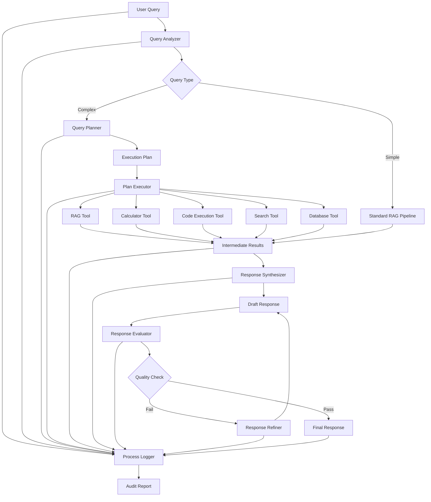

# Metis_RAG Agentic Enhancement Plan

## 1. Overview

This document outlines a plan to enhance Metis_RAG with agentic capabilities, allowing it to not just retrieve information but also analyze it, reason about it, and provide the best possible responses to users through active planning and tool use.

## 2. What Does "Agentic" Mean for RAG?

An agentic RAG system goes beyond simple retrieval and response generation. It:

- Actively reasons about the user's query
- Determines what information is needed
- Formulates a plan to gather that information
- Executes the plan (potentially using tools or taking multiple steps)
- Analyzes the gathered information
- Synthesizes a comprehensive response

It's more like an autonomous assistant that can take initiative rather than a passive question-answering system.

## 3. Proposed Architecture



This architecture combines three key approaches:
1. **Query Planning and Decomposition** as the first step
2. **Tool-using RAG Agent** as the core framework
3. **Self-critique and Refinement** as the final step

Additionally, it includes a comprehensive **Process Logger** that records every step of the process to generate an audit report that guarantees the response is not hallucinated.

## 4. Key Components

### 4.1 Query Analyzer

The Query Analyzer determines if a query is simple (can be answered directly with RAG) or complex (requires planning and potentially tools).

```python
class QueryAnalyzer:
    """
    Analyzes queries to determine their complexity and requirements
    """
    def __init__(self, llm_provider):
        self.llm_provider = llm_provider
        
    async def analyze(self, query: str) -> Dict[str, Any]:
        """
        Analyze a query to determine its complexity and requirements
        
        Returns:
            Dict with keys:
            - complexity: simple or complex
            - requires_tools: list of required tools
            - sub_queries: list of potential sub-queries
            - reasoning: explanation of the analysis
        """
        prompt = self._create_analysis_prompt(query)
        response = await self.llm_provider.generate(prompt=prompt)
        return self._parse_analysis(response.get("response", ""))
        
    def _create_analysis_prompt(self, query: str) -> str:
        return f"""Analyze the following query to determine its complexity and requirements:

Query: {query}

Consider:
1. Is this a simple factual question or a complex analytical query?
2. Does it require calculations, code execution, or external information?
3. Can it be broken down into simpler sub-queries?
4. What tools might be needed to answer it fully?

Output your analysis in JSON format:
{{
    "complexity": "simple" or "complex",
    "requires_tools": ["calculator", "code_execution", "search", etc.],
    "sub_queries": ["sub-query 1", "sub-query 2", etc.],
    "reasoning": "Explanation of your analysis"
}}
"""
```

### 4.2 Query Planner

For complex queries, the Query Planner creates a plan that may involve multiple steps and tools.

```python
class QueryPlanner:
    """
    Creates execution plans for complex queries
    """
    def __init__(self, llm_provider, tool_registry):
        self.llm_provider = llm_provider
        self.tool_registry = tool_registry
        
    async def create_plan(self, query: str, analysis: Dict[str, Any]) -> Dict[str, Any]:
        """
        Create an execution plan for a complex query
        
        Returns:
            Dict with keys:
            - steps: list of execution steps
            - tools: list of required tools
            - reasoning: explanation of the plan
        """
        available_tools = self.tool_registry.list_tools()
        prompt = self._create_planning_prompt(query, analysis, available_tools)
        response = await self.llm_provider.generate(prompt=prompt)
        return self._parse_plan(response.get("response", ""))
        
    def _create_planning_prompt(self, query: str, analysis: Dict[str, Any], available_tools: List[str]) -> str:
        return f"""Create an execution plan for the following query:

Query: {query}

Analysis:
{json.dumps(analysis, indent=2)}

Available Tools:
{json.dumps(available_tools, indent=2)}

Create a step-by-step plan to answer this query. Each step should specify:
1. The action to take (e.g., retrieve information, calculate, execute code)
2. The tool to use (if any)
3. The input to the tool
4. How to use the output of this step

Output your plan in JSON format:
{{
    "steps": [
        {{
            "step_id": 1,
            "action": "action description",
            "tool": "tool name or null",
            "input": "input to the tool",
            "output_usage": "how to use the output"
        }},
        ...
    ],
    "reasoning": "Explanation of your plan"
}}
"""
```

### 4.3 Tool Registry and Tool Interface

The Tool Registry manages available tools, while the Tool interface defines the contract for tool implementations.

```python
class Tool(ABC):
    """
    Abstract base class for tools
    """
    @abstractmethod
    async def execute(self, input_data: Any) -> Any:
        """
        Execute the tool with the given input
        
        Args:
            input_data: Tool-specific input
            
        Returns:
            Tool-specific output
        """
        pass
        
    @abstractmethod
    def get_description(self) -> str:
        """
        Get a description of the tool
        
        Returns:
            Tool description
        """
        pass
        
    @abstractmethod
    def get_input_schema(self) -> Dict[str, Any]:
        """
        Get the input schema for the tool
        
        Returns:
            JSON Schema for tool input
        """
        pass
        
    @abstractmethod
    def get_output_schema(self) -> Dict[str, Any]:
        """
        Get the output schema for the tool
        
        Returns:
            JSON Schema for tool output
        """
        pass

class ToolRegistry:
    """
    Registry for available tools
    """
    def __init__(self):
        self.tools: Dict[str, Tool] = {}
        
    def register_tool(self, name: str, tool: Tool) -> None:
        """
        Register a tool
        
        Args:
            name: Tool name
            tool: Tool implementation
        """
        self.tools[name] = tool
        
    def get_tool(self, name: str) -> Optional[Tool]:
        """
        Get a tool by name
        
        Args:
            name: Tool name
            
        Returns:
            Tool implementation or None if not found
        """
        return self.tools.get(name)
        
    def list_tools(self) -> List[Dict[str, Any]]:
        """
        List all available tools
        
        Returns:
            List of tool information dictionaries
        """
        return [
            {
                "name": name,
                "description": tool.get_description(),
                "input_schema": tool.get_input_schema(),
                "output_schema": tool.get_output_schema()
            }
            for name, tool in self.tools.items()
        ]
```

### 4.4 Plan Executor

The Plan Executor executes the plan, using various tools as needed.

```python
class PlanExecutor:
    """
    Executes query plans
    """
    def __init__(self, tool_registry: ToolRegistry):
        self.tool_registry = tool_registry
        
    async def execute_plan(self, plan: Dict[str, Any], query: str) -> Dict[str, Any]:
        """
        Execute a query plan
        
        Args:
            plan: Query plan
            query: Original query
            
        Returns:
            Dict with execution results
        """
        results = {}
        
        for step in plan["steps"]:
            step_id = step["step_id"]
            tool_name = step.get("tool")
            
            if tool_name:
                # Execute tool
                tool = self.tool_registry.get_tool(tool_name)
                if not tool:
                    results[step_id] = {"error": f"Tool not found: {tool_name}"}
                    continue
                    
                try:
                    tool_input = self._prepare_input(step["input"], results)
                    tool_output = await tool.execute(tool_input)
                    results[step_id] = {"output": tool_output}
                except Exception as e:
                    results[step_id] = {"error": str(e)}
            else:
                # No tool, just record the action
                results[step_id] = {"action": step["action"]}
                
        return {
            "query": query,
            "plan": plan,
            "results": results
        }
        
    def _prepare_input(self, input_template: str, results: Dict[str, Any]) -> Any:
        """
        Prepare tool input by replacing references to previous results
        
        Args:
            input_template: Input template with possible references
            results: Results from previous steps
            
        Returns:
            Prepared input
        """
        # Replace references like {step_1.output} with actual values
        # This is a simplified implementation
        for step_id, step_result in results.items():
            if "output" in step_result:
                input_template = input_template.replace(f"{{step_{step_id}.output}}", json.dumps(step_result["output"]))
                
        return json.loads(input_template)
```

### 4.5 Response Synthesizer

The Response Synthesizer combines the results from all tools into a coherent response.

```python
class ResponseSynthesizer:
    """
    Synthesizes a response from execution results
    """
    def __init__(self, llm_provider):
        self.llm_provider = llm_provider
        
    async def synthesize(self, execution_result: Dict[str, Any]) -> str:
        """
        Synthesize a response from execution results
        
        Args:
            execution_result: Result of plan execution
            
        Returns:
            Synthesized response
        """
        prompt = self._create_synthesis_prompt(execution_result)
        response = await self.llm_provider.generate(prompt=prompt)
        return response.get("response", "")
        
    def _create_synthesis_prompt(self, execution_result: Dict[str, Any]) -> str:
        return f"""Synthesize a comprehensive response to the following query based on the execution results:

Query: {execution_result["query"]}

Execution Results:
{json.dumps(execution_result["results"], indent=2)}

Your task is to create a clear, coherent response that:
1. Directly answers the user's query
2. Incorporates all relevant information from the execution results
3. Explains any calculations or reasoning
4. Acknowledges any limitations or uncertainties
5. Is well-structured and easy to understand

Your response should be in natural language, as if you're speaking directly to the user. Do not include JSON formatting, step numbers, or other technical details unless they're relevant to the answer.
"""
```

### 4.6 Response Evaluator and Refiner

The Response Evaluator checks the quality of the response, and the Response Refiner improves it if needed.

```python
class ResponseEvaluator:
    """
    Evaluates response quality
    """
    def __init__(self, llm_provider):
        self.llm_provider = llm_provider
        
    async def evaluate(self, query: str, response: str, execution_result: Dict[str, Any]) -> Dict[str, Any]:
        """
        Evaluate response quality
        
        Args:
            query: Original query
            response: Synthesized response
            execution_result: Result of plan execution
            
        Returns:
            Dict with evaluation results
        """
        prompt = self._create_evaluation_prompt(query, response, execution_result)
        eval_response = await self.llm_provider.generate(prompt=prompt)
        return self._parse_evaluation(eval_response.get("response", ""))
        
    def _create_evaluation_prompt(self, query: str, response: str, execution_result: Dict[str, Any]) -> str:
        return f"""Evaluate the quality of the following response to a query:

Query: {query}

Response:
{response}

Execution Results (for reference):
{json.dumps(execution_result["results"], indent=2)}

Evaluate the response on the following criteria:
1. Factual accuracy: Does it correctly use the information from the execution results?
2. Completeness: Does it address all aspects of the query?
3. Relevance: Is it focused on answering the query?
4. Clarity: Is it clear and easy to understand?
5. Coherence: Is it well-structured and logically organized?
6. Hallucination: Does it contain any information not supported by the execution results?

Output your evaluation in JSON format:
{{
    "scores": {{
        "accuracy": 1-10,
        "completeness": 1-10,
        "relevance": 1-10,
        "clarity": 1-10,
        "coherence": 1-10,
        "hallucination": 1-10  // 10 = no hallucination, 1 = severe hallucination
    }},
    "overall_score": 1-10,
    "passes_threshold": true/false,
    "hallucinated_content": ["item 1", "item 2", ...],
    "issues": ["issue 1", "issue 2", ...],
    "suggestions": ["suggestion 1", "suggestion 2", ...]
}}
"""

class ResponseRefiner:
    """
    Refines responses based on evaluation
    """
    def __init__(self, llm_provider):
        self.llm_provider = llm_provider
        
    async def refine(self, query: str, response: str, evaluation: Dict[str, Any], execution_result: Dict[str, Any]) -> str:
        """
        Refine a response based on evaluation
        
        Args:
            query: Original query
            response: Original response
            evaluation: Evaluation results
            execution_result: Result of plan execution
            
        Returns:
            Refined response
        """
        prompt = self._create_refinement_prompt(query, response, evaluation, execution_result)
        refined_response = await self.llm_provider.generate(prompt=prompt)
        return refined_response.get("response", "")
        
    def _create_refinement_prompt(self, query: str, response: str, evaluation: Dict[str, Any], execution_result: Dict[str, Any]) -> str:
        return f"""Refine the following response to address the identified issues:

Query: {query}

Original Response:
{response}

Evaluation:
{json.dumps(evaluation, indent=2)}

Execution Results (for reference):
{json.dumps(execution_result["results"], indent=2)}

Your task is to create an improved version of the response that:
1. Addresses all the issues identified in the evaluation
2. Removes any hallucinated content not supported by the execution results
3. Incorporates the suggestions from the evaluation
4. Maintains the strengths of the original response
5. Is clear, coherent, and directly answers the query

Focus particularly on improving the areas with the lowest scores in the evaluation.
"""
```

### 4.7 Process Logger and Audit Report Generator

The Process Logger records every step of the query processing, and the Audit Report Generator creates a detailed report that guarantees the response is not hallucinated.

```python
class ProcessLogger:
    """
    Logs the entire query processing workflow
    """
    def __init__(self, db_connection=None):
        self.db_connection = db_connection
        self.process_log = {}
        
    def start_process(self, query_id: str, query: str) -> None:
        """
        Start logging a new process
        
        Args:
            query_id: Unique query ID
            query: User query
        """
        self.process_log[query_id] = {
            "query": query,
            "timestamp": datetime.now().isoformat(),
            "steps": [],
            "final_response": None,
            "audit_report": None
        }
        
    def log_step(self, query_id: str, step_name: str, step_data: Dict[str, Any]) -> None:
        """
        Log a step in the process
        
        Args:
            query_id: Query ID
            step_name: Name of the step
            step_data: Data from the step
        """
        if query_id not in self.process_log:
            raise ValueError(f"Unknown query ID: {query_id}")
            
        self.process_log[query_id]["steps"].append({
            "step_name": step_name,
            "timestamp": datetime.now().isoformat(),
            "data": step_data
        })
        
        # If database connection is available, save to database
        if self.db_connection:
            self._save_to_db(query_id)
            
    def log_final_response(self, query_id: str, response: str) -> None:
        """
        Log the final response
        
        Args:
            query_id: Query ID
            response: Final response
        """
        if query_id not in self.process_log:
            raise ValueError(f"Unknown query ID: {query_id}")
            
        self.process_log[query_id]["final_response"] = {
            "content": response,
            "timestamp": datetime.now().isoformat()
        }
        
        # If database connection is available, save to database
        if self.db_connection:
            self._save_to_db(query_id)
            
    def generate_audit_report(self, query_id: str) -> Dict[str, Any]:
        """
        Generate an audit report for the process
        
        Args:
            query_id: Query ID
            
        Returns:
            Audit report
        """
        if query_id not in self.process_log:
            raise ValueError(f"Unknown query ID: {query_id}")
            
        process = self.process_log[query_id]
        
        # Extract information from steps
        query_analysis = self._find_step_data(process["steps"], "query_analysis")
        execution_plan = self._find_step_data(process["steps"], "query_planning")
        execution_results = self._find_step_data(process["steps"], "plan_execution")
        retrieval_results = self._find_step_data(process["steps"], "retrieval")
        response_evaluation = self._find_step_data(process["steps"], "response_evaluation")
        
        # Generate report
        audit_report = {
            "query_id": query_id,
            "query": process["query"],
            "timestamp": datetime.now().isoformat(),
            "process_summary": {
                "total_steps": len(process["steps"]),
                "process_duration_ms": self._calculate_duration(process),
                "steps_executed": [step["step_name"] for step in process["steps"]]
            },
            "information_sources": self._extract_information_sources(process),
            "reasoning_trace": self._extract_reasoning_trace(process),
            "hallucination_assessment": self._assess_hallucination(process),
            "verification_status": self._determine_verification_status(process)
        }
        
        # Store the audit report
        self.process_log[query_id]["audit_report"] = audit_report
        
        # If database connection is available, save to database
        if self.db_connection:
            self._save_to_db(query_id)
            
        return audit_report
        
    def _find_step_data(self, steps: List[Dict[str, Any]], step_name: str) -> Optional[Dict[str, Any]]:
        """Find data for a specific step"""
        for step in steps:
            if step["step_name"] == step_name:
                return step["data"]
        return None
        
    def _calculate_duration(self, process: Dict[str, Any]) -> int:
        """Calculate process duration in milliseconds"""
        if not process["steps"]:
            return 0
            
        start_time = datetime.fromisoformat(process["timestamp"])
        
        if process["final_response"]:
            end_time = datetime.fromisoformat(process["final_response"]["timestamp"])
        else:
            end_time = datetime.fromisoformat(process["steps"][-1]["timestamp"])
            
        return int((end_time - start_time).total_seconds() * 1000)
        
    def _extract_information_sources(self, process: Dict[str, Any]) -> List[Dict[str, Any]]:
        """Extract information sources used in the process"""
        sources = []
        
        # Look for retrieval results
        for step in process["steps"]:
            if step["step_name"] == "retrieval":
                if "chunks" in step["data"]:
                    for chunk in step["data"]["chunks"]:
                        if "metadata" in chunk:
                            sources.append({
                                "document_id": chunk["metadata"].get("document_id", "unknown"),
                                "filename": chunk["metadata"].get("filename", "unknown"),
                                "relevance_score": chunk.get("relevance_score", 0),
                                "excerpt": chunk["content"][:200] + "..." if len(chunk["content"]) > 200 else chunk["content"]
                            })
            elif step["step_name"] == "plan_execution":
                if "results" in step["data"]:
                    for step_id, result in step["data"]["results"].items():
                        if "output" in result and isinstance(result["output"], dict) and "sources" in result["output"]:
                            for source in result["output"]["sources"]:
                                sources.append(source)
                                
        return sources
        
    def _extract_reasoning_trace(self, process: Dict[str, Any]) -> List[Dict[str, Any]]:
        """Extract reasoning trace from the process"""
        reasoning_trace = []
        
        # Extract reasoning from each step
        for step in process["steps"]:
            if step["step_name"] == "query_analysis":
                reasoning_trace.append({
                    "stage": "Query Analysis",
                    "reasoning": step["data"].get("reasoning", "No reasoning provided")
                })
            elif step["step_name"] == "query_planning":
                reasoning_trace.append({
                    "stage": "Query Planning",
                    "reasoning": step["data"].get("reasoning", "No reasoning provided")
                })
            elif step["step_name"] == "response_evaluation":
                reasoning_trace.append({
                    "stage": "Response Evaluation",
                    "reasoning": step["data"].get("justification", "No reasoning provided")
                })
                
        return reasoning_trace
        
    def _assess_hallucination(self, process: Dict[str, Any]) -> Dict[str, Any]:
        """Assess hallucination risk in the response"""
        # Look for response evaluation
        for step in process["steps"]:
            if step["step_name"] == "response_evaluation":
                if "scores" in step["data"] and "hallucination" in step["data"]["scores"]:
                    hallucination_score = step["data"]["scores"]["hallucination"]
                    hallucinated_content = step["data"].get("hallucinated_content", [])
                    
                    return {
                        "hallucination_score": hallucination_score,
                        "hallucination_risk": "Low" if hallucination_score >= 8 else "Medium" if hallucination_score >= 5 else "High",
                        "hallucinated_content": hallucinated_content,
                        "assessment_method": "LLM-based evaluation"
                    }
                    
        # If no evaluation found, return default assessment
        return {
            "hallucination_score": None,
            "hallucination_risk": "Unknown",
            "hallucinated_content": [],
            "assessment_method": "No formal assessment"
        }
        
    def _determine_verification_status(self, process: Dict[str, Any]) -> Dict[str, Any]:
        """Determine verification status of the response"""
        # Check if all information in the response is traceable to sources
        hallucination_assessment = self._assess_hallucination(process)
        
        if hallucination_assessment["hallucination_risk"] == "Low":
            status = "Verified"
            confidence = "High"
        elif hallucination_assessment["hallucination_risk"] == "Medium":
            status = "Partially Verified"
            confidence = "Medium"
        elif hallucination_assessment["hallucination_risk"] == "High":
            status = "Not Verified"
            confidence = "Low"
        else:
            status = "Unknown"
            confidence = "Unknown"
            
        return {
            "status": status,
            "confidence": confidence,
            "verification_method": "Source tracing and LLM evaluation"
        }
        
    def _save_to_db(self, query_id: str) -> None:
        """Save process log to database"""
        if not self.db_connection:
            return
            
        process = self.process_log[query_id]
        
        # Save to database (implementation depends on database type)
        # This is a placeholder for the actual implementation
        pass
        
    def get_process_log(self, query_id: str) -> Optional[Dict[str, Any]]:
        """
        Get the process log for a query
        
        Args:
            query_id: Query ID
            
        Returns:
            Process log or None if not found
        """
        return self.process_log.get(query_id)
        
    def get_audit_report(self, query_id: str) -> Optional[Dict[str, Any]]:
        """
        Get the audit report for a query
        
        Args:
            query_id: Query ID
            
        Returns:
            Audit report or None if not found
        """
        process = self.process_log.get(query_id)
        if not process:
            return None
            
        return process.get("audit_report")
```

### 4.8 Agentic RAG Controller

The Agentic RAG Controller orchestrates the entire process, including logging and audit report generation.

```python
class AgenticRAGController:
    """
    Controller for the Agentic RAG system
    """
    def __init__(
        self,
        llm_provider,
        query_analyzer: QueryAnalyzer,
        query_planner: QueryPlanner,
        plan_executor: PlanExecutor,
        response_synthesizer: ResponseSynthesizer,
        response_evaluator: ResponseEvaluator,
        response_refiner: ResponseRefiner,
        process_logger: ProcessLogger,
        rag_engine: RAGEngine
    ):
        self.llm_provider = llm_provider
        self.query_analyzer = query_analyzer
        self.query_planner = query_planner
        self.plan_executor = plan_executor
        self.response_synthesizer = response_synthesizer
        self.response_evaluator = response_evaluator
        self.response_refiner = response_refiner
        self.process_logger = process_logger
        self.rag_engine = rag_engine
        
    async def process_query(self, query: str) -> Dict[str, Any]:
        """
        Process a query using the Agentic RAG system
        
        Args:
            query: User query
            
        Returns:
            Dict with response and metadata
        """
        # Generate query ID
        query_id = str(uuid.uuid4())
        
        # Start process logging
        self.process_logger.start_process(query_id, query)
        
        # Step 1: Analyze query
        analysis = await self.query_analyzer.analyze(query)
        self.process_logger.log_step(query_id, "query_analysis", analysis)
        
        # Step 2: Process based on complexity
        if analysis["complexity"] == "simple":
            # Use standard RAG for simple queries
            rag_response = await self.rag_engine.query(query=query)
            self.process_logger.log_step(query_id, "retrieval", rag_response)
            
            response = rag_response.get("answer", "")
            execution_result = {"query": query, "results": {"rag": rag_response}}
        else:
            # Use agentic approach for complex queries
            plan = await self.query_planner.create_plan(query, analysis)
            self.process_logger.log_step(query_id, "query_planning", plan)
            
            execution_result = await self.plan_executor.execute_plan(plan, query)
            self.process_logger.log_step(query_id, "plan_execution", execution_result)
            
            response = await self.response_synthesizer.synthesize(execution_result)
            self.process_logger.log_step(query_id, "response_synthesis", {"response": response})
            
        # Step 3: Evaluate and refine response
        evaluation = await self.response_evaluator.evaluate(query, response, execution_result)
        self.process_logger.log_step(query_id, "response_evaluation", evaluation)
        
        if not evaluation["passes_threshold"]:
            # Refine response if it doesn't pass quality threshold
            response = await self.response_refiner.refine(query, response, evaluation, execution_result)
            self.process_logger.log_step(query_id, "response_refinement", {"refined_response": response})
            
            # Re-evaluate refined response
            evaluation = await self.response_evaluator.evaluate(query, response, execution_result)
            self.process_logger.log_step(query_id, "response_evaluation", evaluation)
            
        # Log final response
        self.process_logger.log_final_response(query_id, response)
        
        # Generate audit report
        audit_report = self.process_logger.generate_audit_report(query_id)
        
        return {
            "query_id": query_id,
            "query": query,
            "response": response,
            "analysis": analysis,
            "evaluation": evaluation,
            "execution_result": execution_result,
            "audit_report": audit_report
        }
```

## 5. Tool Implementations

### 5.1 RAG Tool

```python
class RAGTool(Tool):
    """
    Tool for retrieving information using RAG
    """
    def __init__(self, rag_engine: RAGEngine):
        self.rag_engine = rag_engine
        
    async def execute(self, input_data: Dict[str, Any]) -> Dict[str, Any]:
        """
        Execute RAG retrieval
        
        Args:
            input_data: Dict with keys:
                - query: Query string
                - metadata_filters: Optional filters
                
        Returns:
            RAG response
        """
        query = input_data["query"]
        metadata_filters = input_data.get("metadata_filters")
        
        response = await self.rag_engine.query(
            query=query,
            metadata_filters=metadata_filters
        )
        
        return response
        
    def get_description(self) -> str:
        return "Retrieves information from the document store using RAG"
        
    def get_input_schema(self) -> Dict[str, Any]:
        return {
            "type": "object",
            "properties": {
                "query": {
                    "type": "string",
                    "description": "Query string"
                },
                "metadata_filters": {
                    "type": "object",
                    "description": "Optional filters for retrieval"
                }
            },
            "required": ["query"]
        }
        
    def get_output_schema(self) -> Dict[str, Any]:
        return {
            "type": "object",
            "properties": {
                "answer": {
                    "type": "string",
                    "description": "Retrieved information"
                },
                "sources": {
                    "type": "array",
                    "description": "Sources of the information"
                }
            }
        }
```

### 5.2 Calculator Tool

```python
class CalculatorTool(Tool):
    """
    Tool for performing mathematical calculations
    """
    async def execute(self, input_data: Dict[str, Any]) -> Dict[str, Any]:
        """
        Execute calculation
        
        Args:
            input_data: Dict with keys:
                - expression: Mathematical expression
                
        Returns:
            Calculation result
        """
        expression = input_data["expression"]
        
        try:
            # Use a safe evaluation method
            import ast
            import math
            import operator
            
            # Define allowed operators
            operators = {
                ast.Add: operator.add,
                ast.Sub: operator.sub,
                ast.Mult: operator.mul,
                ast.Div: operator.truediv,
                ast.Pow: operator.pow,
                ast.BitXor: operator.xor,
                ast.USub: operator.neg
            }
            
            def safe_eval(node):
                if isinstance(node, ast.Num):
                    return node.n
                elif isinstance(node, ast.BinOp):
                    return operators[type(node.op)](safe_eval(node.left), safe_eval(node.right))
                elif isinstance(node, ast.UnaryOp):
                    return operators[type(node.op)](safe_eval(node.operand))
                elif isinstance(node, ast.Call):
                    if node.func.id == 'sqrt':
                        return math.sqrt(safe_eval(node.args[0]))
                    elif node.func.id == 'sin':
                        return math.sin(safe_eval(node.args[0]))
                    elif node.func.id == 'cos':
                        return math.cos(safe_eval(node.args[0]))
                    elif node.func.id == 'tan':
                        return math.tan(safe_eval(node.args[0]))
                    elif node.func.id == 'log':
                        return math.log(safe_eval(node.args[0]))
                    elif node.func.id == 'exp':
                        return math.exp(safe_eval(node.args[0]))
                    else:
                        raise ValueError(f"Function not allowed: {node.func.id}")
                else:
                    raise TypeError(f"Unsupported node type: {type(node)}")
            
            # Parse and evaluate expression
            node = ast.parse(expression, mode='eval').body
            result = safe_eval(node)
            
            return {
                "result": result,
                "expression": expression
            }
        except Exception as e:
            return {
                "error": str(e),
                "expression": expression
            }
        
    def get_description(self) -> str:
        return "Performs mathematical calculations"
        
    def get_input_schema(self) -> Dict[str, Any]:
        return {
            "type": "object",
            "properties": {
                "expression": {
                    "type": "string",
                    "description": "Mathematical expression to evaluate"
                }
            },
            "required": ["expression"]
        }
        
    def get_output_schema(self) -> Dict[str, Any]:
        return {
            "type": "object",
            "properties": {
                "result": {
                    "type": "number",
                    "description": "Calculation result"
                },
                "expression": {
                    "type": "string",
                    "description": "Original expression"
                },
                "error": {
                    "type": "string",
                    "description": "Error message (if calculation failed)"
                }
            }
        }
```

### 5.3 Database Tool

```python
class DatabaseTool(Tool):
    """
    Tool for querying structured data
    """
    def __init__(self, db_connection):
        self.db_connection = db_connection
        
    async def execute(self, input_data: Dict[str, Any]) -> Dict[str, Any]:
        """
        Execute database query
        
        Args:
            input_data: Dict with keys:
                - query: SQL query
                - params: Query parameters
                
        Returns:
            Query results
        """
        query = input_data["query"]
        params = input_data.get("params", {})
        
        try:
            # Execute query
            cursor = await self.db_connection.execute(query, params)
            results = await cursor.fetchall()
            
            # Get column names
            column_names = [column[0] for column in cursor.description]
            
            # Format results as list of dictionaries
            formatted_results = [
                {column_names[i]: value for i, value in enumerate(row)}
                for row in results
            ]
            
            return {
                "results": formatted_results,
                "count": len(formatted_results),
                "query": query
            }
        except Exception as e:
            return {
                "error": str(e),
                "query": query
            }
        
    def get_description(self) -> str:
        return "Queries structured data from the database"
        
    def get_input_schema(self) -> Dict[str, Any]:
        return {
            "type": "object",
            "properties": {
                "query": {
                    "type": "string",
                    "description": "SQL query"
                },
                "params": {
                    "type": "object",
                    "description": "Query parameters"
                }
            },
            "required": ["query"]
        }
        
    def get_output_schema(self) -> Dict[str, Any]:
        return {
            "type": "object",
            "properties": {
                "results": {
                    "type": "array",
                    "description": "Query results"
                },
                "count": {
                    "type": "integer",
                    "description": "Number of results"
                },
                "query": {
                    "type": "string",
                    "description": "Original query"
                },
                "error": {
                    "type": "string",
                    "description": "Error message (if query failed)"
                }
            }
        }
```

## 6. Audit Report Interface

The Audit Report Interface provides a way for users to view the audit report for a query, verifying that the response is not hallucinated.

```python
@router.get("/audit_report/{query_id}")
async def get_audit_report(
    query_id: str,
    process_logger: ProcessLogger = Depends(get_process_logger)
):
    """
    Get the audit report for a query
    """
    audit_report = process_logger.get_audit_report(query_id)
    
    if not audit_report:
        raise HTTPException(
            status_code=404,
            detail=f"Audit report not found for query {query_id}"
        )
        
    return audit_report

@router.get("/audit_report/{query_id}/html")
async def get_audit_report_html(
    query_id: str,
    request: Request,
    process_logger: ProcessLogger = Depends(get_process_logger)
):
    """
    Get the audit report for a query as HTML
    """
    audit_report = process_logger.get_audit_report(query_id)
    
    if not audit_report:
        raise HTTPException(
            status_code=404,
            detail=f"Audit report not found for query {query_id}"
        )
        
    return templates.TemplateResponse(
        "audit_report.html",
        {
            "request": request,
            "audit_report": audit_report
        }
    )
```

## 7. Integration with Existing Metis_RAG

### 7.1 LangGraph Integration

The agentic capabilities can be integrated with the existing LangGraph RAG Agent by extending the state graph:

```python
def _build_graph(self) -> StateGraph:
    """
    Build the state graph for the Agentic RAG process
    """
    # Create the state graph
    graph = StateGraph(AgenticRAGState)
    
    # Add nodes for each stage
    graph.add_node(RAGStage.QUERY_ANALYSIS, self._analyze_query)
    graph.add_node(RAGStage.QUERY_PLANNING, self._plan_query)
    graph.add_node(RAGStage.PLAN_EXECUTION, self._execute_plan)
    graph.add_node(RAGStage.RETRIEVAL, self._retrieve_chunks)
    graph.add_node(RAGStage.QUERY_REFINEMENT, self._refine_query)
    graph.add_node(RAGStage.CONTEXT_OPTIMIZATION, self._optimize_context)
    graph.add_node(RAGStage.GENERATION, self._generate_response)
    graph.add_node(RAGStage.RESPONSE_EVALUATION, self._evaluate_response)
    graph.add_node(RAGStage.RESPONSE_REFINEMENT, self._refine_response)
    graph.add_node(RAGStage.COMPLETE, self._finalize_response)
    
    # Define the edges between nodes
    # Start with query analysis
    graph.add_conditional_edges(
        RAGStage.QUERY_ANALYSIS,
        self._needs_planning,
        {
            True: RAGStage.QUERY_PLANNING,
            False: RAGStage.RETRIEVAL
        }
    )
    
    # After planning, execute the plan
    graph.add_edge(RAGStage.QUERY_PLANNING, RAGStage.PLAN_EXECUTION)
    
    # After plan execution, proceed to retrieval
    graph.add_edge(RAGStage.PLAN_EXECUTION, RAGStage.RETRIEVAL)
    
    # After retrieval, decide whether to refine the query or optimize the context
    graph.add_conditional_edges(
        RAGStage.RETRIEVAL,
        self._needs_refinement,
        {
            True: RAGStage.QUERY_REFINEMENT,
            False: RAGStage.CONTEXT_OPTIMIZATION
        }
    )
    
    # After query refinement, go back to retrieval with the refined query
    graph.add_edge(RAGStage.QUERY_REFINEMENT, RAGStage.RETRIEVAL)
    
    # After context optimization, proceed to generation
    graph.add_edge(RAGStage.CONTEXT_OPTIMIZATION, RAGStage.GENERATION)
    
    # After generation, evaluate the response
    graph.add_edge(RAGStage.GENERATION, RAGStage.RESPONSE_EVALUATION)
    
    # After evaluation, decide whether to refine the response or complete
    graph.add_conditional_edges(
        RAGStage.RESPONSE_EVALUATION,
        self._needs_response_refinement,
        {
            True: RAGStage.RESPONSE_REFINEMENT,
            False: RAGStage.COMPLETE
        }
    )
    
    # After response refinement, re-evaluate
    graph.add_edge(RAGStage.RESPONSE_REFINEMENT, RAGStage.RESPONSE_EVALUATION)
    
    # After completion, end the process
    graph.add_edge(RAGStage.COMPLETE, END)
    
    # Set the entry point
    graph.set_entry_point(RAGStage.QUERY_ANALYSIS)
    
    return graph
```

### 7.2 API Integration

The agentic capabilities can be exposed through the existing API:

```python
@router.post("/agentic_query", response_model=AgenticChatResponse)
async def agentic_query_chat(
    query: ChatQuery,
    agentic_rag_controller: AgenticRAGController = Depends(get_agentic_rag_controller)
):
    """
    Send a chat query to the Agentic RAG system and get a response
    """
    try:
        # Process query with Agentic RAG
        result = await agentic_rag_controller.process_query(query.message)
        
        # Return response
        return AgenticChatResponse(
            message=result["response"],
            conversation_id=query.conversation_id,
            analysis=result["analysis"],
            execution_details=result["execution_result"],
            evaluation=result["evaluation"],
            audit_report_id=result["query_id"]
        )
    except Exception as e:
        logger.error(f"Error generating agentic chat response: {str(e)}")
        
        # Create a user-friendly error message
        error_message = "Sorry, there was an error processing your request with the Agentic RAG system."
        
        # Return a 200 response with the error message
        return AgenticChatResponse(
            message=error_message,
            conversation_id=query.conversation_id
        )
```

## 8. Implementation Roadmap

### Phase 1: Foundation (Weeks 1-3)
- Implement Tool interface and basic tools (RAG, Calculator)
- Create ToolRegistry
- Implement QueryAnalyzer
- Implement ProcessLogger and basic audit reporting

### Phase 2: Planning and Execution (Weeks 4-6)
- Implement QueryPlanner
- Implement PlanExecutor
- Integrate with existing LangGraph framework
- Enhance audit reporting with execution details

### Phase 3: Response Quality (Weeks 7-9)
- Implement ResponseSynthesizer
- Implement ResponseEvaluator with hallucination detection
- Implement ResponseRefiner
- Complete audit report generation with hallucination assessment

### Phase 4: Advanced Tools and Integration (Weeks 10-12)
- Implement additional tools (Database, Code Execution)
- Create AgenticRAGController
- Integrate with API
- Add comprehensive testing
- Implement audit report interface and visualization

## 9. Conclusion

By implementing this agentic enhancement plan, Metis_RAG will evolve from a sophisticated RAG system to a truly intelligent assistant that can reason about queries, plan responses, use tools to gather information, and provide high-quality, comprehensive answers. The system will be able to handle a much wider range of queries, from simple fact retrieval to complex analytical questions that require multiple steps and tools.

The comprehensive process logging and audit report generation will provide transparency and accountability, allowing users to verify that responses are not hallucinated and to understand exactly how the system arrived at its answers. This will build trust in the system and make it suitable for applications where factual accuracy is critical.

The implementation leverages the existing strengths of Metis_RAG, particularly the LangGraph integration, while adding new capabilities in a modular, extensible way. The phased implementation approach allows for incremental development and testing, ensuring that each component works correctly before moving on to the next.