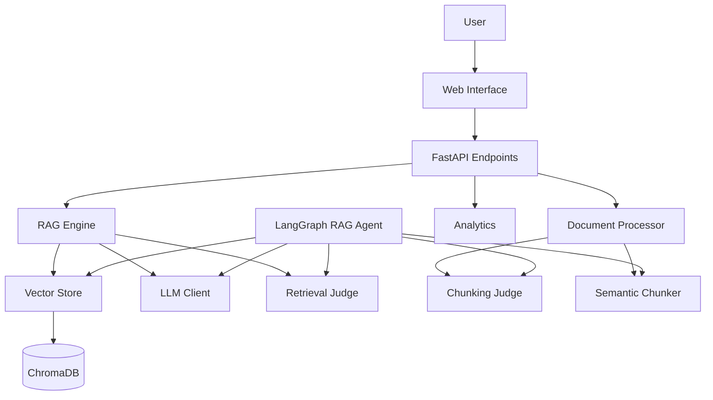
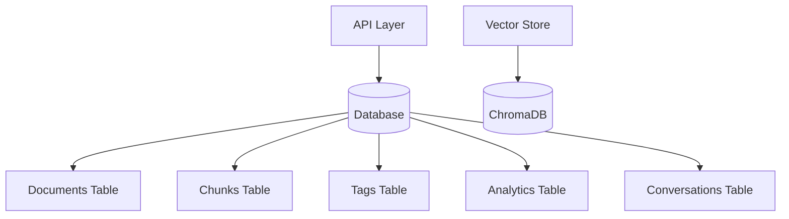
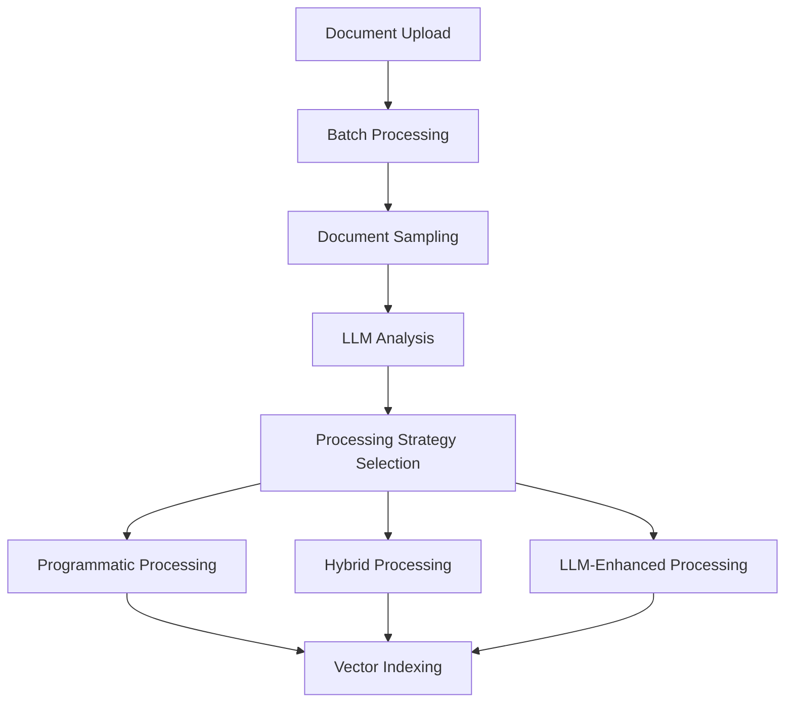
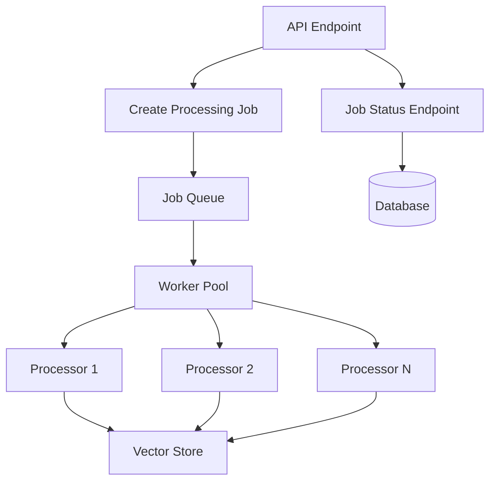
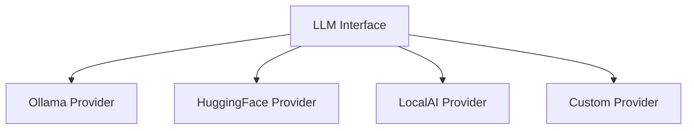

# Metis_RAG Improvement Plan

## 1. Overview of Current System

Metis_RAG is a sophisticated Retrieval Augmented Generation (RAG) system with several advanced features:

- **Document Processing**: Supports multiple file types and chunking strategies
- **LLM-Enhanced RAG**: Uses LLM-based agents for chunking and retrieval optimization
- **Vector Storage**: Uses ChromaDB for embedding storage and retrieval
- **Web Interface**: Provides a user-friendly interface for document management and chat

The system architecture follows good practices with clear separation of concerns:
- API layer for handling HTTP requests
- Core RAG engine for document processing and query handling
- LLM agents for enhancing the RAG pipeline
- Vector store for efficient retrieval



## 2. Critical Issues to Address

### 2.1 In-Memory Data Storage

**Problem**: The system currently uses in-memory storage for:
- Document metadata and content (`documents` dictionary in `documents.py`)
- Tags and folders (`all_tags` and `all_folders` sets)
- Query analytics (`query_analytics` list and `document_usage` dictionary)
- Conversation history (`conversations` dictionary)

**Impact**: 
- Data is lost on application restart
- Not scalable to multiple workers/processes
- Not thread-safe (potential data corruption)
- Limited by available memory

### 2.2 Database Integration

**Solution**: Implement a persistent database solution to replace in-memory storage.



**Implementation Plan**:

1. **Database Selection**:
   - SQLite for simplicity and easy deployment in isolated environments
   - PostgreSQL as an optional backend for higher scalability needs

2. **Schema Design**:
   ```sql
   -- Documents table
   CREATE TABLE documents (
       id TEXT PRIMARY KEY,
       filename TEXT NOT NULL,
       folder TEXT NOT NULL DEFAULT '/',
       uploaded TIMESTAMP NOT NULL DEFAULT CURRENT_TIMESTAMP,
       metadata JSONB,
       processing_status TEXT NOT NULL DEFAULT 'pending',
       processing_strategy TEXT
   );

   -- Chunks table
   CREATE TABLE chunks (
       id TEXT PRIMARY KEY,
       document_id TEXT REFERENCES documents(id) ON DELETE CASCADE,
       content TEXT NOT NULL,
       metadata JSONB,
       index INTEGER NOT NULL
   );

   -- Tags table
   CREATE TABLE tags (
       id SERIAL PRIMARY KEY,
       name TEXT UNIQUE NOT NULL
   );

   -- Document-Tag relationship
   CREATE TABLE document_tags (
       document_id TEXT REFERENCES documents(id) ON DELETE CASCADE,
       tag_id INTEGER REFERENCES tags(id) ON DELETE CASCADE,
       PRIMARY KEY (document_id, tag_id)
   );

   -- Analytics tables
   CREATE TABLE query_analytics (
       id SERIAL PRIMARY KEY,
       query TEXT NOT NULL,
       model TEXT NOT NULL,
       use_rag BOOLEAN NOT NULL,
       timestamp TIMESTAMP NOT NULL,
       response_time_ms FLOAT NOT NULL,
       token_count INTEGER NOT NULL
   );

   CREATE TABLE document_usage (
       document_id TEXT REFERENCES documents(id) ON DELETE CASCADE,
       usage_count INTEGER NOT NULL DEFAULT 0,
       last_used TIMESTAMP
   );

   -- Conversations table
   CREATE TABLE conversations (
       id TEXT PRIMARY KEY,
       created_at TIMESTAMP NOT NULL DEFAULT CURRENT_TIMESTAMP
   );

   -- Messages table
   CREATE TABLE messages (
       id SERIAL PRIMARY KEY,
       conversation_id TEXT REFERENCES conversations(id) ON DELETE CASCADE,
       content TEXT NOT NULL,
       role TEXT NOT NULL,
       timestamp TIMESTAMP NOT NULL DEFAULT CURRENT_TIMESTAMP,
       citations JSONB
   );

   -- Processing jobs table for batch document processing
   CREATE TABLE processing_jobs (
       id TEXT PRIMARY KEY,
       status TEXT NOT NULL DEFAULT 'pending',
       created_at TIMESTAMP NOT NULL DEFAULT CURRENT_TIMESTAMP,
       completed_at TIMESTAMP,
       document_count INTEGER NOT NULL DEFAULT 0,
       processed_count INTEGER NOT NULL DEFAULT 0,
       strategy TEXT,
       metadata JSONB
   );
   ```

3. **Database Access Layer**:
   - Create a `database.py` module with connection management
   - Implement repository classes for each entity (DocumentRepository, ChunkRepository, etc.)
   - Use SQLAlchemy ORM for database operations

4. **Migration Strategy**:
   - Create migration scripts to initialize the database
   - Implement data migration for existing in-memory data
   - Add database connection setup to application startup

## 3. Intelligent Document Processing

### 3.1 Strategic LLM Usage for Document Processing

**Problem**: The current approach uses LLM for all chunking decisions, which won't scale efficiently to thousands of documents.

**Solution**: Implement a tiered document processing system that uses LLMs strategically.



**Implementation Plan**:

1. **Document Analysis Service**:
   ```python
   class DocumentAnalysisService:
       """
       Service for analyzing documents and determining optimal processing strategies
       """
       def __init__(self, llm_client, sample_size=3):
           self.llm_client = llm_client
           self.sample_size = sample_size
           
       async def analyze_document_batch(self, document_ids, file_paths):
           """
           Analyze a batch of documents and recommend a processing strategy
           
           Returns:
               Dict with processing strategy and parameters
           """
           # Sample documents from the batch
           samples = self._sample_documents(document_ids, file_paths)
           
           # Extract representative content from samples
           sample_content = await self._extract_sample_content(samples)
           
           # Use LLM to analyze samples and recommend strategy
           strategy = await self._recommend_strategy(sample_content)
           
           return strategy
           
       def _sample_documents(self, document_ids, file_paths):
           """Sample a subset of documents for analysis"""
           # Logic to select representative documents from the batch
           # Consider file types, sizes, and other metadata
           
       async def _extract_sample_content(self, samples):
           """Extract representative content from sample documents"""
           # Logic to extract content from various file types
           # For PDFs, extract from different sections
           # For text files, extract from beginning, middle, and end
           
       async def _recommend_strategy(self, sample_content):
           """Use LLM to recommend processing strategy"""
           # Create prompt for LLM
           prompt = self._create_strategy_prompt(sample_content)
           
           # Get recommendation from LLM
           response = await self.llm_client.generate(prompt=prompt)
           
           # Parse recommendation
           return self._parse_strategy_recommendation(response)
   ```

2. **Batch Processing System**:
   ```python
   class DocumentProcessingService:
       """
       Service for processing documents in batches
       """
       def __init__(self, db, vector_store, analysis_service, max_batch_size=50):
           self.db = db
           self.vector_store = vector_store
           self.analysis_service = analysis_service
           self.max_batch_size = max_batch_size
           
       async def create_processing_job(self, document_ids):
           """Create a new processing job for a batch of documents"""
           # Create job record in database
           job_id = self._generate_job_id()
           await self.db.create_processing_job(job_id, document_ids)
           
           # Start processing in background
           asyncio.create_task(self.process_job(job_id))
           
           return job_id
           
       async def process_job(self, job_id):
           """Process a batch of documents"""
           # Get job details
           job = await self.db.get_processing_job(job_id)
           document_ids = job["document_ids"]
           
           # Get file paths
           file_paths = await self.db.get_document_file_paths(document_ids)
           
           # Analyze documents and determine strategy
           strategy = await self.analysis_service.analyze_document_batch(
               document_ids, file_paths
           )
           
           # Update job with strategy
           await self.db.update_processing_job(job_id, {"strategy": strategy})
           
           # Process documents in smaller batches
           for i in range(0, len(document_ids), self.max_batch_size):
               batch = document_ids[i:i+self.max_batch_size]
               await self._process_batch(batch, strategy)
               
               # Update job progress
               progress = (i + len(batch)) / len(document_ids)
               await self.db.update_processing_job(
                   job_id, 
                   {"processed_count": i + len(batch)}
               )
           
           # Mark job as completed
           await self.db.complete_processing_job(job_id)
           
       async def _process_batch(self, document_ids, strategy):
           """Process a batch of documents using the determined strategy"""
           # Select processor based on strategy
           processor = self._get_processor(strategy)
           
           # Process documents
           for doc_id in document_ids:
               document = await self.db.get_document(doc_id)
               processed_doc = await processor.process_document(document)
               
               # Update document in database
               await self.db.update_document(doc_id, {
                   "chunks": processed_doc.chunks,
                   "processing_status": "completed",
                   "processing_strategy": strategy["strategy"]
               })
               
               # Add to vector store
               await self.vector_store.add_document(processed_doc)
               
       def _get_processor(self, strategy):
           """Get the appropriate document processor based on strategy"""
           strategy_type = strategy["strategy"]
           
           if strategy_type == "recursive":
               return RecursiveProcessor(
                   chunk_size=strategy["parameters"]["chunk_size"],
                   chunk_overlap=strategy["parameters"]["chunk_overlap"]
               )
           elif strategy_type == "token":
               return TokenProcessor(
                   chunk_size=strategy["parameters"]["chunk_size"],
                   chunk_overlap=strategy["parameters"]["chunk_overlap"]
               )
           elif strategy_type == "markdown":
               return MarkdownProcessor(
                   chunk_size=strategy["parameters"]["chunk_size"],
                   chunk_overlap=strategy["parameters"]["chunk_overlap"]
               )
           elif strategy_type == "semantic":
               return SemanticProcessor(
                   chunk_size=strategy["parameters"]["chunk_size"],
                   chunk_overlap=strategy["parameters"]["chunk_overlap"],
                   llm_client=self.llm_client
               )
           else:
               # Default to recursive
               return RecursiveProcessor()
   ```

3. **Processing Strategy Prompt**:
   ```
   You are a document processing expert. Your task is to analyze the following document samples and recommend the best processing strategy for a batch of similar documents.

   Available Strategies:
   - recursive: Splits text recursively by characters. Good for general text with natural separators. Fast and efficient.
   - token: Splits text by tokens. Good for preserving semantic units in technical content. Moderately fast.
   - markdown: Splits markdown documents by headers. Good for structured documents with clear sections. Fast for markdown files.
   - semantic: Uses LLM to identify natural semantic boundaries in text. Best for preserving meaning and context in complex documents. Slow but high quality.

   Document Samples:
   [Sample 1]
   {sample_1_content}

   [Sample 2]
   {sample_2_content}

   [Sample 3]
   {sample_3_content}

   Consider:
   1. Document structure and formatting
   2. Content complexity and semantic density
   3. Processing efficiency (thousands of documents need to be processed)
   4. Quality requirements (how important is semantic coherence)

   Recommend a strategy that balances quality and efficiency, using semantic chunking ONLY when absolutely necessary for complex documents where other methods would significantly degrade quality.

   Output your recommendation in JSON format:
   {
       "strategy": "...",  // One of: recursive, token, markdown, semantic
       "parameters": {
           "chunk_size": ...,  // Recommended chunk size
           "chunk_overlap": ...  // Recommended overlap size
       },
       "justification": "..." // Explanation of your reasoning
   }
   ```

### 3.2 Scalable Processing Architecture

**Problem**: The current implementation processes documents one at a time, which won't scale to thousands of documents.

**Solution**: Implement a scalable processing architecture with parallel processing and progress tracking.



**Implementation Plan**:

1. **Worker Pool**:
   ```python
   class WorkerPool:
       """
       Pool of workers for processing documents in parallel
       """
       def __init__(self, max_workers=4):
           self.max_workers = max_workers
           self.active_workers = 0
           self.queue = asyncio.Queue()
           self.running = False
           
       async def start(self):
           """Start the worker pool"""
           self.running = True
           for _ in range(self.max_workers):
               asyncio.create_task(self._worker())
           
       async def stop(self):
           """Stop the worker pool"""
           self.running = False
           # Wait for queue to empty
           await self.queue.join()
           
       async def add_job(self, job_func, *args, **kwargs):
           """Add a job to the queue"""
           await self.queue.put((job_func, args, kwargs))
           
       async def _worker(self):
           """Worker process that executes jobs from the queue"""
           while self.running:
               try:
                   # Get job from queue with timeout
                   job_func, args, kwargs = await asyncio.wait_for(
                       self.queue.get(), timeout=1.0
                   )
                   
                   # Execute job
                   self.active_workers += 1
                   try:
                       await job_func(*args, **kwargs)
                   except Exception as e:
                       logger.error(f"Error processing job: {str(e)}")
                   finally:
                       self.active_workers -= 1
                       self.queue.task_done()
               except asyncio.TimeoutError:
                   # No job available, continue waiting
                   pass
   ```

2. **Progress Tracking**:
   ```python
   class ProgressTracker:
       """
       Track progress of document processing jobs
       """
       def __init__(self, db):
           self.db = db
           
       async def create_job(self, job_type, document_ids, metadata=None):
           """Create a new job and return its ID"""
           job_id = str(uuid.uuid4())
           await self.db.execute(
               """
               INSERT INTO processing_jobs 
               (id, status, document_count, metadata, job_type) 
               VALUES (?, ?, ?, ?, ?)
               """,
               (job_id, "pending", len(document_ids), json.dumps(metadata or {}), job_type)
           )
           return job_id
           
       async def update_progress(self, job_id, processed_count, status=None):
           """Update job progress"""
           updates = {"processed_count": processed_count}
           if status:
               updates["status"] = status
               
           await self.db.update_job(job_id, updates)
           
       async def complete_job(self, job_id, status="completed"):
           """Mark a job as completed"""
           await self.db.update_job(
               job_id, 
               {
                   "status": status,
                   "completed_at": datetime.now().isoformat()
               }
           )
           
       async def get_job_status(self, job_id):
           """Get the current status of a job"""
           job = await self.db.get_job(job_id)
           
           if not job:
               return None
               
           progress = job["processed_count"] / job["document_count"] if job["document_count"] > 0 else 0
           
           return {
               "id": job["id"],
               "status": job["status"],
               "progress": progress,
               "document_count": job["document_count"],
               "processed_count": job["processed_count"],
               "created_at": job["created_at"],
               "completed_at": job["completed_at"],
               "metadata": json.loads(job["metadata"])
           }
   ```

3. **API Endpoints**:
   ```python
   @router.post("/process-batch")
   async def process_document_batch(
       request: BatchProcessRequest,
       background_tasks: BackgroundTasks,
       progress_tracker: ProgressTracker = Depends(get_progress_tracker),
       worker_pool: WorkerPool = Depends(get_worker_pool)
   ):
       """
       Process a batch of documents
       """
       # Validate document IDs
       invalid_ids = [doc_id for doc_id in request.document_ids if not await document_exists(doc_id)]
       if invalid_ids:
           raise HTTPException(
               status_code=404,
               detail=f"Documents not found: {', '.join(invalid_ids)}"
           )
       
       # Create processing job
       job_id = await progress_tracker.create_job(
           "batch_processing",
           request.document_ids,
           {
               "force_reprocess": request.force_reprocess,
               "chunking_strategy": request.chunking_strategy,
               "chunk_size": request.chunk_size,
               "chunk_overlap": request.chunk_overlap
           }
       )
       
       # Add job to worker pool
       await worker_pool.add_job(
           process_document_batch_job,
           job_id,
           request.document_ids,
           request.force_reprocess,
           request.chunking_strategy,
           request.chunk_size,
           request.chunk_overlap
       )
       
       return {
           "success": True,
           "message": f"Processing started for {len(request.document_ids)} documents",
           "job_id": job_id
       }
       
   @router.get("/job-status/{job_id}")
   async def get_job_status(
       job_id: str,
       progress_tracker: ProgressTracker = Depends(get_progress_tracker)
   ):
       """
       Get the status of a processing job
       """
       status = await progress_tracker.get_job_status(job_id)
       
       if not status:
           raise HTTPException(
               status_code=404,
               detail=f"Job {job_id} not found"
           )
           
       return status
   ```

## 4. Self-Hosted Model Interface

### 4.1 Model-Agnostic Interface

**Problem**: The system is currently tied to Ollama models.

**Solution**: Implement a provider-agnostic model interface for self-hosted models.



**Implementation Plan**:

1. **Abstract LLM Interface**:
   ```python
   from abc import ABC, abstractmethod
   from typing import Dict, Any, Optional, AsyncGenerator

   class LLMProvider(ABC):
       """
       Abstract interface for LLM providers
       """
       @abstractmethod
       async def generate(
           self,
           prompt: str,
           system_prompt: Optional[str] = None,
           stream: bool = False,
           parameters: Dict[str, Any] = None
       ) -> Dict[str, Any]:
           """
           Generate text from the LLM
           
           Args:
               prompt: The prompt to send to the LLM
               system_prompt: Optional system prompt
               stream: Whether to stream the response
               parameters: Model-specific parameters
               
           Returns:
               Dict with response text or stream
           """
           pass
           
       @abstractmethod
       async def create_embedding(
           self,
           text: str,
           model: Optional[str] = None
       ) -> List[float]:
           """
           Create an embedding for the given text
           
           Args:
               text: The text to embed
               model: Optional embedding model name
               
           Returns:
               List of embedding values
           """
           pass
           
       @abstractmethod
       async def get_available_models(self) -> List[Dict[str, Any]]:
           """
           Get a list of available models
           
           Returns:
               List of model information dictionaries
           """
           pass
   ```

2. **Ollama Provider Implementation**:
   ```python
   class OllamaProvider(LLMProvider):
       """
       LLM provider for Ollama
       """
       def __init__(self, base_url: str = "http://localhost:11434"):
           self.base_url = base_url
           self.client = httpx.AsyncClient(base_url=base_url, timeout=60.0)
           
       async def generate(
           self,
           prompt: str,
           system_prompt: Optional[str] = None,
           stream: bool = False,
           parameters: Dict[str, Any] = None
       ) -> Dict[str, Any]:
           # Implementation for Ollama
           # ...
           
       async def create_embedding(
           self,
           text: str,
           model: Optional[str] = None
       ) -> List[float]:
           # Implementation for Ollama
           # ...
           
       async def get_available_models(self) -> List[Dict[str, Any]]:
           # Implementation for Ollama
           # ...
   ```

3. **HuggingFace Provider Implementation**:
   ```python
   class HuggingFaceProvider(LLMProvider):
       """
       LLM provider for local HuggingFace models
       """
       def __init__(self, model_path: str = None):
           self.model_path = model_path
           self.models = {}
           self.embedding_models = {}
           
       async def generate(
           self,
           prompt: str,
           system_prompt: Optional[str] = None,
           stream: bool = False,
           parameters: Dict[str, Any] = None
       ) -> Dict[str, Any]:
           # Implementation for HuggingFace
           # ...
           
       async def create_embedding(
           self,
           text: str,
           model: Optional[str] = None
       ) -> List[float]:
           # Implementation for HuggingFace
           # ...
           
       async def get_available_models(self) -> List[Dict[str, Any]]:
           # Implementation for HuggingFace
           # ...
   ```

4. **Provider Factory**:
   ```python
   class LLMProviderFactory:
       """
       Factory for creating LLM providers
       """
       @staticmethod
       def create_provider(provider_type: str, **kwargs) -> LLMProvider:
           """
           Create an LLM provider of the specified type
           
           Args:
               provider_type: Type of provider (ollama, huggingface, etc.)
               **kwargs: Provider-specific arguments
               
           Returns:
               LLM provider instance
           """
           if provider_type == "ollama":
               return OllamaProvider(**kwargs)
           elif provider_type == "huggingface":
               return HuggingFaceProvider(**kwargs)
           elif provider_type == "localai":
               return LocalAIProvider(**kwargs)
           else:
               raise ValueError(f"Unknown provider type: {provider_type}")
   ```

## 5. Architecture Improvements

### 5.1 Dependency Injection

**Problem**: Some components create their dependencies internally, making testing and configuration difficult.

**Solution**: Implement a proper dependency injection system.

```python
# app/dependencies.py
from fastapi import Depends
from app.rag.vector_store import VectorStore
from app.rag.llm_interface import LLMProvider, LLMProviderFactory
from app.rag.rag_engine import RAGEngine
from app.rag.agents.langgraph_rag_agent import LangGraphRAGAgent
from app.rag.agents.chunking_judge import ChunkingJudge
from app.rag.agents.retrieval_judge import RetrievalJudge
from app.database import get_db_session
from app.core.config import LLM_PROVIDER_TYPE, LLM_PROVIDER_CONFIG

def get_db():
    db = get_db_session()
    try:
        yield db
    finally:
        db.close()

def get_llm_provider():
    return LLMProviderFactory.create_provider(
        LLM_PROVIDER_TYPE,
        **LLM_PROVIDER_CONFIG
    )

def get_vector_store(llm_provider: LLMProvider = Depends(get_llm_provider)):
    return VectorStore(llm_provider=llm_provider)

def get_chunking_judge(llm_provider: LLMProvider = Depends(get_llm_provider)):
    return ChunkingJudge(llm_provider=llm_provider)

def get_retrieval_judge(llm_provider: LLMProvider = Depends(get_llm_provider)):
    return RetrievalJudge(llm_provider=llm_provider)

def get_rag_engine(
    vector_store: VectorStore = Depends(get_vector_store),
    llm_provider: LLMProvider = Depends(get_llm_provider),
    retrieval_judge: RetrievalJudge = Depends(get_retrieval_judge)
):
    return RAGEngine(
        vector_store=vector_store,
        llm_provider=llm_provider,
        retrieval_judge=retrieval_judge
    )

def get_langgraph_rag_agent(
    vector_store: VectorStore = Depends(get_vector_store),
    llm_provider: LLMProvider = Depends(get_llm_provider),
    chunking_judge: ChunkingJudge = Depends(get_chunking_judge),
    retrieval_judge: RetrievalJudge = Depends(get_retrieval_judge)
):
    return LangGraphRAGAgent(
        vector_store=vector_store,
        llm_provider=llm_provider,
        chunking_judge=chunking_judge,
        retrieval_judge=retrieval_judge
    )

def get_worker_pool():
    return WorkerPool()

def get_progress_tracker(db = Depends(get_db)):
    return ProgressTracker(db)

def get_document_analysis_service(llm_provider: LLMProvider = Depends(get_llm_provider)):
    return DocumentAnalysisService(llm_provider)

def get_document_processing_service(
    db = Depends(get_db),
    vector_store: VectorStore = Depends(get_vector_store),
    analysis_service = Depends(get_document_analysis_service)
):
    return DocumentProcessingService(db, vector_store, analysis_service)
```

### 5.2 Configuration Management

**Problem**: Configuration is scattered across different files and environment variables.

**Solution**: Implement a centralized configuration system with environment variable overrides.

```python
# app/core/config.py
import os
import json
from pathlib import Path
from typing import Dict, Any, Optional
from pydantic import BaseSettings, Field

class DatabaseSettings(BaseSettings):
    """Database configuration"""
    type: str = Field("sqlite", env="DB_TYPE")
    sqlite_path: str = Field("data/metis_rag.db", env="SQLITE_PATH")
    postgres_dsn: Optional[str] = Field(None, env="POSTGRES_DSN")
    
    class Config:
        env_prefix = "METIS_"

class LLMSettings(BaseSettings):
    """LLM configuration"""
    provider_type: str = Field("ollama", env="LLM_PROVIDER_TYPE")
    provider_config: Dict[str, Any] = Field(
        default_factory=lambda: {"base_url": "http://localhost:11434"}
    )
    default_model: str = Field("gemma3:12b", env="DEFAULT_MODEL")
    default_embedding_model: str = Field("nomic-embed-text", env="DEFAULT_EMBEDDING_MODEL")
    chunking_judge_model: str = Field("gemma3:12b", env="CHUNKING_JUDGE_MODEL")
    retrieval_judge_model: str = Field("gemma3:12b", env="RETRIEVAL_JUDGE_MODEL")
    
    class Config:
        env_prefix = "METIS_"

class VectorStoreSettings(BaseSettings):
    """Vector store configuration"""
    type: str = Field("chroma", env="VECTOR_STORE_TYPE")
    chroma_path: str = Field("data/chroma_db", env="CHROMA_DB_DIR")
    
    class Config:
        env_prefix = "METIS_"

class ProcessingSettings(BaseSettings):
    """Document processing configuration"""
    upload_dir: str = Field("data/uploads", env="UPLOAD_DIR")
    chunk_size: int = Field(1500, env="CHUNK_SIZE")
    chunk_overlap: int = Field(150, env="CHUNK_OVERLAP")
    use_chunking_judge: bool = Field(True, env="USE_CHUNKING_JUDGE")
    use_retrieval_judge: bool = Field(True, env="USE_RETRIEVAL_JUDGE")
    max_workers: int = Field(4, env="MAX_PROCESSING_WORKERS")
    
    class Config:
        env_prefix = "METIS_"

class APISettings(BaseSettings):
    """API configuration"""
    host: str = Field("0.0.0.0", env="HOST")
    port: int = Field(8000, env="PORT")
    cors_origins: list = Field(["*"], env="CORS_ORIGINS")
    
    class Config:
        env_prefix = "METIS_"

class Settings(BaseSettings):
    """Application settings"""
    project_name: str = Field("Metis RAG", env="PROJECT_NAME")
    api_v1_str: str = Field("/api", env="API_V1_STR")
    base_dir: Path = Path(__file__).resolve().parent.parent.parent
    
    database: DatabaseSettings = DatabaseSettings()
    llm: LLMSettings = LLMSettings()
    vector_store: VectorStoreSettings = VectorStoreSettings()
    processing: ProcessingSettings = ProcessingSettings()
    api: APISettings = APISettings()
    
    use_langgraph_rag: bool = Field(True, env="USE_LANGGRAPH_RAG")
    
    class Config:
        env_prefix = "METIS_"
        
    def load_from_file(self, file_path: str):
        """Load settings from a JSON file"""
        if os.path.exists(file_path):
            with open(file_path, "r") as f:
                config_data = json.load(f)
                
            # Update settings from file
            for section, values in config_data.items():
                if hasattr(self, section) and isinstance(getattr(self, section), BaseSettings):
                    section_obj = getattr(self, section)
                    for key, value in values.items():
                        if hasattr(section_obj, key):
                            setattr(section_obj, key, value)
                elif hasattr(self, section):
                    setattr(self, section, values)

# Create settings instance
settings = Settings()

# Load from config file if exists
config_file = os.environ.get("METIS_CONFIG_FILE", "config/settings.json")
if os.path.exists(config_file):
    settings.load_from_file(config_file)

# Create directories
os.makedirs(settings.processing.upload_dir, exist_ok=True)
os.makedirs(settings.vector_store.chroma_path, exist_ok=True)
os.makedirs(os.path.dirname(settings.database.sqlite_path), exist_ok=True)

# Export settings for convenience
DATABASE_SETTINGS = settings.database
LLM_SETTINGS = settings.llm
VECTOR_STORE_SETTINGS = settings.vector_store
PROCESSING_SETTINGS = settings.processing
API_SETTINGS = settings.api

# Export individual settings for backward compatibility
API_V1_STR = settings.api_v1_str
PROJECT_NAME = settings.project_name
BASE_DIR = settings.base_dir

UPLOAD_DIR = settings.processing.upload_dir
CHUNK_SIZE = settings.processing.chunk_size
CHUNK_OVERLAP = settings.processing.chunk_overlap
USE_CHUNKING_JUDGE = settings.processing.use_chunking_judge
USE_RETRIEVAL_JUDGE = settings.processing.use_retrieval_judge

DEFAULT_MODEL = settings.llm.default_model
DEFAULT_EMBEDDING_MODEL = settings.llm.default_embedding_model
CHUNKING_JUDGE_MODEL = settings.llm.chunking_judge_model
RETRIEVAL_JUDGE_MODEL = settings.llm.retrieval_judge_model

CHROMA_DB_DIR = settings.vector_store.chroma_path

USE_LANGGRAPH_RAG = settings.use_langgraph_rag

LLM_PROVIDER_TYPE = settings.llm.provider_type
LLM_PROVIDER_CONFIG = settings.llm.provider_config
```

## 6. Performance Optimizations

### 6.1 Caching Improvements

**Problem**: The current caching is limited to in-memory and only for vector search results.

**Solution**: Implement a more comprehensive caching strategy with disk-based persistence.

```python
# app/core/cache.py
import os
import json
import time
import hashlib
import pickle
from typing import Any, Dict, Optional, TypeVar, Generic, Callable
from pathlib import Path

T = TypeVar('T')

class Cache(Generic[T]):
    """
    Generic cache implementation with disk persistence
    """
    def __init__(
        self,
        name: str,
        ttl: int = 3600,
        max_size: int = 1000,
        persist: bool = True,
        persist_dir: str = "data/cache"
    ):
        self.name = name
        self.ttl = ttl
        self.max_size = max_size
        self.persist = persist
        self.persist_dir = persist_dir
        self.cache: Dict[str, Dict[str, Any]] = {}
        self.hits = 0
        self.misses = 0
        
        # Create persist directory if needed
        if self.persist:
            os.makedirs(self.persist_dir, exist_ok=True)
            self._load_from_disk()
    
    def get(self, key: str) -> Optional[T]:
        """Get a value from the cache"""
        if key in self.cache:
            entry = self.cache[key]
            if time.time() - entry["timestamp"] < self.ttl:
                self.hits += 1
                return entry["value"]
            else:
                # Expired, remove from cache
                del self.cache[key]
        
        self.misses += 1
        return None
    
    def set(self, key: str, value: T) -> None:
        """Set a value in the cache"""
        self.cache[key] = {
            "value": value,
            "timestamp": time.time()
        }
        
        # Prune cache if it gets too large
        if len(self.cache) > self.max_size:
            self._prune()
            
        # Persist to disk if enabled
        if self.persist:
            self._save_to_disk()
    
    def invalidate(self, key: str) -> None:
        """Invalidate a specific cache entry"""
        if key in self.cache:
            del self.cache[key]
            
            # Persist changes if enabled
            if self.persist:
                self._save_to_disk()
    
    def clear(self) -> None:
        """Clear the entire cache"""
        self.cache = {}
        
        # Remove persisted cache if enabled
        if self.persist:
            cache_file = self._get_cache_file()
            if os.path.exists(cache_file):
                os.remove(cache_file)
    
    def get_stats(self) -> Dict[str, Any]:
        """Get cache statistics"""
        total_requests = self.hits + self.misses
        hit_ratio = self.hits / total_requests if total_requests > 0 else 0
        
        return {
            "name": self.name,
            "size": len(self.cache),
            "max_size": self.max_size,
            "hits": self.hits,
            "misses": self.misses,
            "hit_ratio": hit_ratio,
            "ttl_seconds": self.ttl,
            "persist": self.persist
        }
    
    def _prune(self) -> None:
        """Remove oldest entries from cache"""
        # Sort by timestamp and keep the newest entries
        sorted_cache = sorted(
            self.cache.items(),
            key=lambda x: x[1]["timestamp"],
            reverse=True
        )
        
        # Keep only half of the max cache size
        keep_count = self.max_size // 2
        self.cache = dict(sorted_cache[:keep_count])
    
    def _get_cache_file(self) -> str:
        """Get the cache file path"""
        return os.path.join(self.persist_dir, f"{self.name}_cache.pkl")
    
    def _save_to_disk(self) -> None:
        """Save cache to disk"""
        try:
            with open(self._get_cache_file(), "wb") as f:
                pickle.dump(self.cache, f)
        except Exception as e:
            print(f"Error saving cache to disk: {str(e)}")
    
    def _load_from_disk(self) -> None:
        """Load cache from disk"""
        cache_file = self._get_cache_file()
        if os.path.exists(cache_file):
            try:
                with open(cache_file, "rb") as f:
                    self.cache = pickle.load(f)
                    
                # Remove expired entries
                current_time = time.time()
                expired_keys = [
                    key for key, entry in self.cache.items()
                    if current_time - entry["timestamp"] >= self.ttl
                ]
                
                for key in expired_keys:
                    del self.cache[key]
            except Exception as e:
                print(f"Error loading cache from disk: {str(e)}")
                self.cache = {}

# Create cache instances
vector_search_cache = Cache[List[Dict[str, Any]]](
    name="vector_search",
    ttl=3600,  # 1 hour
    max_size=1000,
    persist=True
)

document_cache = Cache[Document](
    name="document",
    ttl=86400,  # 24 hours
    max_size=500,
    persist=True
)

analytics_cache = Cache[Dict[str, Any]](
    name="analytics",
    ttl=300,  # 5 minutes
    max_size=100,
    persist=True
)

llm_response_cache = Cache[Dict[str, Any]](
    name="llm_response",
    ttl=86400,  # 24 hours
    max_size=1000,
    persist=True
)
```

### 6.2 Asynchronous Processing

**Problem**: Some operations block the main thread, affecting responsiveness.

**Solution**: Expand asynchronous processing beyond document processing.

```python
# app/core/tasks.py
import asyncio
import logging
from typing import Dict, Any, Callable, Awaitable, List, Optional

logger = logging.getLogger("app.core.tasks")

class TaskManager:
    """
    Manager for asynchronous tasks
    """
    def __init__(self, max_concurrent_tasks: int = 10):
        self.max_concurrent_tasks = max_concurrent_tasks
        self.semaphore = asyncio.Semaphore(max_concurrent_tasks)
        self.tasks: Dict[str, asyncio.Task] = {}
        
    async def submit(
        self,
        task_id: str,
        func: Callable[..., Awaitable[Any]],
        *args,
        **kwargs
    ) -> str:
        """
        Submit a task for execution
        
        Args:
            task_id: Unique identifier for the task
            func: Async function to execute
            *args, **kwargs: Arguments to pass to the function
            
        Returns:
            Task ID
        """
        if task_id in self.tasks and not self.tasks[task_id].done():
            raise ValueError(f"Task {task_id} is already running")
            
        # Create and start the task
        task = asyncio.create_task(self._run_task(task_id, func, *args, **kwargs))
        self.tasks[task_id] = task
        
        return task_id
        
    async def _run_task(
        self,
        task_id: str,
        func: Callable[..., Awaitable[Any]],
        *args,
        **kwargs
    ) -> Any:
        """
        Run a task with semaphore control
        """
        async with self.semaphore:
            try:
                logger.info(f"Starting task {task_id}")
                result = await func(*args, **kwargs)
                logger.info(f"Task {task_id} completed successfully")
                return result
            except Exception as e:
                logger.error(f"Task {task_id} failed: {str(e)}")
                raise
            finally:
                # Clean up completed task
                if task_id in self.tasks and self.tasks[task_id].done():
                    del self.tasks[task_id]
    
    def get_task_status(self, task_id: str) -> Optional[Dict[str, Any]]:
        """
        Get the status of a task
        
        Args:
            task_id: Task ID
            
        Returns:
            Task status or None if task not found
        """
        if task_id not in self.tasks:
            return None
            
        task = self.tasks[task_id]
        
        if task.done():
            if task.exception():
                status = "failed"
                result = str(task.exception())
            else:
                status = "completed"
                result = task.result()
        else:
            status = "running"
            result = None
            
        return {
            "id": task_id,
            "status": status,
            "result": result
        }
        
    def cancel_task(self, task_id: str) -> bool:
        """
        Cancel a running task
        
        Args:
            task_id: Task ID
            
        Returns:
            True if task was cancelled, False otherwise
        """
        if task_id in self.tasks and not self.tasks[task_id].done():
            self.tasks[task_id].cancel()
            return True
        return False
        
    def get_all_tasks(self) -> List[Dict[str, Any]]:
        """
        Get status of all tasks
        
        Returns:
            List of task status dictionaries
        """
        return [
            {
                "id": task_id,
                "status": "completed" if task.done() and not task.exception() else
                         "failed" if task.done() and task.exception() else
                         "running"
            }
            for task_id, task in self.tasks.items()
        ]

# Create task manager instance
task_manager = TaskManager()
```

## 7. Deployment and DevOps

### 7.1 Containerization

**Problem**: The application lacks proper containerization for production deployment.

**Solution**: Enhance Docker configuration for production readiness.

```dockerfile
# Dockerfile
FROM python:3.10-slim as base

# Set working directory
WORKDIR /app

# Set environment variables
ENV PYTHONDONTWRITEBYTECODE=1 \
    PYTHONUNBUFFERED=1 \
    PYTHONPATH=/app

# Install system dependencies
RUN apt-get update && apt-get install -y --no-install-recommends \
    build-essential \
    libpq-dev \
    && apt-get clean \
    && rm -rf /var/lib/apt/lists/*

# Install Python dependencies
COPY requirements.txt .
RUN pip install --no-cache-dir -r requirements.txt

# Copy application code
COPY . .

# Create necessary directories
RUN mkdir -p data/uploads data/chroma_db data/cache

# Expose port
EXPOSE 8000

# Set health check
HEALTHCHECK --interval=30s --timeout=30s --start-period=5s --retries=3 \
    CMD curl -f http://localhost:8000/api/health || exit 1

# Set entrypoint
ENTRYPOINT ["uvicorn", "app.main:app", "--host", "0.0.0.0", "--port", "8000"]

# Production stage
FROM base as production

# Set production environment variables
ENV METIS_ENV=production

# Development stage
FROM base as development

# Install development dependencies
RUN pip install --no-cache-dir pytest pytest-asyncio pytest-cov black isort mypy

# Set development environment variables
ENV METIS_ENV=development

# Set entrypoint for development
ENTRYPOINT ["uvicorn", "app.main:app", "--host", "0.0.0.0", "--port", "8000", "--reload"]
```

```yaml
# docker-compose.yml
version: '3.8'

services:
  metis-rag:
    build:
      context: .
      target: ${METIS_BUILD_TARGET:-production}
    image: metis-rag:${METIS_VERSION:-latest}
    container_name: metis-rag
    restart: unless-stopped
    ports:
      - "${METIS_PORT:-8000}:8000"
    volumes:
      - ./data:/app/data
      - ./config:/app/config
    environment:
      - METIS_CONFIG_FILE=/app/config/settings.json
      - METIS_DB_TYPE=${METIS_DB_TYPE:-sqlite}
      - METIS_SQLITE_PATH=/app/data/metis_rag.db
      - METIS_LLM_PROVIDER_TYPE=${METIS_LLM_PROVIDER_TYPE:-ollama}
    networks:
      - metis-network
    depends_on:
      - ollama

  ollama:
    image: ollama/ollama:latest
    container_name: metis-ollama
    restart: unless-stopped
    ports:
      - "11434:11434"
    volumes:
      - ./data/ollama:/root/.ollama
    networks:
      - metis-network

networks:
  metis-network:
    driver: bridge
```

### 7.2 Monitoring and Logging

**Problem**: The system lacks comprehensive monitoring and structured logging.

**Solution**: Implement a robust monitoring and logging system.

```python
# app/core/logging.py
import logging
import json
import sys
import time
import uuid
from typing import Dict, Any, Optional
from contextvars import ContextVar

# Create context variable for request ID
request_id_var: ContextVar[str] = ContextVar('request_id', default='')

class JSONFormatter(logging.Formatter):
    """
    Formatter that outputs JSON strings after parsing the log record
    """
    def __init__(self, **kwargs):
        self.json_default = kwargs.pop("json_default", str)
        self.json_encoder = kwargs.pop("json_encoder", json.JSONEncoder)
        self.json_indent = kwargs.pop("json_indent", None)
        self.json_separators = kwargs.pop("json_separators", None)
        self.prefix = kwargs.pop("prefix", "")
        super().__init__(**kwargs)

    def format(self, record):
        message = record.getMessage()
        extra = self.get_extra_fields(record)
        json_record = {
            "timestamp": self.formatTime(record),
            "level": record.levelname,
            "name": record.name,
            "message": message,
            **extra
        }
        
        # Add request ID if available
        request_id = request_id_var.get()
        if request_id:
            json_record["request_id"] = request_id
            
        # Add exception info if available
        if record.exc_info:
            json_record["exception"] = self.formatException(record.exc_info)
            
        return self.prefix + json.dumps(
            json_record,
            default=self.json_default,
            cls=self.json_encoder,
            indent=self.json_indent,
            separators=self.json_separators
        )
        
    def get_extra_fields(self, record):
        """
        Get extra fields from the record
        """
        extra = {}
        for key, value in record.__dict__.items():
            if key not in {
                "args", "asctime", "created", "exc_info", "exc_text", "filename",
                "funcName", "id", "levelname", "levelno", "lineno", "module",
                "msecs", "message", "msg", "name", "pathname", "process",
                "processName", "relativeCreated", "stack_info", "thread", "threadName"
            }:
                extra[key] = value
        return extra

class RequestIDMiddleware:
    """
    Middleware to add request ID to each request
    """
    def __init__(self, app):
        self.app = app
        
    async def __call__(self, scope, receive, send):
        if scope["type"] != "http":
            return await self.app(scope, receive, send)
            
        # Generate request ID
        request_id = str(uuid.uuid4())
        request_id_var.set(request_id)
        
        # Add request ID to response headers
        original_send = send
        
        async def send_with_request_id(message):
            if message["type"] == "http.response.start":
                headers = message.get("headers", [])
                headers.append((b"X-Request-ID", request_id.encode()))
                message["headers"] = headers
            await original_send(message)
            
        return await self.app(scope, receive, send_with_request_id)

def setup_logging(level=logging.INFO):
    """
    Set up logging with JSON formatter
    """
    # Create JSON formatter
    json_formatter = JSONFormatter()
    
    # Configure root logger
    root_logger = logging.getLogger()
    root_logger.setLevel(level)
    
    # Remove existing handlers
    for handler in root_logger.handlers:
        root_logger.removeHandler(handler)
    
    # Add console handler with JSON formatter
    console_handler = logging.StreamHandler(sys.stdout)
    console_handler.setFormatter(json_formatter)
    root_logger.addHandler(console_handler)
    
    # Configure app logger
    app_logger = logging.getLogger("app")
    app_logger.setLevel(level)
    
    # Add file handler for app logger
    file_handler = logging.FileHandler("data/logs/app.log")
    file_handler.setFormatter(json_formatter)
    app_logger.addHandler(file_handler)
    
    # Log startup message
    app_logger.info("Logging initialized", extra={"service": "metis-rag"})
    
    return root_logger
```

```python
# app/core/metrics.py
import time
from typing import Dict, Any, List, Optional, Callable
from prometheus_client import Counter, Histogram, Gauge, Summary, CollectorRegistry, generate_latest

# Create registry
registry = CollectorRegistry()

# Define metrics
http_requests_total = Counter(
    'http_requests_total',
    'Total number of HTTP requests',
    ['method', 'endpoint', 'status'],
    registry=registry
)

http_request_duration_seconds = Histogram(
    'http_request_duration_seconds',
    'HTTP request duration in seconds',
    ['method', 'endpoint'],
    registry=registry
)

document_count = Gauge(
    'document_count',
    'Number of documents in the system',
    registry=registry
)

chunk_count = Gauge(
    'chunk_count',
    'Number of chunks in the system',
    registry=registry
)

query_count = Counter(
    'query_count',
    'Total number of queries',
    ['use_rag', 'model'],
    registry=registry
)

query_duration_seconds = Histogram(
    'query_duration_seconds',
    'Query duration in seconds',
    ['use_rag', 'model'],
    registry=registry
)

llm_tokens_total = Counter(
    'llm_tokens_total',
    'Total number of tokens processed by LLM',
    ['model', 'operation'],
    registry=registry
)

cache_hits_total = Counter(
    'cache_hits_total',
    'Total number of cache hits',
    ['cache_name'],
    registry=registry
)

cache_misses_total = Counter(
    'cache_misses_total',
    'Total number of cache misses',
    ['cache_name'],
    registry=registry
)

processing_jobs_total = Counter(
    'processing_jobs_total',
    'Total number of processing jobs',
    ['status'],
    registry=registry
)

processing_documents_total = Counter(
    'processing_documents_total',
    'Total number of processed documents',
    ['strategy'],
    registry=registry
)

class MetricsMiddleware:
    """
    Middleware to collect HTTP metrics
    """
    def __init__(self, app):
        self.app = app
        
    async def __call__(self, scope, receive, send):
        if scope["type"] != "http":
            return await self.app(scope, receive, send)
            
        # Start timer
        start_time = time.time()
        
        # Get request method and path
        method = scope.get("method", "UNKNOWN")
        path = scope["path"]
        
        # Process request
        response_status = "500"  # Default to error
        
        async def send_with_metrics(message):
            nonlocal response_status
            if message["type"] == "http.response.start":
                response_status = str(message["status"])
            await send(message)
            
        try:
            await self.app(scope, receive, send_with_metrics)
        finally:
            # Record metrics
            duration = time.time() - start_time
            http_requests_total.labels(method, path, response_status).inc()
            http_request_duration_seconds.labels(method, path).observe(duration)
            
def get_metrics():
    """
    Get metrics in Prometheus format
    """
    return generate_latest(registry)

def update_document_metrics(doc_count: int, chunks: int):
    """
    Update document metrics
    """
    document_count.set(doc_count)
    chunk_count.set(chunks)

def record_query_metrics(
    use_rag: bool,
    model: str,
    duration: float,
    token_count: int
):
    """
    Record query metrics
    """
    query_count.labels(str(use_rag), model).inc()
    query_duration_seconds.labels(str(use_rag), model).observe(duration)
    llm_tokens_total.labels(model, "query").inc(token_count)

def record_cache_metrics(cache_name: str, hits: int, misses: int):
    """
    Record cache metrics
    """
    cache_hits_total.labels(cache_name).inc(hits)
    cache_misses_total.labels(cache_name).inc(misses)

def record_processing_job_metrics(status: str, count: int = 1):
    """
    Record processing job metrics
    """
    processing_jobs_total.labels(status).inc(count)

def record_document_processing_metrics(strategy: str, count: int = 1):
    """
    Record document processing metrics
    """
    processing_documents_total.labels(strategy).inc(count)
```

## 8. Implementation Roadmap

### Phase 1: Database Migration (Weeks 1-2)
- Design database schema
- Implement database access layer
- Migrate in-memory storage to database
- Add database connection management

### Phase 2: Intelligent Document Processing (Weeks 3-4)
- Implement document analysis service
- Create batch processing system
- Add worker pool for parallel processing
- Implement progress tracking

### Phase 3: Self-Hosted Model Interface (Weeks 5-6)
- Create abstract LLM interface
- Implement provider implementations (Ollama, HuggingFace)
- Add provider factory
- Update existing code to use the new interface

### Phase 4: Architecture Improvements (Weeks 7-8)
- Implement dependency injection
- Enhance configuration management
- Improve error handling
- Add request ID tracking

### Phase 5: Performance Optimizations (Weeks 9-10)
- Implement disk-based caching
- Add asynchronous task management
- Optimize vector search
- Implement query optimization

### Phase 6: Deployment and DevOps (Weeks 11-12)
- Enhance Docker configuration
- Implement monitoring and logging
- Add health checks
- Create deployment documentation

## 9. Conclusion

The Metis_RAG system is already a sophisticated RAG implementation with advanced features like LLM-based chunking and retrieval optimization. The proposed improvements focus on making the system production-ready by addressing critical issues like in-memory storage, adding intelligent document processing for scalability, and enhancing performance.

Key improvements include:

1. **Database Integration**: Replace in-memory storage with a persistent database to support larger datasets and ensure data durability.

2. **Intelligent Document Processing**: Implement a tiered approach where LLMs direct the processing strategy but programmatic methods handle the bulk of the work, enabling efficient processing of thousands of documents.

3. **Self-Hosted Model Interface**: Create a provider-agnostic interface that supports multiple self-hosted models while maintaining isolation.

4. **Architecture Improvements**: Implement dependency injection and centralized configuration to improve maintainability and testability.

5. **Performance Optimizations**: Add disk-based caching and asynchronous processing to improve responsiveness and throughput.

6. **Deployment and DevOps**: Enhance containerization and add monitoring for production readiness.

By following this improvement plan, Metis_RAG will evolve into a robust, scalable, and feature-rich RAG system suitable for production use in isolated environments.