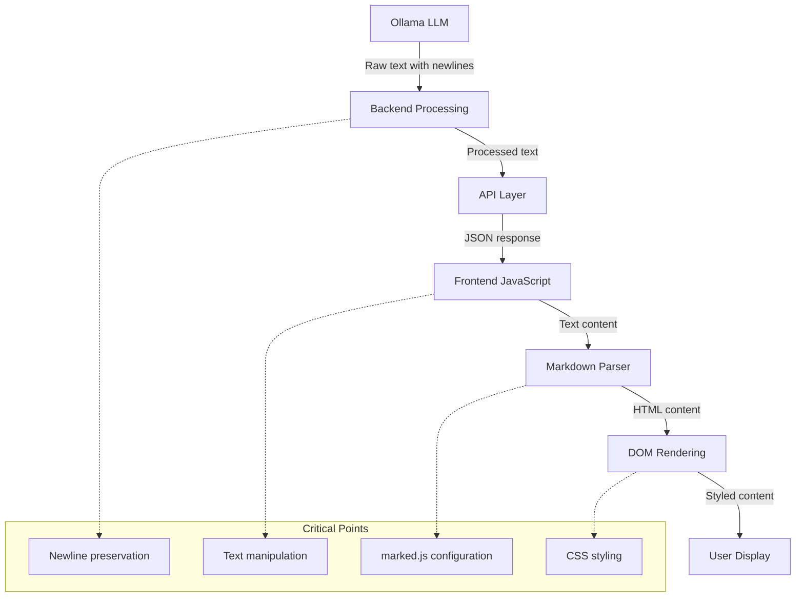

# Metis RAG Text Formatting Implementation Plan

## 1. Executive Summary

This document outlines a comprehensive plan to analyze and address the fundamental text formatting issues in the Metis RAG system. The plan covers the entire pipeline from backend generation to frontend display, identifying the root causes of formatting problems and recommending solutions based on industry best practices.

## 2. Architecture Overview

### Text Processing Pipeline

### Component Responsibilities
- **Ollama LLM**: Generates raw text with natural paragraph breaks and formatting
- **Backend Processing**: Processes text, potentially altering newlines and formatting
- **API Layer**: Transmits text as JSON, potentially affecting special characters
- **Frontend JavaScript**: Handles response, potentially manipulating text before rendering
- **Markdown Parser**: Converts markdown to HTML, critical for preserving formatting
- **DOM Rendering**: Applies CSS styling, potentially affecting visual formatting

## 3. Root Cause Analysis

### 3.1 Fundamental Text Formatting Problems
- Regular text responses come out in unbroken paragraphs
- Code blocks have inconsistent formatting
- The issue appears to be architectural rather than just code-specific

### 3.2 Newline Handling Throughout the Pipeline
- Potential mismatch between LLM newline usage and markdown parser configuration
- Possible accidental newline stripping in backend or frontend processing
- Inconsistent handling of paragraph breaks

### 3.3 Markdown Parser Configuration
- Current marked.js configuration may not be optimal for Ollama's output format
- The `breaks` option in marked.setOptions affects how newlines are rendered
- CSS styling may be affecting the visual display of paragraphs

## 4. Implementation Plan

### Phase 1: Investigation and Diagnosis (1-2 weeks)

#### Implement Logging Throughout the Text Processing Pipeline
- Log raw text from Ollama before any processing
- Log text after backend processing
- Log text received by frontend before markdown parsing
- Log HTML output from marked.parse()

#### Analyze Raw Ollama Output Format
- Determine newline conventions used by Ollama for paragraphs (single vs. double)
- Analyze code block formatting in raw output
- Document consistent patterns and inconsistencies

#### Review Markdown Parser Configuration
- Analyze current marked.js configuration in markdown-parser.js
- Test different settings for the `breaks` option
- Evaluate impact on paragraph rendering

#### Inspect CSS Styling
- Review CSS applied to message content
- Test modifications to white-space, display, and other properties
- Identify styling issues affecting text display

### Phase 2: Short-term Fixes (1-2 weeks)

#### Optimize Markdown Parser Configuration
- Update marked.js configuration based on investigation findings
- Adjust the `breaks` option to match Ollama's newline convention
- Test with various text formats to ensure proper rendering

#### Enhance Backend Text Processing
- Modify normalize_text() to preserve paragraph structure
- Ensure newlines are consistently handled
- Add specific handling for paragraph breaks

#### Improve CSS Styling
- Update styles for message content to properly display paragraphs
- Ensure proper spacing between paragraphs
- Test with various content types

#### Fix Streaming Text Handling
- Ensure consistent formatting between streaming and non-streaming modes
- Implement proper handling of partial markdown during streaming
- Test with long responses containing various formatting elements

### Phase 3: Medium-term Architectural Improvements (2-3 weeks)

#### Refactor Text Processing Pipeline
- Create a unified text processing module
- Implement consistent newline handling throughout the pipeline
- Add robust error handling and logging

#### Enhance System Prompts
- Update system prompts to explicitly instruct the LLM on proper text formatting
- Add examples of correctly formatted paragraphs and code blocks
- Test with various query types

#### Implement Text Format Verification
- Add a verification step to ensure proper formatting before rendering
- Create a format correction mechanism for common issues
- Test with various edge cases

#### Create Comprehensive Testing Framework
- Develop unit tests for text processing functions
- Create integration tests for the full text processing pipeline
- Implement automated testing for various content types

### Phase 4: Long-term Redesign (3-4 weeks)

#### Evaluate Alternative Markdown Parsers
- Research alternatives to marked.js
- Compare performance and feature sets
- Test with Ollama's output format

#### Consider Custom Text Processing Pipeline
- Design a custom pipeline specifically for LLM output
- Implement specialized handling for different content types
- Optimize for performance and reliability

#### Implement Structured Output Format
- Research Ollama's structured output feature
- Design a schema for text and code content
- Implement frontend rendering for structured output

#### Enhance User Experience
- Add user preferences for text display
- Implement theme support for code highlighting
- Add accessibility features for text content

## 5. Comparison with Industry Standards

### Ollama's Approach
- Ollama's structured outputs feature provides a JSON schema-based approach
- Allows for constraining model output to specific formats
- Uses Pydantic (Python) or Zod (JavaScript) for schema validation
- Provides more reliability and consistency than traditional JSON mode

### Other RAG Implementations
- Many RAG systems use similar markdown parsing approaches
- Some implement custom text processing pipelines
- Best practices include consistent newline handling and robust error recovery

### Chat Platforms
- Discord, Slack, and other platforms have robust markdown rendering
- They typically use custom markdown parsers optimized for chat
- They handle streaming and non-streaming content consistently

### Documentation Platforms
- GitHub, MDN, and other sites have excellent code formatting
- They use specialized renderers for different content types
- They prioritize readability and consistency

## 6. Diagnostic Steps

### 6.1 Raw Output Analysis
1. Log the raw string received from ollama_client.generate in the backend before any processing
2. Analyze newline patterns (single \n vs. double \n\n for paragraphs)
3. Examine code block formatting in raw output
4. Document consistent patterns and inconsistencies

### 6.2 Backend Processing Analysis
1. Log the text after normalize_text() and format_code_blocks()
2. Check for any modifications to newlines or paragraph structure
3. Verify that code blocks are properly preserved
4. Identify any unintended side effects

### 6.3 Frontend Processing Analysis
1. Log the string received by chat.js before it's passed to MetisMarkdown.processResponse
2. Check for any manipulations of newlines or special characters
3. Log the HTML output from marked.parse() inside MetisMarkdown.processResponse
4. Look for 
 tags and   tags to understand how paragraphs are being rendered

### 6.4 CSS Analysis
1. Use browser developer tools to inspect a rendered assistant message
2. Check the CSS applied to the .message-content div and any 
 tags within it
3. Look for display, white-space, margin, padding properties that might be causing paragraphs to merge visually
4. Temporarily disable suspicious rules to identify the cause

## 7. Testing Framework

### 7.1 Unit Tests
- Test normalize_text() with various paragraph structures
- Test format_code_blocks() with different code formats
- Test markdown parsing with different configurations
- Test HTML sanitization with potentially malicious inputs

### 7.2 Integration Tests
- Test the full flow from RAG response to rendered output
- Verify paragraph structure is preserved throughout the pipeline
- Test with various content types (text, code, lists, tables)
- Test streaming vs. non-streaming behavior

### 7.3 Visual Regression Tests
- Create baseline screenshots of properly formatted responses
- Compare with new implementations to ensure visual consistency
- Test across different browsers and screen sizes
- Verify accessibility standards are met

### 7.4 User Experience Tests
- Gather feedback on text readability and formatting
- Test with various content types and lengths
- Implement improvements based on user feedback
- Ensure consistent experience across devices

## 8. Conclusion

This implementation plan provides a comprehensive approach to addressing the fundamental text formatting issues in the Metis RAG system. By systematically analyzing the entire text processing pipeline, implementing targeted fixes, and adopting industry best practices, we can significantly improve the readability and consistency of both regular text and code blocks in chat responses.

The plan emphasizes a phased approach, starting with investigation and diagnosis to identify the root causes, followed by short-term fixes to address immediate issues, medium-term architectural improvements for more robust handling, and long-term redesign considerations for optimal performance and user experience.

By following this plan, we will create a more reliable and user-friendly text formatting system that enhances the overall quality of the Metis RAG chat interface.