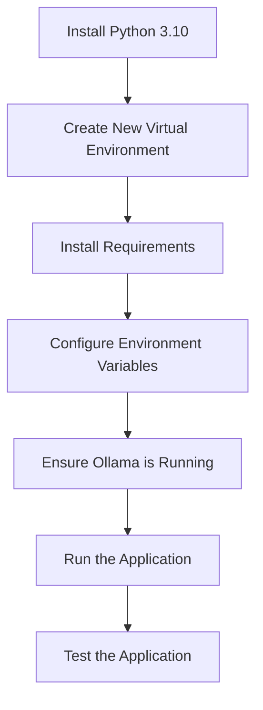

# Metis RAG Setup Plan

This document outlines a detailed plan to get the Metis RAG application running with Python 3.10, which should resolve the pydantic-core wheel building issue you're encountering with Python 3.13.

## Overview



## Detailed Steps

### 1. Install Python 3.10

First, we need to install Python 3.10 on your system:

#### For macOS (using Homebrew):
```bash
brew install python@3.10
```

#### For Linux (Ubuntu/Debian):
```bash
sudo apt update
sudo apt install python3.10 python3.10-venv python3.10-dev
```

#### For Windows:
Download the Python 3.10 installer from the official Python website and run it.

### 2. Create a New Virtual Environment with Python 3.10

Once Python 3.10 is installed, exit your current virtual environment and create a new one:

```bash
# Exit current virtual environment
deactivate

# Create a new virtual environment with Python 3.10
python3.10 -m venv venv_py310

# Activate the new virtual environment
source venv_py310/bin/activate  # On macOS/Linux
# or
# venv_py310\Scripts\activate  # On Windows
```

### 3. Install Requirements

With the Python 3.10 virtual environment activated, install the requirements:

```bash
# Install wheel and setuptools first
pip install --upgrade pip wheel setuptools

# Install the requirements
pip install -r requirements.txt
```

### 4. Configure Environment Variables

Create a `.env` file based on the `.env.example`:

```bash
cp .env.example .env
```

Edit the `.env` file if needed, particularly the Ollama settings:

```
# API Settings
API_HOST=0.0.0.0
API_PORT=8000

# Ollama Settings
OLLAMA_BASE_URL=http://localhost:11434
DEFAULT_MODEL=llama3
DEFAULT_EMBEDDING_MODEL=nomic-embed-text

# Document Settings
UPLOAD_DIR=./uploads
CHROMA_DB_DIR=./chroma_db
CHUNK_SIZE=500
CHUNK_OVERLAP=50

# Security Settings
CORS_ORIGINS=*
```

### 5. Ensure Ollama is Running

Make sure Ollama is running and has the required models:

```bash
# Check if Ollama is running
curl http://localhost:11434/api/tags

# If needed, pull the required models
ollama pull llama3
ollama pull nomic-embed-text
```

### 6. Run the Application

With everything set up, run the application:

```bash
# Create necessary directories if they don't exist
mkdir -p uploads chroma_db

# Run the application
uvicorn app.main:app --reload
```

### 7. Test the Application

Once the application is running, you can access it at:
- Main interface: http://localhost:8000
- API documentation: http://localhost:8000/docs

You can also run the RAG retrieval test script to verify that the document processing and retrieval are working correctly:

```bash
# Run the RAG retrieval test script
python test_rag_retrieval.py
```

This script creates test documents, processes them, and tests the RAG retrieval with specific queries to verify that the system correctly retrieves and uses information from the documents.

## Troubleshooting Common Issues

1. **If you still encounter issues with pydantic-core**:
   Try installing it separately with:
   ```bash
   pip install pydantic-core
   ```

2. **If you encounter issues with langchain or langchain-community**:
   Try installing specific versions:
   ```bash
   pip install langchain==0.0.335 langchain-community==0.0.13
   ```

3. **If Ollama connection fails**:
   Ensure Ollama is running and accessible at http://localhost:11434

4. **If directories are not accessible**:
   Check permissions for the uploads and chroma_db directories

5. **If you encounter issues with specific dependencies**:
   You might need to install system-level dependencies. For example, on Ubuntu:
   ```bash
   sudo apt-get install build-essential python3-dev
   ```

6. **If you encounter issues with document processing**:
   Ensure you have the necessary dependencies for document processing:
   ```bash
   pip install pypdf>=3.15.1 unstructured>=0.10.16
   ```
   
7. **If you encounter issues with RAG retrieval**:
   Run the test script to diagnose issues:
   ```bash
   python test_rag_retrieval.py
   ```
   Check the logs for detailed information about the retrieval process.

## Alternative Approach: Using Docker

If you continue to face issues with the Python setup, you can alternatively use Docker:

```bash
# Create a .env file
cp .env.example .env

# Build and start the containers
docker-compose up -d

# Access the application at http://localhost:8000
```

This approach isolates all dependencies within containers and should work regardless of your local Python setup.