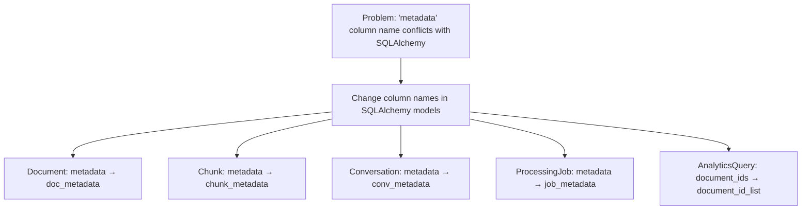
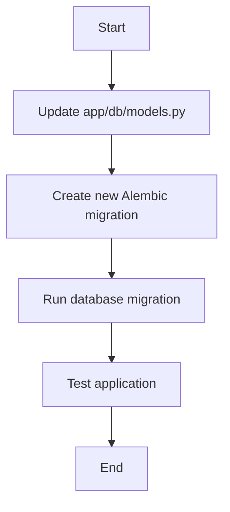

# Fix SQLAlchemy Metadata Naming Conflicts

## 1. Problem Summary

SQLAlchemy's Declarative API reserves the attribute name `metadata` for internal use. However, several of your model classes in `app/db/models.py` use `metadata` as a column name:

```python
metadata = Column(JSONB, default={})  # This conflicts with SQLAlchemy's reserved attribute
```

The error message from the application:

```
sqlalchemy.exc.InvalidRequestError: Attribute name 'metadata' is reserved when using the Declarative API.
```

Interestingly, your adapter functions in `app/db/adapters.py` are already set up to use different attribute names, but the models themselves need to be updated.

## 2. Required Code Changes

### 2.1. Update app/db/models.py



Specifically:

1. In the `Document` class:
   ```python
   # Change this:
   metadata = Column(JSONB, default={})
   
   # To this:
   doc_metadata = Column(JSONB, default={})
   ```

2. In the `Chunk` class:
   ```python
   # Change this:
   metadata = Column(JSONB, default={})
   
   # To this:
   chunk_metadata = Column(JSONB, default={})
   ```

3. In the `Conversation` class:
   ```python
   # Change this:
   metadata = Column(JSONB, default={})
   
   # To this:
   conv_metadata = Column(JSONB, default={})
   ```

4. In the `ProcessingJob` class:
   ```python
   # Change this:
   metadata = Column(JSONB, default={})
   
   # To this:
   job_metadata = Column(JSONB, default={})
   ```

5. In the `AnalyticsQuery` class:
   ```python
   # Change this:
   document_ids = Column(JSONB, default=[])
   
   # To this:
   document_id_list = Column(JSONB, default=[])
   ```

### 2.2. Create Database Migration

Create a new migration script using Alembic to rename these columns in the database:

```python
"""rename_metadata_columns

Revision ID: [alembic will generate]
Revises: [current head]
Create Date: [current date]

"""
from alembic import op
import sqlalchemy as sa
from sqlalchemy.dialects.postgresql import JSONB

# revision identifiers
revision = '[alembic will generate]'
down_revision = '[current head]'
branch_labels = None
depends_on = None


def upgrade():
    # Rename metadata column in documents table
    op.alter_column('documents', 'metadata', new_column_name='doc_metadata', 
                   existing_type=JSONB(), nullable=True, server_default=sa.text("'{}'::jsonb"))
    
    # Rename metadata column in chunks table
    op.alter_column('chunks', 'metadata', new_column_name='chunk_metadata', 
                   existing_type=JSONB(), nullable=True, server_default=sa.text("'{}'::jsonb"))
    
    # Rename metadata column in conversations table
    op.alter_column('conversations', 'metadata', new_column_name='conv_metadata', 
                   existing_type=JSONB(), nullable=True, server_default=sa.text("'{}'::jsonb"))
    
    # Rename metadata column in processing_jobs table
    op.alter_column('processing_jobs', 'metadata', new_column_name='job_metadata', 
                   existing_type=JSONB(), nullable=True, server_default=sa.text("'{}'::jsonb"))
    
    # Rename document_ids column in analytics_queries table
    op.alter_column('analytics_queries', 'document_ids', new_column_name='document_id_list', 
                   existing_type=JSONB(), nullable=True, server_default=sa.text("'[]'::jsonb"))


def downgrade():
    # Revert column name changes
    op.alter_column('documents', 'doc_metadata', new_column_name='metadata', 
                   existing_type=JSONB(), nullable=True, server_default=sa.text("'{}'::jsonb"))
    
    op.alter_column('chunks', 'chunk_metadata', new_column_name='metadata', 
                   existing_type=JSONB(), nullable=True, server_default=sa.text("'{}'::jsonb"))
    
    op.alter_column('conversations', 'conv_metadata', new_column_name='metadata', 
                   existing_type=JSONB(), nullable=True, server_default=sa.text("'{}'::jsonb"))
    
    op.alter_column('processing_jobs', 'job_metadata', new_column_name='metadata', 
                   existing_type=JSONB(), nullable=True, server_default=sa.text("'{}'::jsonb"))
    
    op.alter_column('analytics_queries', 'document_id_list', new_column_name='document_ids', 
                   existing_type=JSONB(), nullable=True, server_default=sa.text("'[]'::jsonb"))
```

## 3. Implementation Process



1. **Update Model Definitions**: Modify the SQLAlchemy model classes in `app/db/models.py` as outlined above.

2. **Create Database Migration**: 
   ```bash
   # Generate a new migration
   alembic revision --autogenerate -m "rename_metadata_columns"
   
   # Edit the generated migration file to ensure it correctly renames columns
   ```

3. **Run the Migration**:
   ```bash
   alembic upgrade head
   ```

4. **Test the Application**:
   ```bash
   python -m scripts.run_app
   ```

## 4. Verification

After implementing these changes, verify that:

1. The application starts without errors
2. Document processing works correctly
3. Queries return expected results
4. Data persistence functions properly

## 5. Root Cause Analysis

This issue likely arose when upgrading SQLAlchemy versions or implementing more complex ORM features. The `metadata` attribute is reserved in SQLAlchemy's Declarative API because it holds table definitions and other metadata about the model class. When a column is also named `metadata`, it creates an attribute conflict.

The adapter functions in `app/db/adapters.py` suggest that this naming issue was known and worked around in that part of the code, but the model definitions weren't updated to match.

## 6. Next Steps

After fixing this specific issue, consider a code review focused on:

1. Other potential attribute naming conflicts with SQLAlchemy
2. Consistency in naming conventions throughout the application
3. Automated tests to catch similar issues in the future