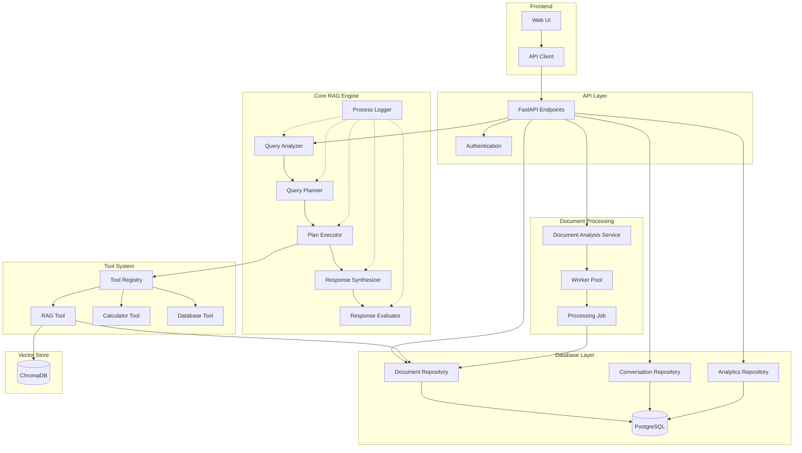
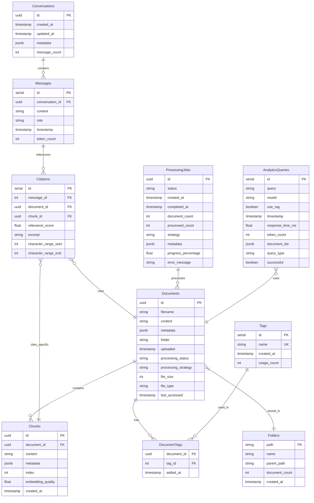
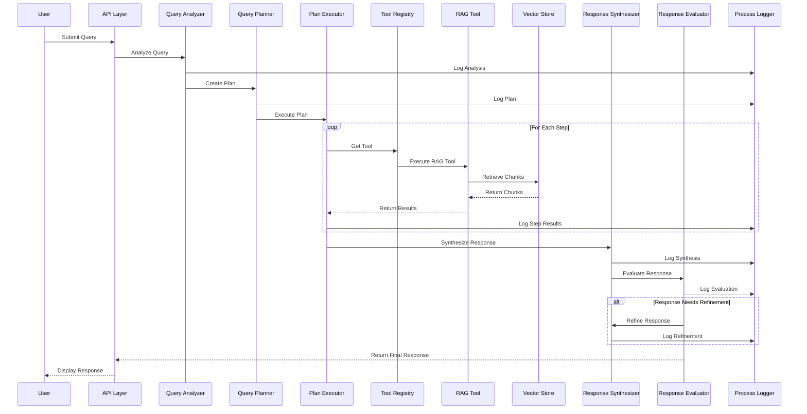
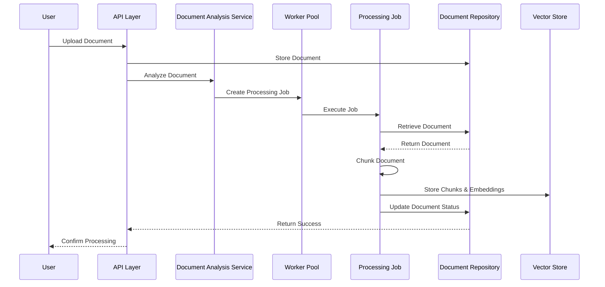
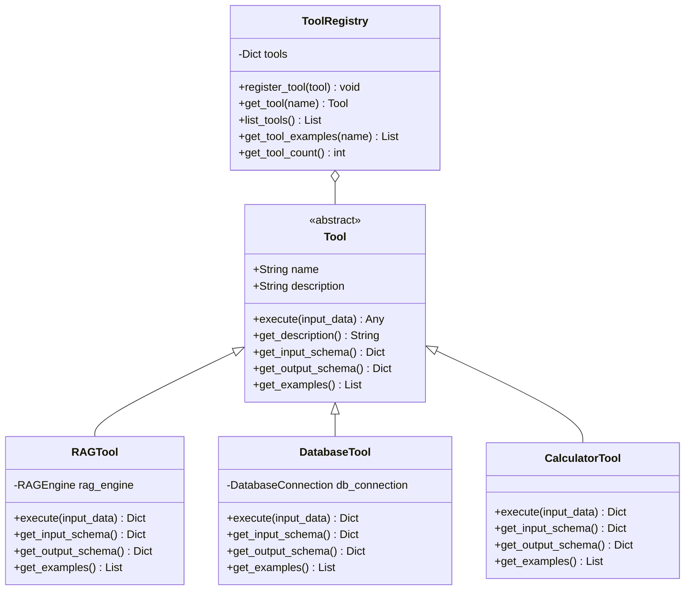
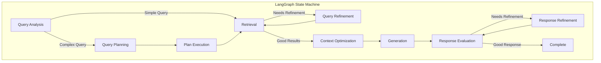

# Metis_RAG System Visualization

## System Architecture

## Database Schema

## Query Processing Flow

## Document Processing Flow

## Tool System

## LangGraph Integration

## Key Components

### Core RAG Engine
- **Query Analyzer**: Determines query complexity and required tools
- **Query Planner**: Creates execution plans for complex queries
- **Plan Executor**: Executes query plans using appropriate tools
- **Response Synthesizer**: Generates coherent responses from execution results
- **Response Evaluator**: Assesses response quality and determines if refinement is needed
- **Process Logger**: Records the entire query processing workflow for auditing

### Tool System
- **Tool Registry**: Manages available tools
- **RAG Tool**: Retrieves information from documents using vector search
- **Calculator Tool**: Performs mathematical calculations
- **Database Tool**: Queries structured data

### Document Processing
- **Document Analysis Service**: Analyzes documents to determine optimal processing strategies
- **Worker Pool**: Manages parallel document processing
- **Processing Job**: Represents a document processing task

### Database Layer
- **Document Repository**: Manages document storage and retrieval
- **Conversation Repository**: Stores conversation history
- **Analytics Repository**: Records query analytics

### Vector Store
- **ChromaDB**: Stores document chunks and embeddings for semantic search