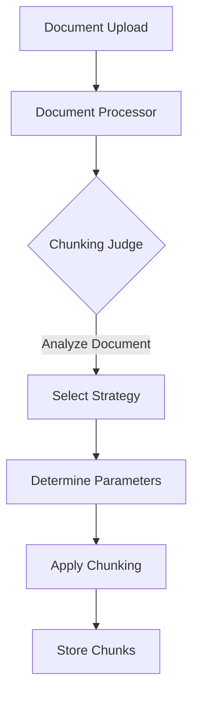
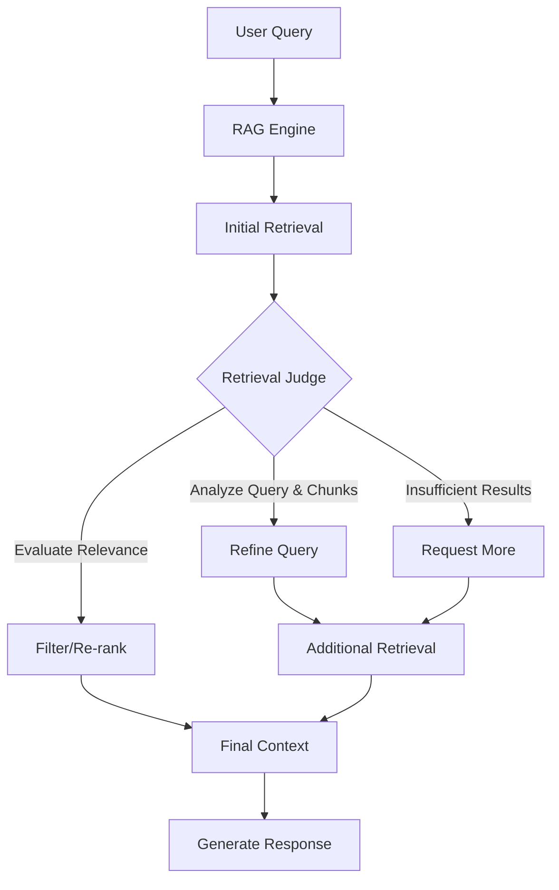

# LLM-Enhanced RAG System Implementation Plan (Updated)

## Overview

This document outlines a comprehensive plan for implementing an enhanced Retrieval Augmented Generation (RAG) system using LLM-based "judges" to improve two critical aspects of the RAG pipeline:

1. **Dynamic Chunking Strategy Selection**: An LLM agent ("Chunking Judge") that analyzes documents and selects the most appropriate chunking strategy and parameters.

2. **Query Refinement and Retrieval Enhancement**: An LLM agent ("Retrieval Judge") that analyzes queries and retrieved chunks to improve retrieval quality through query refinement, relevance evaluation, and potential re-retrieval.

## Implementation Progress

### Completed:

- [x] Created git branch `llm-enhanced-rag` for the implementation
- [x] Updated configuration to use gemma3:12b as the default model
- [x] Added configuration variables for LLM judges
- [x] Created the agents directory structure
- [x] Implemented the Chunking Judge class with enhanced document sample extraction
- [x] Integrated Chunking Judge with DocumentProcessor
- [x] Added unit tests for the Chunking Judge
- [x] Added integration tests for the Chunking Judge
- [x] Updated documentation in README.md
- [x] Conducted testing of Chunking Judge with real Ollama client
- [x] Analyzed test results and verified Chunking Judge functionality

### Pending:

- [ ] Implement the Retrieval Judge class
- [ ] Integrate Retrieval Judge with RAGEngine
- [ ] Add unit tests for the Retrieval Judge
- [ ] Add integration tests for the Retrieval Judge
- [ ] Implement advanced semantic chunking
- [ ] Integrate LangGraph for agentic RAG
- [ ] Create benchmarking scripts
- [ ] Conduct performance evaluation

## Current System Analysis

The current RAG implementation has several strengths:

- Multiple chunking strategies (recursive, token-based, markdown) with file type-specific handling
- Relevance filtering with a threshold of 0.4 to filter out less relevant chunks
- Robust vector store using ChromaDB with caching for performance
- Well-structured document model with chunks, metadata, tags, and folder organization
- Resilient Ollama client with retry logic and error handling

However, the system currently uses static rules for chunking strategy selection and fixed parameters, which limits adaptability to diverse document types. The retrieval process is also relatively simple, without query refinement or iterative retrieval.

## Implementation Approach

We are taking a phased approach to implementation, starting with the Chunking Judge and then moving on to the Retrieval Judge. Both judges use the gemma3:12b model for its multimodal capabilities, with the system designed to allow changing the model in the future.

## Phase 1: Chunking Judge Implementation (COMPLETED)

### 1.1 Create Agent Architecture (COMPLETED)



### 1.2 Create the Chunking Judge Class (COMPLETED)

The Chunking Judge class has been implemented in `app/rag/agents/chunking_judge.py`. The implementation includes:

- Analysis of document structure, content type, and formatting
- Selection of the most appropriate chunking strategy (recursive, token, markdown)
- Recommendation of optimal chunk size and overlap parameters
- Enhanced document sample extraction that prioritizes headers, introduction, and conclusion
- Robust error handling and fallback mechanisms

### 1.3 Update Configuration (COMPLETED)

Configuration variables have been added to `app/core/config.py`:

```python
# LLM Judge settings
CHUNKING_JUDGE_MODEL = os.getenv("CHUNKING_JUDGE_MODEL", "gemma3:12b")
RETRIEVAL_JUDGE_MODEL = os.getenv("RETRIEVAL_JUDGE_MODEL", "gemma3:12b")
USE_CHUNKING_JUDGE = os.getenv("USE_CHUNKING_JUDGE", "True").lower() == "true"
USE_RETRIEVAL_JUDGE = os.getenv("USE_RETRIEVAL_JUDGE", "True").lower() == "true"
```

### 1.4 Integrate with DocumentProcessor (COMPLETED)

The DocumentProcessor has been updated to use the Chunking Judge when processing documents. The integration includes:

- Using the Chunking Judge if enabled via configuration
- Updating chunking strategy and parameters based on the judge's recommendation
- Storing the chunking analysis in document metadata
- Logging the judge's recommendations and justification

### 1.5 Testing (COMPLETED)

Unit and integration tests have been created for the Chunking Judge:

- Unit tests in `tests/unit/test_chunking_judge.py`
- Integration tests in `tests/integration/test_chunking_judge_integration.py`

### 1.6 Test Results with Real Ollama (COMPLETED)

The Chunking Judge was tested with the real Ollama client (gemma3:12b model) using three different document types:

#### Test Results Summary:

1. **Plain Text Document (test_document.txt)**
   - **Recommended Strategy**: markdown
   - **Parameters**: chunk_size=1500, chunk_overlap=200
   - **Justification**: "The document is formatted with Markdown headers, indicating a clear hierarchical structure. Using the 'markdown' strategy will preserve this structure, ensuring that related sections and subsections are grouped together. A chunk size of 1500 characters allows for substantial content within each chunk while maintaining reasonable size. An overlap of 200 characters helps to avoid abrupt transitions between chunks and ensures context is carried over."

2. **Markdown Document (technical_documentation.md)**
   - **Recommended Strategy**: markdown
   - **Parameters**: chunk_size=1500, chunk_overlap=200
   - **Justification**: "The document is a markdown file with a well-defined structure using headers (e.g., Introduction, Architecture Overview, Deployment Options, Configuration, API Reference, Performance Considerations). Using the 'markdown' strategy will allow us to split the document along these logical sections, preserving the context and relationships between different parts of the documentation. A chunk size of 1500 characters allows for a reasonable amount of content within each chunk while still allowing for meaningful sections. An overlap of 200 ensures that context isn't lost between chunks."

3. **CSV Document (test_data.csv)**
   - **Recommended Strategy**: recursive
   - **Parameters**: chunk_size=1000, chunk_overlap=200
   - **Justification**: "The document is a CSV file, which doesn't inherently have a clear header structure suitable for markdown chunking. While it's structured data, the content within each cell (particularly the 'skills' column) can be quite variable in length. Token-based chunking might be overly granular, as it could split skills lists mid-item. Recursive chunking provides a good balance. A chunk size of 1000 characters allows for capturing a reasonable amount of context from multiple rows, while an overlap of 200 helps maintain continuity between chunks, especially when a row's content spans across two chunks. This approach will allow the RAG system to understand the relationships between employees and their skills."

#### Analysis of Results:

The test results demonstrate that the Chunking Judge effectively:

1. **Recognizes Document Structure**: Correctly identifies document structures, even recognizing markdown-like formatting in the plain text file.

2. **Selects Appropriate Strategies**: Recommends chunking strategies that align with the document structure (markdown for header-based documents, recursive for tabular data).

3. **Optimizes Parameters**: Suggests appropriate chunk sizes and overlaps based on document characteristics.

4. **Provides Detailed Justifications**: Offers clear, detailed explanations that demonstrate understanding of document structure and the implications of different chunking strategies.

The real Ollama LLM provides more nuanced and detailed recommendations than the mock client used in initial testing, demonstrating the value of using a sophisticated language model for this task.

## Phase 2: Retrieval Judge Implementation (NEXT PHASE)

### 2.1 Create Agent Architecture



### 2.2 Create the Retrieval Judge Class

Based on the success of the Chunking Judge, the next step is to implement the Retrieval Judge class in `app/rag/agents/retrieval_judge.py`. This class will:

- Analyze queries to determine complexity, specificity, and intent
- Analyze retrieved chunks for relevance to the query
- Refine queries to improve retrieval precision
- Evaluate relevance of retrieved chunks with detailed justifications
- Re-rank chunks based on relevance to the query
- Request additional retrieval when necessary
- Optimize context assembly for the LLM

The implementation should include:

```python
class RetrievalJudge:
    """
    LLM-based agent that analyzes queries and retrieved chunks to improve retrieval quality
    """
    def __init__(self, ollama_client: Optional[OllamaClient] = None, model: str = RETRIEVAL_JUDGE_MODEL):
        self.ollama_client = ollama_client or OllamaClient()
        self.model = model
    
    async def analyze_query(self, query: str) -> Dict[str, Any]:
        """
        Analyze a query and recommend retrieval parameters
        """
        # Implementation details...
    
    async def evaluate_chunks(self, query: str, chunks: List[Chunk]) -> Dict[str, Any]:
        """
        Evaluate retrieved chunks for relevance to the query
        """
        # Implementation details...
    
    async def refine_query(self, query: str, chunks: List[Chunk]) -> str:
        """
        Refine a query based on retrieved chunks
        """
        # Implementation details...
    
    async def optimize_context(self, query: str, chunks: List[Chunk]) -> List[Chunk]:
        """
        Optimize the assembly of chunks into a context for the LLM
        """
        # Implementation details...
```

### 2.3 Integrate with RAGEngine

After implementing the Retrieval Judge, it will be integrated with the RAGEngine to:

- Use the Retrieval Judge if enabled via configuration
- Implement query analysis before initial retrieval
- Implement iterative retrieval with query refinement
- Filter and re-rank chunks based on the judge's evaluation
- Format context with the most relevant chunks
- Dynamically adjust retrieval parameters based on query characteristics
- Implement a feedback loop to improve retrieval over time

The integration should include:

```python
# In rag_engine.py

async def retrieve(self, query: str, k: int = 5, filter_criteria: Dict[str, Any] = None) -> List[Chunk]:
    """
    Retrieve chunks from the vector store with Retrieval Judge enhancement
    """
    # Use Retrieval Judge if enabled
    if USE_RETRIEVAL_JUDGE:
        # Analyze query
        analysis_result = await self.retrieval_judge.analyze_query(query)
        
        # Adjust retrieval parameters based on analysis
        k = analysis_result.get("k", k)
        threshold = analysis_result.get("threshold", self.similarity_threshold)
        
        # Perform initial retrieval
        chunks = await self._retrieve(query, k, filter_criteria)
        
        # Evaluate chunks
        evaluation_result = await self.retrieval_judge.evaluate_chunks(query, chunks)
        
        # Refine query if needed
        if evaluation_result.get("needs_refinement", False):
            refined_query = await self.retrieval_judge.refine_query(query, chunks)
            additional_chunks = await self._retrieve(refined_query, k, filter_criteria)
            chunks.extend(additional_chunks)
        
        # Re-rank chunks
        chunks = await self.retrieval_judge.optimize_context(query, chunks)
        
        return chunks
    else:
        # Use standard retrieval
        return await self._retrieve(query, k, filter_criteria)
```

## Phase 3: Advanced Semantic Chunking (FUTURE PHASE)

Building on the success of the Chunking Judge, we will implement more advanced semantic chunking strategies:

### 3.1 Implement Semantic Chunking

Create a SemanticChunker class that uses the LLM to split text based on semantic boundaries rather than just character or token counts.

### 3.2 Integrate Semantic Chunking with DocumentProcessor

Update the DocumentProcessor to support semantic chunking as a new chunking strategy.

## Phase 4: LangGraph Integration for Agentic RAG (FUTURE PHASE)

Building on the success of the individual judges, we will implement a more sophisticated agentic RAG system using LangGraph:

### 4.1 Install Dependencies

Add LangGraph to the project dependencies.

### 4.2 Create LangGraph RAG Agent

Implement a LangGraphRAGAgent class that uses a state machine to orchestrate the RAG process.

### 4.3 Integrate LangGraph Agent with API

Add a new endpoint to the API for the LangGraph RAG agent.

## Implementation Timeline

### Phase 1: Chunking Judge (COMPLETED)
- Implement Chunking Judge class and integration with DocumentProcessor
- Testing and refinement of Chunking Judge

### Phase 2: Retrieval Judge (Weeks 3-4)
- Week 3: Implement Retrieval Judge class and integration with RAGEngine
- Week 4: Testing and refinement of Retrieval Judge

### Phase 3: Advanced Semantic Chunking (Weeks 5-6)
- Week 5: Implement SemanticChunker class
- Week 6: Integration and testing of semantic chunking

### Phase 4: LangGraph Integration (Weeks 7-8)
- Week 7: Implement LangGraphRAGAgent
- Week 8: Integration with API and testing

## Potential Challenges and Mitigations

1. **Increased Latency**
   - **Challenge**: Adding LLM calls will increase response time (observed ~30 seconds for Chunking Judge analysis with gemma3:12b)
   - **Mitigation**: Implement caching for judge decisions, make judges optional via configuration, optimize when to use judges, consider using smaller models for faster inference

2. **Cost Considerations**
   - **Challenge**: Additional LLM calls increase computational costs
   - **Mitigation**: Make judges optional, implement usage tracking, optimize when to use judges, cache results for similar documents/queries

3. **Error Handling**
   - **Challenge**: LLM responses may not always be parseable (observed occasional timeout errors during testing)
   - **Mitigation**: Robust fallback mechanisms in the parsing functions, implement retry logic with exponential backoff (already implemented in OllamaClient)

4. **Cold Start Problem**
   - **Challenge**: Judges may perform poorly on new document types
   - **Mitigation**: Implement a feedback loop to improve judge performance over time, store successful analyses for reference

5. **Model Quality Variations**
   - **Challenge**: Different LLMs may provide varying quality of recommendations
   - **Mitigation**: Test multiple models and select the best performing one, allow configuration of model per judge

6. **Justification Quality**
   - **Challenge**: Ensuring justifications are detailed and helpful for debugging and understanding
   - **Mitigation**: Include specific prompting for detailed justifications, as demonstrated in the Chunking Judge test results

## Conclusion

The LLM-enhanced RAG system with "judges" for chunking and retrieval has significant potential to improve the adaptability and accuracy of the RAG pipeline. By dynamically selecting chunking strategies and refining queries, the system can better handle diverse document types and complex queries.

Phase 1 (Chunking Judge) has been successfully implemented and tested with real Ollama, providing a solid foundation for the remaining phases. The test results demonstrate that the Chunking Judge effectively:

1. Recognizes document structure and formatting, even identifying markdown-like elements in plain text files
2. Selects appropriate chunking strategies based on document characteristics
3. Recommends optimized parameters (chunk size and overlap) tailored to each document type
4. Provides detailed, insightful justifications for its recommendations

The real Ollama LLM (gemma3:12b) provided more nuanced and detailed recommendations than our initial mock implementation, demonstrating the value of using a sophisticated language model for this task. The Chunking Judge makes the system more adaptable to different document types without manual configuration, which will improve retrieval quality and user experience.

The next phase will focus on implementing the Retrieval Judge to enhance query refinement and retrieval quality. Based on the success of the Chunking Judge, we've enhanced our plans for the Retrieval Judge to include:

1. Query analysis to determine complexity, specificity, and intent
2. Dynamic adjustment of retrieval parameters based on query characteristics
3. Relevance evaluation with detailed justifications
4. Context optimization for improved response generation
5. A feedback loop to continuously improve retrieval performance

These enhancements will further improve the accuracy and relevance of responses, making the RAG system more effective for a wider range of use cases.